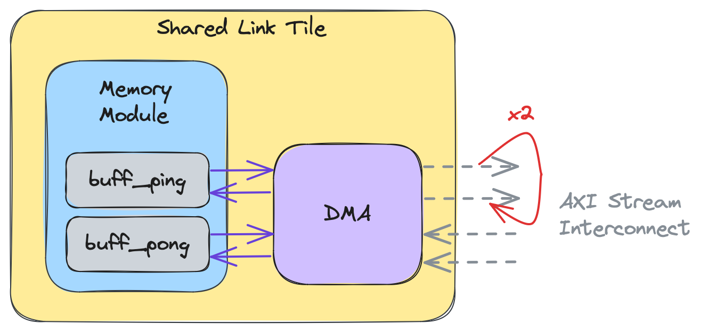

<!---//===- README.md ---------------------------------------*- Markdown -*-===//
//
// This file is licensed under the Apache License v2.0 with LLVM Exceptions.
// See https://llvm.org/LICENSE.txt for license information.
// SPDX-License-Identifier: Apache-2.0 WITH LLVM-exception
//
// Copyright (C) 2024, Advanced Micro Devices, Inc.
// 
//===----------------------------------------------------------------------===//-->

# <ins>Object FIFO Repeat Pattern</ins>

The Object FIFO provides users with a way to specify that data from the producer should be repeated by leveraging the Object FIFO link functionality. This feature is available using the following syntax:
```python
of0 = object_fifo("objfifo0", A, B, 2, np.ndarray[(256,), np.dtype[np.int32]])
of1 = object_fifo("objfifo1", B, C, 2, np.ndarray[(256,), np.dtype[np.int32]])
object_fifo_link(of0, of1)
of1.set_repeat_count(2) # the data in each object is sent to the consumer C twice
```


This repetition is achieved using the Data Movement Accelerator (DMA) of the shared tile in the link. In particular, the DMA buffer descriptors rely on synchronization logic to ensure data is handled at the correct time, to avoid data corruption. To program the repeat pattern the synchronization logic associated to the buffer descriptors of the shared tile is generated in such a way as to send additional copies of the data received through the input Object FIFO. These data copies do not lead to additional memory being allocated as they are made at the DMA level of the output Object FIFO, as is showcased by the red arrow in the figure below:


For more information into DMAs and their buffer descriptors you can refer to the [Advanced Topic of Section 2a](../../section-2a/README.md#advanced-topic-data-movement-accelerators) and [Section 2f](../../section-2f/).

One particularity of this feature is the repeat pattern for Object FIFOs with a size greater than 1. The data movement generated for Object FIFOs follows a cyclic pattern of First In First Out and when this is paired with a repeat it results in the repetition of the entire cyclic pattern instead of the repetition of each individual object. This is shown in the figure below with the red arrow representing the repeat value:



Specifically, the pattern we would see for the figure above is: `buff_ping - buff_pong - buff_ping - buff_pong`, where the data in each buffer remains the same in each instance.

> **NOTE:**  It currently isn't possible to use repeat with Object FIFOs that are being accessed explicitly through a compute core without accounting for the synchronization between the core and its DMA that is performing the repetition.

The repeat functionality can be used in conjunction with the distribute pattern introduced in the previous section. Currently, the repeat value specified for each distribute destination must be the same to ensure functional correctness. Additionally, the syntax currently doesn't support both output Object FIFOs with repeat and without at the same time, in the same distribute pattern. The code below shows how the two output Object FIFOs of a distribute pattern can be set to each repeat three times:
```python
of0 = object_fifo("objfifo0", A, B, 2, np.ndarray[(256,), np.dtype[np.int32]])
of1 = object_fifo("objfifo1", B, C, 2, np.ndarray[(256,), np.dtype[np.int32]])
of2 = object_fifo("objfifo2", B, D, 2, np.ndarray[(256,), np.dtype[np.int32]])
object_fifo_link(of0, [of1, of2])
of1.set_repeat_count(3)
of2.set_repeat_count(3)
```
The code snippet above is part of a test that can be found [here](../../../../test/npu-xrt/objectfifo_repeat/distribute_repeat/).

-----
[[Prev](../03_Link_Distribute_Join/)] [[Up](..)] [[Next - Section 2c](../../section-2c/)]
