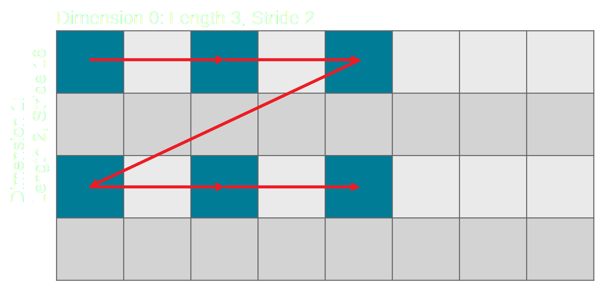

<!---//===- README.md ---------------------------------------*- Markdown -*-===//
//
// This file is licensed under the Apache License v2.0 with LLVM Exceptions.
// See https://llvm.org/LICENSE.txt for license information.
// SPDX-License-Identifier: Apache-2.0 WITH LLVM-exception
//
// Copyright (C) 2024, Advanced Micro Devices, Inc.
// 
//===----------------------------------------------------------------------===//-->

# <ins>Section 2c - Data Layout Transformations</ins>

While the Object FIFO primitive aims to reduce the complexity tied to data movement configuration on the AI Engine array, it also gives the user control over some advanced features of the underlying architecture. One such feature is the ability to do data layout transformations on the fly using the tile's dedicated hardware: the Data Movement Accelerators (DMAs). <u>This is available on AIE-ML devices.</u>

Tile DMAs interact directly with the memory modules of their tiles and are responsible for pushing and retrieving data to and from the AXI stream interconnect. When data is pushed onto the stream, the user can program the DMA's n-dimensional address generation scheme such that the data's layout when pushed may be different than how it is stored in the tile's local memory. In the same way, a user can also specify in what layout a DMA should store the data retrieved from the AXI stream.

DMA blocks contain buffer descriptor operations that summarize what data is being moved, from what offset, how much of it, and in what layout. These buffer descriptors are the `AIE_DMABDOp` operations in MLIR and have their own auto-generated python binding (available under `<MLIR_AIE_INSTALL_PATH>/python/aie/dialects/_aie_ops_gen.py` after the repository is built):
```python
def dma_bd
    (
        buffer,
        *,
        offset=None,
        len=None,
        dimensions=None,
        bd_id=None,
        next_bd_id=None,
        loc=None,
        ip=None
    )
```
It is not necessary to understand these low-level operations in order to use the data layout transformations with the Object FIFO primitive.

A data layout transformation is presented as a tuple of pairs, where each pair represents a `size` and a `stride` for a particular dimension of the data:
```c
[<size_2, stride_2>, <size_1, stride_1>, <size_0, stride_0>]
```
Transformations can be expressed in up to three dimensions on each compute and Shim tile, and in up to four dimensions on Mem tiles. The first pair of this array gives the outer-most dimension's stride and size `<size_2, stride_2>`, while the last pair of the array gives the inner-most dimension's stride and size `<size_0,stride_0>`. All strides are expressed in <u>multiples of the element width</u>.

> **NOTE:**  Only for 4B data types the inner-most dimension's stride must be 1 by design.

Data layout transformations can be viewed as a way to specify to the hardware which location in the data to access next and as such it is possible to model the access pattern using a series of nested loops. For example, the transformation above can be expressed as:
```c
int *buffer;
for(int i = 0; i < size_2; i++)
    for(int j = 0; j < size_1; j++)
        for(int k = 0; k < size_0; k++)
            # access/store element at/to buffer[  i * stride_2
            #                                   + j * stride_1
            #                                   + k * stride_0]
```

As a practical example, here is an access pattern that corresponds to alternating between even and odd elements every 8 elements in a 128 element buffer/stream:
```mlir
aie.dma_bd(%buf : memref<128xi32>, 0, 128, [<8, 16>, <2, 1>, <8, 2>])
```
which translates to:
```c
for(int i = 0; i < 8; i++)          # size_2
    for(int j = 0; j < 2; j++)      # size_1
        for(int k = 0; k < 8; k++)  # size_0
            # access/store element at/to index:
            (
                i * 16  # stride_2 
                + j * 1 # stride_1 
                + k * 2 # stride_0
            )
```

### Data Layout Transformations with the Object FIFO

Reminder that the Object FIFO class constructor has two default valued inputs: `dimensionsToStream` and `dimensionsFromStreamPerConsumer`.
```python
class object_fifo:
    def __init__(
        self,
        name,
        producerTile,
        consumerTiles,
        depth,
        datatype,
        dimensionsToStream=None,
        dimensionsFromStreamPerConsumer=None,
    )
```

The Object FIFO directly lowers to `AIE_DMABDOp` operations described above that can leverage data layout transformations expressed as pairs of strides and sizes. It uses the `dimensionsToStream` input in relation to the `producerTile` to describe in what layout that tile's DMA should push the objects onto the stream. Similarly, the `dimensionsFromStreamPerConsumer` input describes to the DMA's of each individual tile in the `consumerTiles` in what layout to retrieve the objects from the stream.

As an example, the Object FIFO in the code below contains objects with datatype `<4x8xi8>`. Using the `dimensionsToStream` input it performs a data layout transformation on the producer tile side that, for every row out of two, selects one element out of two up to three elements.
```python
A = tile(1, 1)
B = tile(1, 3)
of0 = object_fifo
    (
        "objfifo0",
        A,
        B,
        3,
        T.memref((4, 8), T.i8()),
        [
            (2, 16),
            (3, 2),
        ],
    )
```
The access pattern of the transformation can be written as:
```c
for(int i = 0; i < 2; i++)      # size_1
    for(int j = 0; j < 3; j++)  # size_0
        # access/store element at/to index:
        (
            i * 16  # stride_1 
            + j * 2 # stride_0
        )
```
and further represented as in the image below,



Other examples containing data layout transformations are available in the [programming_examples](../../../programming_examples/). A few notable ones are [matrix_vector_multiplication](../../../programming_examples/basic/matrix_multiplication/matrix_vector/) and [matrix_multiplication_whole_array](../../../programming_examples/basic/matrix_multiplication/whole_array/).

-----
[[Prev - Section 2b](../section-2b/)] [[Up](..)] [[Next - Section 2d](../section-2d/)]
