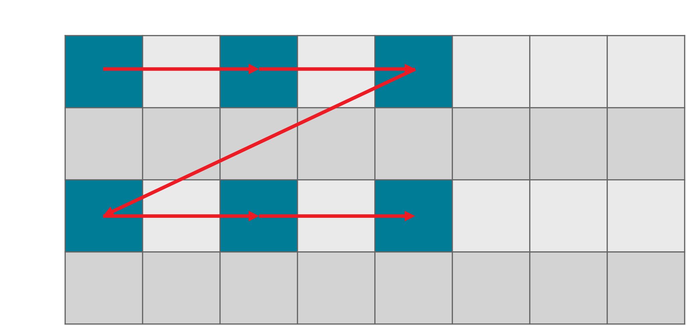

<!---//===- README.md ---------------------------------------*- Markdown -*-===//
//
// Copyright (C) 2024-2026 Advanced Micro Devices, Inc.
// SPDX-License-Identifier: Apache-2.0 WITH LLVM-exception
//
//===----------------------------------------------------------------------===//-->

# Section 2c - Data Layout Transformations { #data-layout-transformations }

* [Section 2 - Data Movement (ObjectFifos)](../../section-2/)
    * [Section 2a - Introduction](../section-2a/)
    * [Section 2b - Key ObjectFifo Patterns](../section-2b/)
    * Section 2c - Data Layout Transformations
    * [Section 2d - Runtime Data Movement](../section-2d/)
    * [Section 2e - Programming for multiple cores](../section-2e/)
    * [Section 2f - Practical Examples](../section-2f/)
    * [Section 2g - Data Movement Without ObjectFifos](../section-2g/)

-----

While the ObjectFifo primitive aims to reduce the complexity tied to data movement configuration on the AI Engine array, it also gives the user control over some advanced features of the underlying architecture. One such feature is the ability to do data layout transformations on the fly using the tile's dedicated hardware: the Direct Memory Access channels (DMAs). **This is available on AIE-ML devices.**

Tile DMAs interact directly with the memory modules of their tiles and are responsible for pushing and retrieving data to and from the AXI stream interconnect. When data is pushed onto the stream, the user can program the DMA's n-dimensional address generation scheme such that the data's layout when pushed may be different than how it is stored in the tile's local memory. In the same way, a user can also specify in what layout a DMA should store the data retrieved from the AXI stream.

DMA blocks contain buffer descriptor operations that summarize what data is being moved, from what offset, how much of it, and in what layout. These buffer descriptors are the `AIE_DMABDOp` operations in MLIR and have their own auto-generated Python binding (available under `<MLIR_AIE_INSTALL_PATH>/python/aie/dialects/_aie_ops_gen.py` after the repository is built):
```python
def dma_bd
    (
        buffer,
        *,
        offset=None,
        len=None,
        dimensions=None,
        bd_id=None,
        next_bd_id=None,
        loc=None,
        ip=None
    )
```
It is not necessary to understand these low-level operations in order to use the data layout transformations with the ObjectFifo primitive.

In IRON, a data layout transformation is written as a `TensorAccessPattern`, or `tap`, from the `taplib` library. A `tap` is the walk a DMA takes over a tensor, and `taplib` derives it with a small algebra rather than by hand: `TensorAccessPattern.full(dims)` is the row-major walk over a whole tensor of shape `dims`, `.tile(tile_dims)` divides it into a grid of equal tiles whose leading dimensions index the grid, and `tiles[i, j]` is the walk over one tile. Reordering and transposing (`.permute(...)`, `.T`), slicing (`tiles[0, ::2]`, `tap[2:6, ::2]`) and repeating (`.repeat(n)`) refine these walks. An in-depth introduction to `taplib` is available [here](../../../programming_examples/basic/tiling_exploration/README.md).

As a practical example, here is the `tap` that alternates between the even and odd elements of each 16-element block of a 128-element buffer, eight at a time. Viewing the buffer as `(8, 8, 2)` puts each block's even elements at `[i, :, 0]` and its odd elements at `[i, :, 1]`, so walking the last two dimensions in swapped order gives the pattern:
```python
from aie.helpers.taplib import TensorAccessPattern

tap = TensorAccessPattern.full((8, 8, 2)).permute((0, 2, 1))
print(tap)
# TensorAccessPattern([8, 8, 2], offset=0, sizes=[8, 2, 8], strides=[16, 1, 2])
```
`tap.visualize()` draws the order in which the walk visits each element, and `tap.access_order()` returns it as an array.

The compiler lowers a `tap` to the DMA's n-dimensional address generation, a list of pairs where each pair represents a `size` and a `stride` for a particular dimension of the data (`tap.transformation_dims` gives this list):
```c
[<size_2, stride_2>, <size_1, stride_1>, <size_0, stride_0>]
```
Transformations can be expressed in up to three dimensions on each compute and Shim tile, and in up to four dimensions on Mem tiles. The first pair of this array gives the outer-most dimension's stride and size `<size_2, stride_2>`, while the last pair of the array gives the inner-most dimension's stride and size `<size_0, stride_0>`. All strides are expressed in **multiples of the element width**.

> **NOTE:**  Only for 4B data types the inner-most dimension's stride must be 1 by design.

The `tap` above lowers to:
```mlir
aie.dma_bd(%buf : memref<128xi32> offset = 0 len = 128 sizes = [8, 2, 8] strides = [16, 1, 2])
```
Data layout transformations can be viewed as a way to specify to the hardware which location in the data to access next and as such it is possible to model the access pattern using a series of nested loops:
```c
for(int i = 0; i < 8; i++)          // size_2
    for(int j = 0; j < 2; j++)      // size_1
        for(int k = 0; k < 8; k++)  // size_0
            // access/store element at/to index:
            (
                i * 16  // stride_2
                + j * 1 // stride_1
                + k * 2 // stride_0
            )
```

It is important to note that data layout transformations are interpreted differently depending on whether data is pushed onto or read from the AXI stream:
- when data are pushed to the AXI stream, the layout describes from where in memory the DMA reads the elements to push to the stream (where to ``get items from'');
- when data are read from the AXI stream, the data layout describes where in memory the DMA writes the elements that are arriving over the stream in-sequence (where to ``put arriving items'').

### Data Layout Transformations with the ObjectFifo

The `ObjectFifo` takes a `tap` over one of its objects for each side of the transfer. The `to_stream` input describes in which order the producer's DMA pushes each object onto the stream. The `from_stream` input of `cons()` describes in what layout that consumer's DMA writes the objects it retrieves from the stream; `from_stream_per_cons` on the `ObjectFifo` sets the default for every consumer. A `tap.pad(...)` walk as `to_stream` also pads the stream on a MemTile.
```python
ObjectFifo(obj_type, *, depth=2, name=None, to_stream=None, from_stream_per_cons=None, ...)
of.cons(depth=None, from_stream=None, ...)
```

> **NOTE:**  Data layout transformations are applied to individual ObjectFifo objects and cannot act across object boundaries.

As an example, the ObjectFifo in the code below contains objects with datatype `<4x8xi8>`. Using the `to_stream` input it performs a data layout transformation on the producer side that pushes elements from memory onto the stream as follows: For every even length-8 row, select the first three even-indexed elements.
```python
tile_ty = np.ndarray[(4, 8), np.dtype[np.int8]]
of0 = ObjectFifo(
    tile_ty,
    depth=3,
    name="objfifo0",
    to_stream=TensorAccessPattern.full((4, 8))[::2, :6:2],
)
```
The slice `[::2, :6:2]` keeps rows 0 and 2 and, in each, columns 0, 2 and 4; it lowers to sizes `[2, 3]` with strides `[16, 2]`. The access pattern of the transformation can be written as:
```c
for(int i = 0; i < 2; i++)      // size_1
    for(int j = 0; j < 3; j++)  // size_0
        // access/store element at/to index:
        (
            i * 16  // stride_1
            + j * 2 // stride_0
        )
```
and further represented as in the image below:



Please see the [`to_stream_transformations`](./to_stream_transformations/) and [`from_stream_transformations`](./from_stream_transformations/) designs for end-to-end IRON examples of each pattern.

Other examples containing data layout transformations are available in the [programming_examples](../../../programming_examples/). A few notable ones are [matrix_vector_multiplication](../../../programming_examples/basic/matrix_multiplication/matrix_vector/) and [matrix_multiplication_whole_array](../../../programming_examples/basic/matrix_multiplication/whole_array/).

When using the implicit copy feature of the ObjectFifo for a join or distribute data movement pattern, a data layout transformation on the output of a join or on the input of a distribute applies to each participant's segment of the shared object on its own; it cannot walk across the larger tensor. The reasoning behind this decision is largely due to the complexity of the DMA program that is required to achieve a data layout transformation across the larger data tensor while ensuring race-free execution of the DMA buffer descriptor logic. Users may however program the DMA buffer descriptors themselves for specific designs; this is further detailed in [this](https://github.com/Xilinx/mlir-aie/discussions/2748) discussion.

### Data Layout Transformations with the Runtime Sequence

The runtime sequence uses the same `tap`s, over the whole host tensor rather than one object. Runtime sequence operations such as `fill()` and `drain()` in IRON, or `dma_wait` and `npu_dma_memcpy_nd` in the AIE dialect, can optionally take a `tap` as input to change the access pattern to/from external memory on-the-fly. For more details on programming the runtime sequence please see the corresponding [section](../section-2d/README.md).

Examples containing `tap`s are available in the [programming_examples](../../../programming_examples/). A few notable ones are [transposes](../../../programming_examples/basic/transposes/) (specifically `--strategy=dma`) and [row_wise_bias_add](../../../programming_examples/basic/row_wise_bias_add/).

-----
[Prev](../section-2b/) &middot; [Top](..) &middot; [Next](../section-2d/)
