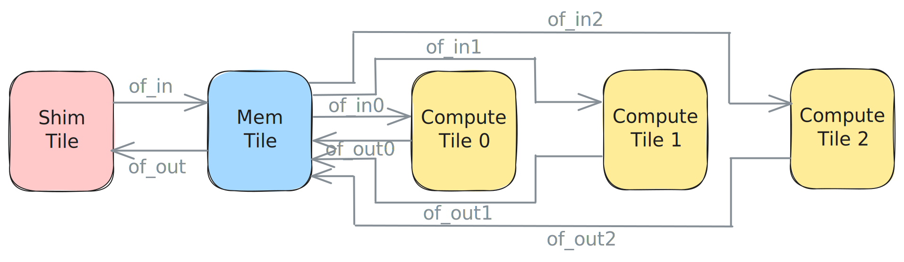

<!---//===- README.md ---------------------------------------*- Markdown -*-===//
//
// This file is licensed under the Apache License v2.0 with LLVM Exceptions.
// See https://llvm.org/LICENSE.txt for license information.
// SPDX-License-Identifier: Apache-2.0 WITH LLVM-exception
//
// Copyright (C) 2024, Advanced Micro Devices, Inc.
// 
//===----------------------------------------------------------------------===//-->

# <ins>Section 2d - Programming for multiple cores</ins>

This section will focus on the process of taking code written for a single core and transforming it into a design with multiple cores relatively quickly. For this we will start with the code in [aie2.py](./aie2.py) which contains a simple design running on a single compute tile, and progressively turn it into the code in [aie2_multi.py](./aie2_multi.py) which contains the same design that distributes the work to three compute tiles.

The first step in the design is the tile declaration. In the simple design we use one Shim tile to bring data from external memory into the AIE array inside of a Mem tile that will then send the data to a compute tile, wait for the output and send it back to external memory through the Shim tile. Below is how those tiles are declared in the simple design:
```python
ShimTile = tile(0, 0)
MemTile = tile(0, 1)
ComputeTile = tile(0, 2)
```
For our scale out design we will keep a using a single Shim tile and a single Mem tile but we will increase the number of compute tiles to three. We can do so cleanly and efficiently in the following way:
```python
n_cores = 3

ShimTile = tile(0, 0)
MemTile = tile(0, 1)
ComputeTiles = [tile(0, 2 + i) for i in range(n_cores)]
```
Each compute tile can now be accessed by indexing into the `ComputeTiles` array.

Once the tiles have been declared the next step is to setup the data movement using Object FIFOs. The simple design has a total of four double-buffered Object FIFOs and two object_fifo_links. The Object FIFOs move objects of datatype `<48xi32>`. `of_in` brings data from the Shim tile to the Mem tile and is linked to `of_in0` which brings data from the Mem tile to the compute tile. For the output side, `of_out0` brings data from the compute tile to the Mem tile where it is linked to `of_out` to bring the data out through the Shim tile. The corresponding code is shown below:
```python
data_size = 48
buffer_depth = 2
memRef_48_ty = T.memref(48, T.i32())


# Input data movement

of_in = object_fifo("in", ShimTile, MemTile, buffer_depth, memRef_data_ty)
of_in1 = object_fifo("in0", MemTile, ComputeTile, buffer_depth, memRef_data_ty)
object_fifo_link(of_in, of_in0)


# Output data movement

of_out = object_fifo("out", MemTile, ShimTile, buffer_depth, memRef_data_ty)
of_out0 = object_fifo("out0", ComputeTile, MemTile, buffer_depth, memRef_data_ty)
object_fifo_link(of_out0, of_out)
```


We can apply the same method as in the tile declaration to generate the data movement from the Mem tile to the three compute tiles and back. The `object_fifo_link` operations change from the 1-to-1 case to distributing the original `<48xi32>` data tensors to the three compute tiles as smaller `<16xi32>` tensors on the input side, and to joining the output from each compute tile to the Mem tile on the output side. A list of names and a map from names to Object FIFO is used in order to keep track of the input and output Object FIFOs. With these changes the code becomes:
```python
n_cores = 3
data_size = 48
tile_size = data_size // 3

buffer_depth = 2
memRef_tiles_ty = T.memref(tile_size, T.i32())
memRef_data_ty = T.memref(data_size, T.i32())


# Input data movement

inX_fifo_names = [f"in{i}" for i in range(n_cores)]     # list of input object FIFO names
inX_fifos = {}                                          # map name to its object FIFO

of_in = object_fifo("in", ShimTile, MemTile, buffer_depth, memRef_data_ty)
for i in range(n_cores):
    inX_fifos[inX_fifo_names[i]] = object_fifo(
        inX_fifo_names[i], MemTile, ComputeTiles[i], buffer_depth, memRef_tiles_ty
    )
object_fifo_link(of_in, [inX_fifo_names])


# Output data movement

outX_fifo_names = [f"out{i}" for i in range(n_cores)]    # list of output object FIFO names
outX_fifos = {}                                          # map name to its object FIFO

of_out = object_fifo("out", ShimTile, MemTile, buffer_depth, memRef_data_ty)
for i in range(n_cores):
    outX_fifos[outX_fifo_names[i]] = object_fifo(
        outX_fifo_names[i], ComputeTiles[i], MemTile, buffer_depth, memRef_tiles_ty
    )
object_fifo_link([outX_fifo_names], of_out)
```



The core of this simple design acquires one object of each Object FIFO, adds `1` to each entry of the incoming data, copies it to the object of the outgoing Object FIFO, then releases both objects:
```python
@core(ComputeTile)
def core_body():
    # Effective while(1)
    for _ in for_(0xFFFFFFFF):
        elem_in = of_in0.acquire(ObjectFifoPort.Consume, 1)
        elem_out = of_out0.acquire(ObjectFifoPort.Produce, 1)
        for i in for_(data_size):
            v0 = memref.load(elem_in, [i])
            v1 = arith.addi(v0, arith.constant(1, T.i32()))
            memref.store(v1, elem_out, [i])
            yield_([])
        of_in0.release(ObjectFifoPort.Consume, 1)
        of_out0.release(ObjectFifoPort.Produce, 1)
        yield_([])
```
Once again we apply the same logic and use a for loop over our three cores to write the code which will be executed on the three compute tiles. Each tile will index the `inX_fifos` and `outX_fifos` maps to retrieve the Object FIFOs it will acquire and release from. This process results in the following code:
```python
for i in range(n_cores):
    # Compute tile i
    @core(ComputeTiles[i])
    def core_body():
        for _ in for_(0xFFFFFFFF):
            elem_in = inX_fifos[inX_fifo_names[i]].acquire(
                ObjectFifoPort.Consume, 1
            )
            elem_out = outX_fifos[outX_fifo_names[i]].acquire(
                ObjectFifoPort.Produce, 1
            )
            for i in for_(tile_size):
                v0 = memref.load(elem_in, [i])
                v1 = arith.addi(v0, arith.constant(1, T.i32()))
                memref.store(v1, elem_out, [i])
                yield_([])
            inX_fifos[inX_fifo_names[i]].release(
                ObjectFifoPort.Consume, 1
            )
            outX_fifos[outX_fifo_names[i]].release(
                ObjectFifoPort.Produce, 1
            )
            yield_([])
```
