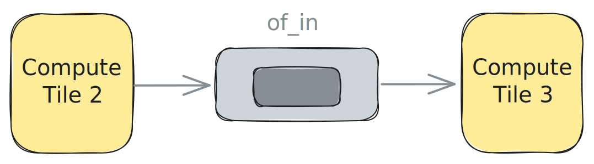
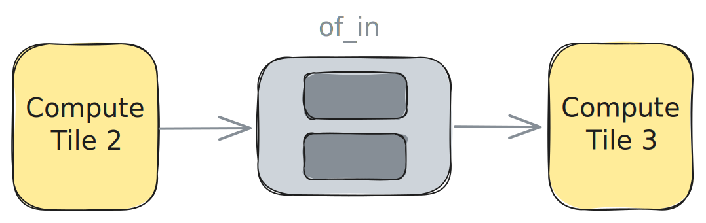

<!---//===- README.md ---------------------------------------*- Markdown -*-===//
//
// This file is licensed under the Apache License v2.0 with LLVM Exceptions.
// See https://llvm.org/LICENSE.txt for license information.
// SPDX-License-Identifier: Apache-2.0 WITH LLVM-exception
//
// Copyright (C) 2024, Advanced Micro Devices, Inc.
// 
//===----------------------------------------------------------------------===//-->

# <ins>Single / Double Buffer</ins>

The design in [single_buffer.py](./single_buffer.py) uses an Object FIFO `of_in` to transfer data from producer tile `ComputeTile2` to consumer tile `ComputeTile3`. The Object FIFO has a depth of `1` which describes a single buffer between the two tiles as shown in the figure below.



Both the producer and the consumer processes in this design have trivial tasks. The producer process running on `ComputeTile2` acquires the single buffer and writes `1` into all its entries before releasing it for consumption. The producer process running on `ComputeTile3` acquires the single buffer and immediately releases it back for the producer.

To have this design use a double, or ping-pong, buffer for the data transfer instead, the user need only set the depth of the Object FIFO to `2`. No other change is required as the Object FIFO lowering will take care of properly cycling between the ping and pong buffers. To change the depth of `of_in` the user should write:
```python
of_in = object_fifo("in", ComputeTile2, ComputeTile3, 2, memRef_16_ty) # double buffer
```
This change effectively increases the number of available resources of the Object FIFO as is shown in the figure below:



All examples available in the [programming_examples](../../../../programming_examples/) contain this data movement pattern.

-----
[[Up](..)] [[Next](../02_external_mem_to_core/)]
