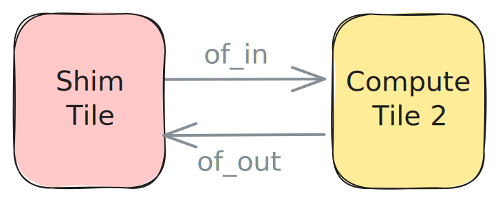

<!---//===- README.md ---------------------------------------*- Markdown -*-===//
//
// This file is licensed under the Apache License v2.0 with LLVM Exceptions.
// See https://llvm.org/LICENSE.txt for license information.
// SPDX-License-Identifier: Apache-2.0 WITH LLVM-exception
//
// Copyright (C) 2024, Advanced Micro Devices, Inc.
// 
//===----------------------------------------------------------------------===//-->

# <ins>External Memory to Core</ins>

The design in [ext_to_core.py](./ext_to_core.py) uses an Object FIFO `of_in` to bring data from the `ShimTile` to `ComputeTile2` and another Object FIFO `of_out` to send the data from the compute tile to external memory. Each fifo uses a double buffer.



Both a consumer and a producer process are running on `ComputeTile2`. The producer process acquires one object from `of_in` to consume and one object from `of_out` to produce into. It then reads the value of the input object and adds `1` to all its entries before releasing both objects.

It is possible to build, run and test this design with the following commands:
```
make
make run
```
The [test.cpp](./test.cpp) as well as the `# To/from AIE-array data movement` section of the design code will be described in detail in [Section 3](../../../section-3/).

Other examples containing this data movement pattern are available in the [programming_examples](../../../../programming_examples/). A few notable ones are [vector_reduce_add](../../../../programming_examples/basic/vector_reduce_add/) and [vector_scalar_add](../../../../programming_examples/basic/vector_scalar_add/).
