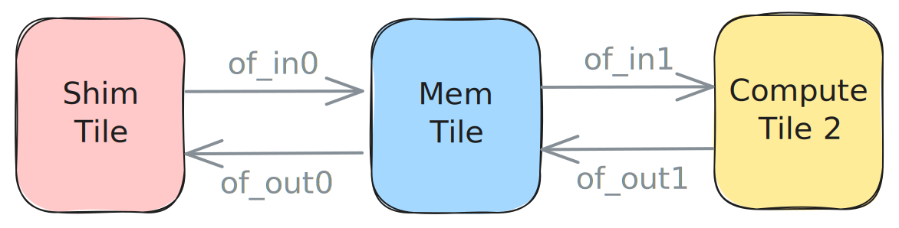

<!---//===- README.md ---------------------------------------*- Markdown -*-===//
//
// This file is licensed under the Apache License v2.0 with LLVM Exceptions.
// See https://llvm.org/LICENSE.txt for license information.
// SPDX-License-Identifier: Apache-2.0 WITH LLVM-exception
//
// Copyright (C) 2024, Advanced Micro Devices, Inc.
// 
//===----------------------------------------------------------------------===//-->

# <ins>External Memory to Core through L2</ins>

The design in [ext_to_coreL2.py](./ext_to_core.py) is very similar to the one in the previous [example](../02_external_mem_to_core/) with the difference being that in this design we first bring the `24xi32` data from external memory to the `MemTile` with `of_in0`. We then use `of_in1` to bring smaller `8xi32` slices of the data from the `MemTile` to `ComputeTile2`. Two fifos then bring the data first to the `MemTile` via `of_out1` as `8xi32` tensors, then to the `ShimTile` via `of_out0` as `24xi32` ones. All fifos use double buffers.



```python
  # AIE-array data movement with object fifos
  # Input
  of_in0 = object_fifo("in0", ShimTile, MemTile, 2, memRef_24_ty)
  of_in1 = object_fifo("in1", MemTile, ComputeTile2, 2, memRef_8_ty)
  object_fifo_link(of_in0, of_in1)

  # Output
  of_out0 = object_fifo("out0", MemTile, ShimTile, 2, memRef_24_ty)
  of_out1 = object_fifo("out1", ComputeTile2, MemTile, 2, memRef_8_ty)
  object_fifo_link(of_out1, of_out0)
```

The processes on the compute tile work the same way as in the previous design. The producer process acquires one object from `of_in1` to consume and one object from `of_out1` to produce into. It then reads the value of the input object and adds `1` to all its entries before releasing both objects.

It is possible to build, run and test this design with the following commands:
```
make
make run
```
The [test.cpp](./test.cpp) as well as the `# To/from AIE-array data movement` section of the design code will be described in detail in [Section 2g](../../section-2g/).

Other examples containing this data movement pattern are available in the [programming_examples/matrix_multiplication/](../../../../programming_examples/basic/matrix_multiplication/).

-----
[[Prev](../02_external_mem_to_core/)] [[Up](..)] [[Next](../04_distribute_L2/)]
