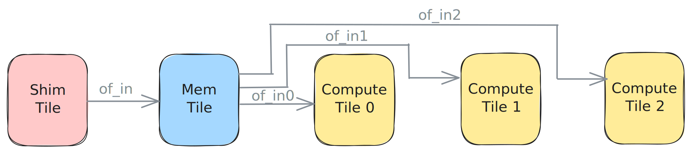

<!---//===- README.md ---------------------------------------*- Markdown -*-===//
//
// This file is licensed under the Apache License v2.0 with LLVM Exceptions.
// See https://llvm.org/LICENSE.txt for license information.
// SPDX-License-Identifier: Apache-2.0 WITH LLVM-exception
//
// Copyright (C) 2024, Advanced Micro Devices, Inc.
// 
//===----------------------------------------------------------------------===//-->

# <ins>Distribute from L2</ins>

The design in [distribute_L2.py](./distribute_L2.py) uses an Object FIFO `of_in` to bring data from external memory via the `ShimTile` to the `MemTile` as `24xi32` tensors. From there three Object FIFOs distribute smaller `8xi32` parts of the data to each of the three compute tiles. Each tile receives a different part of the larger data based on the order of the Object FIFOs in the `object_fifo_link`.

All compute tiles are running the same process of acquring one object from their respective input Object FIFOs to consume, add `1` to all of its entries, and release the object. The [join design](../05_join_L2/) shows how the data is sent back out to external memory and tested.

Other examples containing this data movement pattern are available in the [programming_examples/matrix_multiplication/](../../../../programming_examples/basic/matrix_multiplication/).

-----
[[Prev](../03_external_mem_to_core_L2/)] [[Up](..)] [[Next](../05_join_L2/)]
