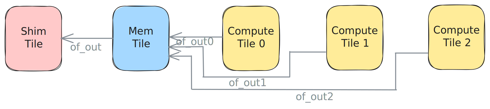

<!---//===- README.md ---------------------------------------*- Markdown -*-===//
//
// This file is licensed under the Apache License v2.0 with LLVM Exceptions.
// See https://llvm.org/LICENSE.txt for license information.
// SPDX-License-Identifier: Apache-2.0 WITH LLVM-exception
//
// Copyright (C) 2024, Advanced Micro Devices, Inc.
// 
//===----------------------------------------------------------------------===//-->

# <ins>Join in L2</ins>

The design in [join_L2.py](./join_L2.py) uses three Object FIFOs from each of the three compute tiles to send `8xi32` pieces of data to the `MemTile`. There, the data is joined together into `24xi32` tensors based on the order of the fifos in the `object_fifo_link`. The data is then sent out to external memory using `of_out`.



All compute tiles are running the same process of acquring one object from their respective input Object FIFOs to produce, write `1` to all of its entries, and release the object.

This design is combined with the previous [distribute](../04_distribute_L2/distribute_L2.py) design to achieve a full data movement from external memory to the AIE array and back. The resulting code is available in [distribute_and_join_L2.py](./distribute_and_join_L2.py). It is possible to build, run and test it with the following commands:
```
make
make run
```
The [test.cpp](./test.cpp) as well as the `# To/from AIE-array data movement` section of the design code will be described in detail in [Section 2g](../../section-2g/).

> **NOTE:**  The design in [distribute_and_join_L2.py](./distribute_and_join_L2.py) takes [ext_to_core](../03_external_mem_to_core_L2/) and distributes smaller pieces of the input data to three compute tiles. This pattern is typically used when the input data is too large for a single core's memory module and needs to be processed in smaller chunks, the result of which is then joined together to produce the final output.

Other examples containing this data movement pattern are available in the [programming_examples](../../../../programming_examples/). A notable one is [vector_exp](../../../../programming_examples/basic/vector_exp/).

-----
[[Top](..)]
