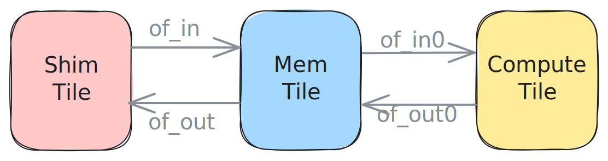

<!---//===- README.md ---------------------------------------*- Markdown -*-===//
//
// This file is licensed under the Apache License v2.0 with LLVM Exceptions.
// See https://llvm.org/LICENSE.txt for license information.
// SPDX-License-Identifier: Apache-2.0 WITH LLVM-exception
//
// Copyright (C) 2024, Advanced Micro Devices, Inc.
// 
//===----------------------------------------------------------------------===//-->

# <ins>Section 2e - Programming for multiple cores</ins>

* [Section 2 - Data Movement (Object FIFOs)](../../section-2/)
    * [Section 2a - Introduction](../section-2a/)
    * [Section 2b - Key Object FIFO Patterns](../section-2b/)
    * [Section 2c - Data Layout Transformations](../section-2c/)
    * [Section 2d - Runtime Data Movement](../section-2d/)
    * Section 2e - Programming for multiple cores
    * [Section 2f - Practical Examples](../section-2f/)
    * [Section 2g - Data Movement Without Object FIFOs](../section-2g/)

-----

This section will focus on the process of taking code written for a single core and transforming it into a design with multiple cores relatively quickly. We will go over this process both for the highest level of IRON API as well as for the explicitly placed level.

### High-Level IRON

We will start with the code in [aie2.py](./aie2.py) which contains a simple design running on a single Worker, and progressively turn it into the code in [aie2_multi.py](./aie2_multi.py) which contains the same design that distributes the work to three Workers.

In the first part of our design we set up the data movement using Object FIFOs. The simple design has a total of four Object FIFOs, two of which are created by forwarding data for an implicit copy. The Object FIFOs move objects of datatype `<48xi32>`. `of_in` brings data from external memory and is linked, through a Mem tile, to `of_in0` which brings data from the Mem tile to the Worker. For the output side, `of_out0` brings data from the Worker to the Mem tile where it is linked to `of_out` to bring the data out to external memory. The corresponding code is shown below:
```python
data_size = 48

# Define tensor types
data_ty = np.ndarray[(data_size,), np.dtype[np.int32]]

# Input data movement
of_in = ObjectFifo(data_ty, name="in")
of_in1 = of_in.cons().forward(obj_type=data_ty, name="in1")

# Output data movement
of_out1 = ObjectFifo(data_ty, name="out1")
of_out = of_out1.cons().forward(obj_type=data_ty, name="out")
```
For our scale out design we will keep using a single Mem tile, but we will increase the number of Workers to three. Now each Worker will receive objects of datatype `<16xi32>`. Data brought into the AIE array via `of_in` will be split into three Object FIFOs for each Worker. Similarly data produced by each Worker will be joined and sent to external memory through `of_out`. Please [see distribute and join patterns](../section-2b/03_Link_Distribute_Join/README.md) for more details. These changes result in the following code:
```python
n_workers = 3
data_size = 48
tile_size = data_size // 3

# Define tensor types
data_ty = np.ndarray[(data_size,), np.dtype[np.int32]]
tile_ty = np.ndarray[(tile_size,), np.dtype[np.int32]]

# Input data movement
of_offsets = [tile_size * worker for worker in range(n_workers)]

of_in = ObjectFifo(data_ty, name="in")
of_ins = (
    of_in
    .cons()
    .split(
        of_offsets,
        obj_types=[tile_ty] * n_workers,
        names=[f"in{worker}" for worker in range(n_workers)],
    )
)

# Output data movement
of_out = ObjectFifo(data_ty, name="out")
of_outs = (
    of_out.prod().join(
        of_offsets,
        obj_types=[tile_ty] * n_workers,
        names=[f"out{worker}" for worker in range(n_workers)],
    )
)
```
The Worker of this simple design acquires one object of each Object FIFO, adds `1` to each entry of the incoming data, copies it to the object of the outgoing Object FIFO, then releases both objects:
```python
# Task for the core to perform
def core_fn(of_in, of_out):
    elem_in = of_in.acquire(1)
    elem_out = of_out.acquire(1)
    for _ in range_(data_size):
        elem_out[i] = elem_in[i] + 1
    of_in.release(1)
    of_out.release(1)


# Create a worker to perform the task
my_worker = Worker(core_fn, [of_in1.cons(), of_out1.prod()])
```
For our larger design we create more Workers and select the input and output Object FIFOs for each Worker from the lists we made in the previous part:
```python
# Create workers to perform the tasks
workers = []
for worker in range(n_workers):
    workers.append(
        Worker(
            core_fn,
            [
                of_ins[worker].cons(),
                of_outs[worker].prod(),
            ],
        )
    )
```
Finally, in our simple design we write a runtime sequence to bring data to/from external memory and start our Worker:
```python
# Runtime operations to move data to/from the AIE-array
rt = Runtime()
with rt.sequence(data_size, data_size, data_size) as (a_in, b_out, _):
    rt.start(my_worker)
    rt.fill(of_in.prod(), a_in)
    rt.drain(of_out.cons(), b_out, wait=True)
```
The runtime sequence remains largely unchanged for the larger design except that it has to start all three Workers:
```python
# Runtime operations to move data to/from the AIE-array
rt = Runtime()
with rt.sequence(data_size, data_size, data_size) as (a_in, b_out, _):
    rt.start(*workers)
    rt.fill(of_in.prod(), a_in)
    rt.drain(of_out.cons(), b_out, wait=True)
```

To compile the designs:
```python
make all
```

### Explicitly Placed Level IRON

We will start with the code in [aie2_placed.py](./aie2_placed.py) which contains a simple design running on a single compute tile, and progressively turn it into the code in [aie2_placed_multi.py](./aie2_placed_multi.py) which contains the same design that distributes the work to three compute tiles.

The first step in the design is the tile declaration. In the simple design we use one Shim tile to bring data from external memory into the AIE array inside of a Mem tile that will then send the data to a compute tile, wait for the output and send it back to external memory through the Shim tile. Below is how those tiles are declared in the simple design:
```python
ShimTile = tile(0, 0)
MemTile = tile(0, 1)
ComputeTile = tile(0, 2)
```
For our scale out design we will keep using a single Shim tile and a single Mem tile, but we will increase the number of compute tiles to three. We can do so cleanly and efficiently in the following way:
```python
n_cores = 3

ShimTile = tile(0, 0)
MemTile = tile(0, 1)
ComputeTiles = [tile(0, 2 + i) for i in range(n_cores)]
```
Each compute tile can now be accessed by indexing into the `ComputeTiles` array.

Once the tiles have been declared, the next step is to set up the data movement using Object FIFOs. The simple design has a total of four double-buffered Object FIFOs and two `object_fifo_links`. The Object FIFOs move objects of datatype `<48xi32>`. `of_in` brings data from the Shim tile to the Mem tile and is linked to `of_in0` which brings data from the Mem tile to the compute tile. For the output side, `of_out0` brings data from the compute tile to the Mem tile where it is linked to `of_out` to bring the data out through the Shim tile. The corresponding code is shown below:
```python
data_size = 48
buffer_depth = 2
data_ty = np.ndarray[(48,), np.dtype[np.int32]]


# Input data movement

of_in = object_fifo("in", ShimTile, MemTile, buffer_depth, data_ty)
of_in0 = object_fifo("in0", MemTile, ComputeTile, buffer_depth, data_ty)
object_fifo_link(of_in, of_in0)


# Output data movement

of_out = object_fifo("out", MemTile, ShimTile, buffer_depth, data_ty)
of_out0 = object_fifo("out0", ComputeTile, MemTile, buffer_depth, data_ty)
object_fifo_link(of_out0, of_out)
```



We can apply the same method as in the tile declaration to generate the data movement from the Mem tile to the three compute tiles and back ([see distribute and join patterns](../section-2b/03_Implicit_Copy/README.md)). The `object_fifo_link` operations change from the 1-to-1 case to distributing the original `<48xi32>` data tensors to the three compute tiles as smaller `<16xi32>` tensors on the input side, and to joining the output from each compute tile to the Mem tile on the output side. Lists of Object FIFOs are used to keep track of the input and output Object FIFOs. With these changes the code becomes:
```python
n_cores = 3
data_size = 48
tile_size = data_size // 3

buffer_depth = 2
data_ty = np.ndarray[(data_size,), np.dtype[np.int32]]
tile_ty = np.ndarray[(tile_size,), np.dtype[np.int32]]

# Input data movement
inX_fifos = []

of_in = object_fifo("in", ShimTile, MemTile, buffer_depth, data_ty)
for i in range(n_cores):
    inX_fifos.append(object_fifo(
        f"in{i}", MemTile, ComputeTiles[i], buffer_depth, tile_ty
    ))

# Calculate the offsets into the input/output data for the join/distribute
if n_cores > 1:
    of_offsets = [16 * i for i in range(n_cores)]
else:
    of_offsets = []
object_fifo_link(of_in, inX_fifos, [], of_offsets)


# Output data movement
outX_fifos = []

of_out = object_fifo("out", ShimTile, MemTile, buffer_depth, data_ty)
for i in range(n_cores):
    outX_fifos.append(object_fifo(
        f"out{i}", ComputeTiles[i], MemTile, buffer_depth, tile_ty
    ))
object_fifo_link(outX_fifos, of_out, of_offsets, [])
```


The core of this simple design acquires one object of each Object FIFO, adds `1` to each entry of the incoming data, copies it to the object of the outgoing Object FIFO, then releases both objects:
```python
@core(ComputeTile)
def core_body():
    # Effective while(1)
    for _ in range_(0xFFFFFFFF):
        elem_in = of_in0.acquire(ObjectFifoPort.Consume, 1)
        elem_out = of_out0.acquire(ObjectFifoPort.Produce, 1)
        for i in range_(data_size):
            elem_out[i] = elem_in[i] + 1
        of_in0.release(ObjectFifoPort.Consume, 1)
        of_out0.release(ObjectFifoPort.Produce, 1)
```
Once again we apply the same logic and use a `for`-loop over our three cores to write the code which will be executed on the three compute tiles. Each tile will index the `inX_fifos` and `outX_fifos` maps to retrieve the Object FIFOs it will acquire and release from. This process results in the following code:
```python
for i in range(n_cores):
    # Compute tile i
    @core(ComputeTiles[i])
    def core_body():
        for _ in range_(0xFFFFFFFF):
            elem_in = inX_fifos[i].acquire(ObjectFifoPort.Consume, 1)
            elem_out = outX_fifos[i].acquire(ObjectFifoPort.Produce, 1)
            for i in range_(tile_size):
                elem_out[i] = elem_in[i] + 1
            inX_fifos[i].release(ObjectFifoPort.Consume, 1)
            outX_fifos[i].release(ObjectFifoPort.Produce, 1)
```

To compile the designs:
```python
make placed
```

-----
[[Prev - Section 2d](../section-2d/)] [[Up](..)] [[Next - Section 2f](../section-2f/)]
