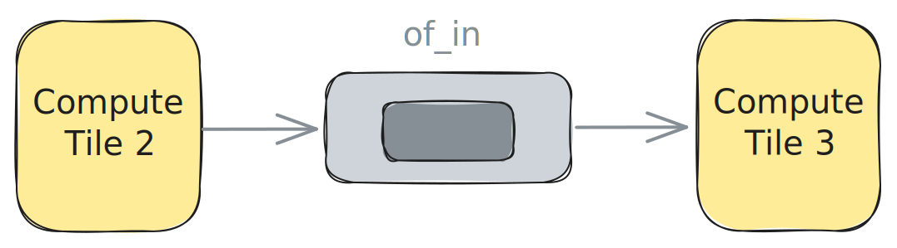

<!---//===- README.md ---------------------------------------*- Markdown -*-===//
//
// Copyright (C) 2025-2026 Advanced Micro Devices, Inc.
// SPDX-License-Identifier: Apache-2.0 WITH LLVM-exception
//
//===----------------------------------------------------------------------===//-->

# Single / Double Buffer

The design in [single_buffer.py](./single_buffer.py) uses an ObjectFifo `of_in` to transfer the output of `my_worker` to `my_worker2` and an ObjectFifo `of_out` to transfer the output of `my_worker2` to external memory. `of_in` has a depth of `1` which describes a single buffer between the two Workers as shown in the figure below. 



> **NOTE:**  The image above assumes that the Workers are already mapped to `ComputeTile2` and `ComputeTile3`. However, this is not the only possible mapping and when creating a Worker, its placement can be left to the compiler.

Both the producer and the consumer processes in this design have trivial tasks. The producer process running on `my_worker` acquires the single buffer and writes `1` into all its entries before releasing it for consumption. The consumer process running on `my_worker2` acquires the single buffer from `of_in` as well as the single buffer from `of_out`, copies the data from the input ObjectFifo to the output ObjectFifo, and releases both objects for other processes.

To have this design use a double, or ping-pong, buffer for the data transfer instead, the user need only set the depth of the ObjectFifos to `2`. No other change is required as the ObjectFifo lowering will take care of properly cycling between the ping and pong buffers. To change the depth the user should write:
```python
of_in = ObjectFifo(data_ty, name="in", depth=2) # double buffer
of_out = ObjectFifo(data_ty, name="out", depth=2) # double buffer
```
This change effectively increases the number of available resources of the ObjectFifos as is shown in the figure below:


All examples available in the [programming_examples](../../../../programming_examples/) contain this data movement pattern.

The design is wrapped in `@iron.jit`, so a single command JIT-compiles and runs it on the attached NPU:
```bash
make run                              # builds + runs on the NPU (devicename={npu,npu2})
make emit-mlir                        # writes the lowered MLIR to build/aie.mlir without touching the NPU
```

-----
[Up](..) [Next](../02_external_mem_to_core/)
