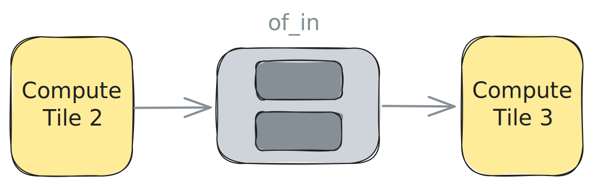

<!---//===- README.md ---------------------------------------*- Markdown -*-===//
//
// This file is licensed under the Apache License v2.0 with LLVM Exceptions.
// See https://llvm.org/LICENSE.txt for license information.
// SPDX-License-Identifier: Apache-2.0 WITH LLVM-exception
//
// Copyright (C) 2024, Advanced Micro Devices, Inc.
// 
//===----------------------------------------------------------------------===//-->

# <ins>Single / Double Buffer</ins>

The design in [single_buffer.py](./single_buffer.py) uses an Object FIFO `of_in` to transfer the output of `my_worker` to `my_worker2` and an Object FIFO `of_out` to transfer the output of `my_worker2` to external memory. `of_in` has a depth of `1` which describes a single buffer between the two Workers as shown in the figure below. 


> **NOTE:**  The image above assumes that the Workers are already mapped to `ComputeTile2` and `ComputeTile3`. However, this is not the only possible mapping and when creating a Worker, its placement can be left to the compiler.

Both the producer and the consumer processes in this design have trivial tasks. The producer process running on `my_worker` acquires the single buffer and writes `1` into all its entries before releasing it for consumption. The consumer process running on `my_worker2` acquires the single buffer from `of_in` as well as the single buffer from `of_out`, copies the data from the input Object FIFO to the output Object FIFO, and releases both objects for other processes.

To have this design use a double, or ping-pong, buffer for the data transfer instead, the user need only set the depth of the Object FIFOs to `2`. No other change is required as the Object FIFO lowering will take care of properly cycling between the ping and pong buffers. To change the depth the user should write:
```python
of_in = ObjectFifo(data_ty, name="in", depth=2) # double buffer
of_out = ObjectFifo(data_ty, name="out", depth=2) # double buffer
```
This change effectively increases the number of available resources of the Object FIFOs as is shown in the figure below:



All examples available in the [programming_examples](../../../../programming_examples/) contain this data movement pattern.

It is possible to compile, run and test this design with the following commands:
```bash
make
make run
```

The explicitly placed level of IRON programming for this design is available in [single_buffer_placed.py](./single_buffer_placed.py). It can be compiled, run and tested with the following commands:
```bash
env use_placed=1 make
make run
```

-----
[[Up](..)] [[Next](../02_external_mem_to_core/)]
