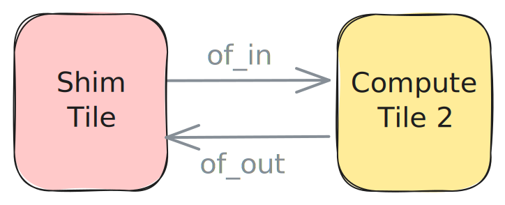

<!---//===- README.md ---------------------------------------*- Markdown -*-===//
//
// Copyright (C) 2024-2026 Advanced Micro Devices, Inc.
// SPDX-License-Identifier: Apache-2.0 WITH LLVM-exception
//
//===----------------------------------------------------------------------===//-->

# External Memory to Core

The design in [ext_to_core.py](./ext_to_core.py) uses an ObjectFifo `of_in` to bring data from external memory to `my_worker` and another ObjectFifo `of_out` to send the data from the Worker to external memory. Each fifo uses a double buffer.



```python
# Dataflow with ObjectFifos
of_in = ObjectFifo(tile_ty, name="in")
of_out = ObjectFifo(tile_ty, name="out")
```

Both consumer and producer processes are running on `my_worker`. The producer process acquires one object from `of_in` to consume and one object from `of_out` to produce into. It then reads the value of the input object and adds `1` to all its entries before releasing both objects.

The design is wrapped in `@iron.jit`, so a single command JIT-compiles and runs it on the attached NPU:
```bash
make run                              # builds + runs on the NPU (devicename={npu,npu2})
make emit-mlir                        # writes the lowered MLIR to build/aie.mlir without touching the NPU
```

The `# To/from AIE-array data movement` section of the design code is described in detail in [Section 2d](../../section-2d/).

Other examples containing this data movement pattern are available in the [programming_examples](../../../../programming_examples/). A few notable ones are [vector_reduce_add](../../../../programming_examples/basic/vector_reduce_add/) and [vector_scalar_add](../../../../programming_examples/basic/vector_scalar_add/).

-----
[Prev](../01_single_double_buffer/) &middot; [Up](..) &middot; [Next](../03_external_mem_to_core_L2/)
