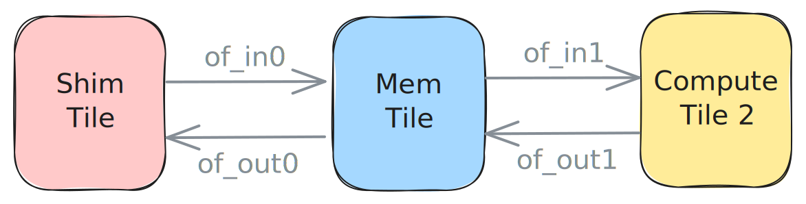

<!---//===- README.md ---------------------------------------*- Markdown -*-===//
//
// This file is licensed under the Apache License v2.0 with LLVM Exceptions.
// See https://llvm.org/LICENSE.txt for license information.
// SPDX-License-Identifier: Apache-2.0 WITH LLVM-exception
//
// Copyright (C) 2024, Advanced Micro Devices, Inc.
// 
//===----------------------------------------------------------------------===//-->

# <ins>External Memory to Core through L2</ins>

The design in [ext_to_coreL2.py](./ext_to_core.py) is very similar to the one in the previous [example](../02_external_mem_to_core/) with the difference being that in this design we first bring the `24xi32` data from external memory to L2 memory (i.e., a Mem tile) with `of_in0`. We then use `of_in1` to bring smaller `8xi32` slices of the data from the `MemTile` to `my_worker`. Two FIFOs then bring the data first to L2 via `of_out1` as `8xi32` tensors, then to external memory via `of_out0` as `24xi32` ones. All FIFOs use double buffers.



```python
# Dataflow with ObjectFifos
# Input
of_in0 = ObjectFifo(tile24_ty, name="in0")
of_in1 = of_in0.cons().forward(name="in1", obj_type=tile8_ty)

# Output
of_out1 = ObjectFifo(tile8_ty, name="out1")
of_out0 = of_out1.cons().forward(name="out0", obj_type=tile24_ty)
```

The processes on the Worker are the same as in the previous design. The producer process acquires one object from `of_in1` to consume and one object from `of_out1` to produce into. It then reads the value of the input object and adds `1` to all its entries before releasing both objects.

It is possible to compile, run and test this design with the following commands:
```bash
make
make run
```

The explicitly placed level of IRON programming for this design is available in [ext_to_core_L2_placed.py](./ext_to_core_L2_placed.py). It can be compiled, run and tested with the following commands:
```bash
env use_placed=1 make
make run
```

The [test.cpp](./test.cpp) as well as the `# To/from AIE-array data movement` section of the design code will be described in detail in [Section 2d](../../section-2d/).

Other examples containing this data movement pattern are available in the [programming_examples/matrix_multiplication/](../../../../programming_examples/basic/matrix_multiplication/).

-----
[[Prev](../02_external_mem_to_core/)] [[Up](..)] [[Next](../04_distribute_L2/)]
