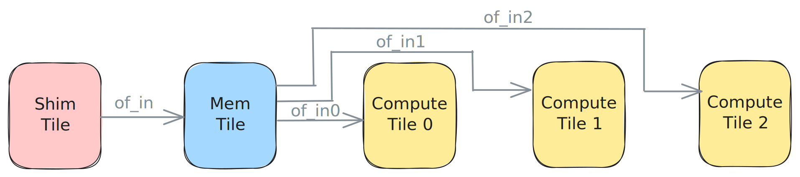

<!---//===- README.md ---------------------------------------*- Markdown -*-===//
//
// Copyright (C) 2025-2026 Advanced Micro Devices, Inc.
// SPDX-License-Identifier: Apache-2.0 WITH LLVM-exception
//
//===----------------------------------------------------------------------===//-->

# Distribute from L2

The design in [distribute_L2.py](./distribute_L2.py) uses an ObjectFifo `of_in` to bring data from external memory to L2 as `24xi32` tensors. From there, the data is distributed to three ObjectFifos in smaller `8xi32` parts. Each Worker receives a different part of the larger data based on which of the three ObjectFifo it accesses.



```python
# Dataflow with ObjectFifos
# Input
of_offsets = [8 * worker for worker in range(n_workers)]

of_in = ObjectFifo(tile24_ty, name="in")
of_ins = (
    of_in
    .cons()
    .split(
        of_offsets,
        obj_types=[tile8_ty] * n_workers,
        names=[f"in{worker}" for worker in range(n_workers)],
    )
)
```

All Workers are running the same process of acquiring one object from their respective input ObjectFifos to consume, adding `1` to all of its entries, and releasing the object. The [join design](../05_join_L2/) shows how the data is sent back out to external memory and tested.

This design is structural-only — the Workers acquire + release but do no compute, so there is no NPU run path. To inspect the generated MLIR:
```bash
make emit-mlir                        # writes the lowered MLIR to build/aie.mlir
```

Other examples containing this data movement pattern are available in the [programming_examples/matrix_multiplication/](../../../../programming_examples/basic/matrix_multiplication/).

-----
[Prev](../03_external_mem_to_core_L2/) &middot; [Up](..) &middot; [Next](../05_join_L2/)
