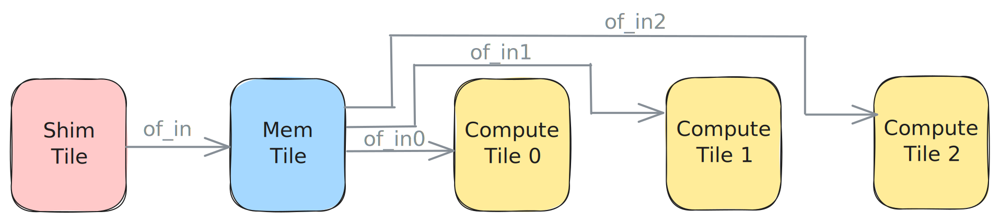

<!---//===- README.md ---------------------------------------*- Markdown -*-===//
//
// This file is licensed under the Apache License v2.0 with LLVM Exceptions.
// See https://llvm.org/LICENSE.txt for license information.
// SPDX-License-Identifier: Apache-2.0 WITH LLVM-exception
//
// Copyright (C) 2024, Advanced Micro Devices, Inc.
// 
//===----------------------------------------------------------------------===//-->

# <ins>Distribute from L2</ins>

The design in [distribute_L2.py](./distribute_L2.py) uses an Object FIFO `of_in` to bring data from external memory to L2 as `24xi32` tensors. From there, the data is distributed to three Object FIFOs in smaller `8xi32` parts. Each Worker receives a different part of the larger data based on which of the three Object FIFO it accesses.



```python
# Dataflow with ObjectFifos
# Input
of_offsets = [8 * worker for worker in range(n_workers)]

of_in = ObjectFifo(tile24_ty, name="in")
of_ins = (
    of_in
    .cons()
    .split(
        of_offsets,
        obj_types=[tile8_ty] * n_workers,
        names=[f"in{worker}" for worker in range(n_workers)],
    )
)
```

All Workers are running the same process of acquiring one object from their respective input Object FIFOs to consume, adding `1` to all of its entries, and releasing the object. The [join design](../05_join_L2/) shows how the data is sent back out to external memory and tested.

It is possible to compile this design with the following commands:
```bash
make
```

The explicitly placed level of IRON programming for this design is available in [distribute_L2_placed.py](./distribute_L2_placed.py). It can be compiled with the following commands:
```bash
env use_placed=1 make
```

Other examples containing this data movement pattern are available in the [programming_examples/matrix_multiplication/](../../../../programming_examples/basic/matrix_multiplication/).

-----
[[Prev](../03_external_mem_to_core_L2/)] [[Up](..)] [[Next](../05_join_L2/)]
