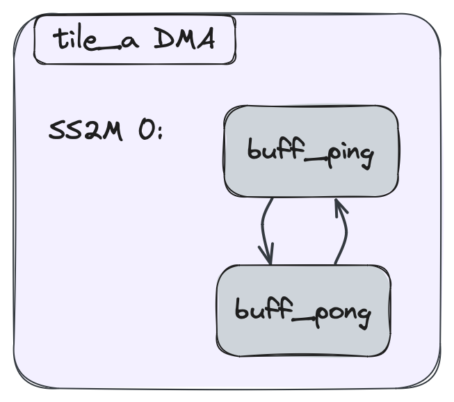

<!---//===- README.md ---------------------------------------*- Markdown -*-===//
//
// This file is licensed under the Apache License v2.0 with LLVM Exceptions.
// See https://llvm.org/LICENSE.txt for license information.
// SPDX-License-Identifier: Apache-2.0 WITH LLVM-exception
//
// Copyright (C) 2024, Advanced Micro Devices, Inc.
// 
//===----------------------------------------------------------------------===//-->

# <ins>Section 2f - Data Movement Without Object FIFOs</ins>

Not all data movement patterns can be described with Object FIFOs. This section goes into detail about how a user can express data movement using the Data Movement Accelerators (or `DMA`) on AIE tiles.

The AIE architecture currently has three different types of tiles: compute tiles referred to as `tile`, memory tiles reffered to as `Mem tile`, and external memory interface tiles referred to as `Shim tile`. Each of these tiles has its own attributes regarding compute capabilities and memory capacity, but the base design of their DMAs is the same. The different types of DMAs can be intialized using the constructors in [aie.py](../../../python/dialects/aie.py):
```python
@mem(tile) # compute tile DMA
@shim_dma(tile) # Shim tile DMA
@memtile_dma(tile) # Mem tile DMA
```

The DMA hardware component has a certain number of input and output `channels`, and each one has a direction and a port index. Input channels are denoted with the keyword `SS2M` and output ones with `M2SS`. Port indices vary per tile, for example compute tiles have two input and two output ports, same as Shim tiles, whereas Mem tiles have six input and six output ports.

A channel in any tile's DMA can be initialized using the unified `dma` constructor:
```python
def dma(
    channel_dir,
    channel_index,
    *,
    num_blocks=1,
    loop=None,
    repeat_count=None,
    sym_name=None,
    loc=None,
    ip=None,
)
```

The data movement on each channel is described by a chain of Buffer Descriptors (or `BD`), where each BD describes what data is being moved and configures its synchornization mechanism. The `dma` constructor already creates space for one such BD as can be seen by its `num_blocks=1` default valued input.

The code snippet below shows how to configure the DMA on `tile_a` such that data coming in on input channel 0 is written into `buff_in`:
```python
tile_a = tile(1, 3)

prod_lock = lock(tile_a, lock_id=0, init=1)
cons_lock = lock(tile_a, lock_id=1, init=0)
buff_in = buffer(tile=tile_a, shape=(256,), dtype=T.i32()) # 256xi32

@mem(tile_a)
def mem_body():
    @dma(S2MM, 0) # input channel, port 0
    def dma_in_0():
        use_lock(prod_lock, AcquireGreaterEqual)
        dma_bd(buff_in)
        use_lock(cons_lock, Release)
```
The locks `prod_lock` and `cons_lock` follow AIE2 architecture semantics. Their task is to mark synchronization points in the tile's and its DMA's execution: for example, if the tile is currently using `buff_in` it will only release the `prod_lock` when it is done and that is when the DMA will be allowed to overwrite the data in `buff_in` with new input. Similarly, the tile's core can query the `cons_lock` to know when the new data is ready to be read (i.e., when the DMA releases the lock so the core can acquire it).

In the previous code the channel only had one BD in its chain. To add additional BDs to the chain, users can use the following constructor, which takes as input what would be the previous BD in the chain it should be added to:
```python
@another_bd(dma_bd)
```

This next code snippet shows how to extend the previous input channel with a double, or ping-pong, buffer using the previous constructor:
```python
tile_a = tile(1, 3)

prod_lock = lock(tile_a, lock_id=0, init=2) # note that the producer lock now has 2 tokens
cons_lock = lock(tile_a, lock_id=1, init=0)
buff_ping = buffer(tile=tile_a, shape=(256,), dtype=T.i32()) # 256xi32
buff_pong = buffer(tile=tile_a, shape=(256,), dtype=T.i32()) # 256xi32

@mem(tile_a)
def mem_body():
    @dma(S2MM, 0, num_blocks=2) # note the additional BD
    def dma_in_0():
        use_lock(prod_lock, AcquireGreaterEqual)
        dma_bd(buff_ping)
        use_lock(cons_lock, Release)

    @another_bd(dma_in_0)
    def dma_in_1():
        use_lock(prod_lock, AcquireGreaterEqual)
        dma_bd(buff_pong)
        use_lock(cons_lock, Release)
```
> **NOTE:**  This DMA configuration is equivalent to what the Object FIFO lowering looks like for double buffers.

The code above can be visualized like in the following figure, where the two BDs ping-pong to each other:



The last step to configure the data movement is to establish its endpoints, similar to how the Object FIFO has producer and consumer tiles. To do this, users should use the `flow` constructor:
```python
def flow(
    source,
    source_bundle=None,
    source_channel=None,
    dest=None,
    dest_bundle=None,
    dest_channel=None,
)
```
The `flow` is established between channels of two DMAs (other endpoints are available, but they are beyond the scope of this section) and as such it requires:
* their `source` and `dest` tiles,
* their `source_bundle` and `dest_bundle`, which represent the type of endpoints (for our scope, these will be `WireBundle.DMA`),
* and their `source_channel` and `dest_channel`, which represent the index of the channel.

For example, to create a flow between tile `tile_a` and tile `tile_b` where `tile_a` is sending data on its output channel 0 to `tile_b`'s input channel 1, the user can write:
```python
aie.flow(tile_a, WireBundle.DMA, 0, tile_b, WireBundle.DMA, 1)
```
Note how the direction of the two channels is not required by the flow, only the indices. This is because the flow lowering can infer the direction based on the `source` and `dest` inputs.

The following code snippet shows a full example of two tiles where `tile_a` is sending data to `tile_b`:
```python
tile_a = tile(1, 2)
tile_b = tile(1, 3)

prod_lock_a = lock(tile_a, lock_id=0, init=1)
cons_lock_a = lock(tile_a, lock_id=1, init=0)
buff_a = buffer(tile=tile_a, shape=(256,), dtype=T.i32()) # 256xi32

prod_lock_b = lock(tile_b, lock_id=0, init=1)
cons_lock_b = lock(tile_b, lock_id=1, init=0)
buff_b = buffer(tile=tile_b, shape=(256,), dtype=T.i32()) # 256xi32

aie.flow(tile_a, WireBundle.DMA, 0, tile_b, WireBundle.DMA, 1)

@mem(tile_a)
def mem_body():
    @dma(MM2S, 0) # output channel, port 0
    def dma_in_0():
        use_lock(cons_lock_a, AcquireGreaterEqual)
        dma_bd(buff_a)
        use_lock(prod_lock_a, Release)

@mem(tile_b)
def mem_body():
    @dma(SS2M, 1) # input channel, port 1
    def dma_in_0():
        use_lock(prod_lock_b, AcquireGreaterEqual)
        dma_bd(buff_b)
        use_lock(cons_lock_b, Release)
```
