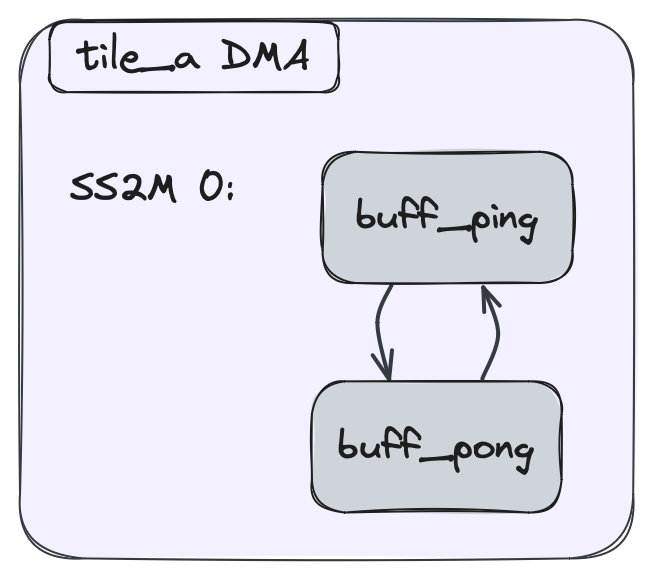

<!---//===- README.md ---------------------------------------*- Markdown -*-===//
//
// This file is licensed under the Apache License v2.0 with LLVM Exceptions.
// See https://llvm.org/LICENSE.txt for license information.
// SPDX-License-Identifier: Apache-2.0 WITH LLVM-exception
//
// Copyright (C) 2024-2026, Advanced Micro Devices, Inc.
//
//===----------------------------------------------------------------------===//-->

# <ins>Section 2g - Data Movement Without Object FIFOs</ins>

* [Section 2 - Data Movement (Object FIFOs)](../../section-2/)
    * [Section 2a - Introduction](../section-2a/)
    * [Section 2b - Key Object FIFO Patterns](../section-2b/)
    * [Section 2c - Data Layout Transformations](../section-2c/)
    * [Section 2d - Runtime Data Movement](../section-2d/)
    * [Section 2e - Programming for multiple cores](../section-2e/)
    * [Section 2f - Practical Examples](../section-2f/)
    * Section 2g - Data Movement Without Object FIFOs
    * [Section 2h - Advanced ObjectFifo + Cross-Tile Buffer](../section-2h/)

-----

Not all data movement patterns fit cleanly into Object FIFOs.  This
**advanced** section goes into detail about how to express data
movement directly in terms of the underlying hardware pieces: per-tile
Direct Memory Access (DMA) channels, buffer descriptors, hardware
locks, and the AXI-stream routes between them.  To better understand
the code and concepts here, it is recommended to first read the
[Advanced Topic of Section 2a on DMAs](../section-2a/README.md/#advanced-topic--data-movement-accelerators).

IRON exposes the same surface in two tiers — both fully supported,
both lower into the same `aie.flow` / `aie.lock` / `aie.mem` /
`aie.memtile_dma` / `aie.shim_dma` ops:

* **IRON Python primitives** (the rest of this section).  First-class
  Python classes — `Flow`, `Lock`, `TileDma`, `DmaChannel`, `Bd`,
  `Acquire`, `Release` — that compose into a regular `@iron.jit`
  design alongside `Worker` and `Runtime`.  Use this tier when you
  want to hand-wire DMA programs but still get the `@iron.jit`
  lifecycle (content-addressed caching, `iron.tensor` host I/O,
  `aiecc` lowering).
* **AIE dialect Python** ([§Lowered-equivalent dialect](#lowered-equivalent-dialect-aie-dialect-python)
  at the end).  Raw `@mem` / `@memtile_dma` / `@shim_dma` /
  `aie.flow` / `aie.lock` decorators from
  [`python/dialects/aie.py`](../../../python/dialects/aie.py).
  Useful for pure-dialect lit tests and for the rare design that
  needs an op the IRON primitives don't expose yet.

## <u>Hardware background</u>

The AIE architecture has three types of tiles — compute tiles, mem
tiles, and shim tiles (external memory interface).  Each has its own
compute and memory characteristics, but the DMAs share a common
design.  Each tile's DMA exposes some number of input (`S2MM`) and
output (`MM2S`) channels — compute and shim tiles have two of each;
mem tiles have six of each.

The data movement on each channel is described by a chain of *buffer
descriptors* (BDs).  Each BD says which buffer is being moved and how
it synchronizes — locks acquired before the transfer starts and
released after it completes.  BDs in a chain link to a `next` BD,
forming a loop that keeps streaming as long as the lock protocol
permits.

A *flow* connects two channels (or a channel to another endpoint kind)
across the AXI stream switch fabric.  Flows are direction-agnostic at
the API level — the lowering reads direction off the source and
destination tiles.

## <u>IRON Python: structural primitives</u>

These classes live under `aie.iron`:

| Class | What it lowers to | Defined in |
|-------|-------------------|-----------|
| `Buffer(tile, type, initial_value=None, name)` | `aie.buffer` on the given tile | [`python/iron/buffer.py`](../../../python/iron/buffer.py) |
| `Lock(tile, lock_id=None, init=0, name)` | `aie.lock` with explicit id + init count | [`python/iron/lock.py`](../../../python/iron/lock.py) |
| `Flow(src, dst, *, src_port=DMA, src_channel, dst_port=DMA, dst_channel)` | `aie.flow` — one circuit-switched route | [`python/iron/dataflow/flow.py`](../../../python/iron/dataflow/flow.py) |
| `PacketFlow(src, dsts: list[PacketDest], *, pkt_id, ...)` | `aie.packetflow` with explicit packet IDs | same file |
| `TileDma(tile, channels=[DmaChannel(...)])` | `aie.mem` (compute), `aie.memtile_dma` (memtile), or `aie.shim_dma` (shim) — picked by tile type | [`python/iron/dataflow/tile_dma.py`](../../../python/iron/dataflow/tile_dma.py) |
| `DmaChannel(direction, channel, bds=[Bd(...)])` | One `@dma(dir, ch)` chain inside the TileDma's region | same |
| `Bd(buffer, offset=0, length=None, acquires=[...], releases=[...], next="self"\|int\|None, packet=None)` | One BD block: acquires + `aie.dma_bd` + releases + `aie.next_bd` | same |
| `Acquire(lock, value=1, greater_equal=True)` | `aie.use_lock(..., AcquireGreaterEqual\|Acquire)` at BD start | same |
| `Release(lock, value=1)` | `aie.use_lock(..., Release)` at BD end | same |

`Bd.next` mirrors the dialect's `aie.next_bd` chain wiring:

* `"self"` (default) — loop back to this BD (the common "keep streaming"
  pattern).
* an `int` `i` — point at the i-th BD in this `DmaChannel`'s `bds` list
  (zero-based).  Useful for explicit cycles in multi-BD chains.
* `None` — emit no `next_bd`.  Rarely useful; the basic block ends up
  without a terminator and the caller takes responsibility.

`Bd.packet = (pkt_type, pkt_id)` stamps a packet header on every
transfer this BD emits — pair it with a `PacketFlow` carrying the same
`pkt_id` so the routing fabric dispatches correctly.

### Wiring everything into the `Runtime`

Three registrations on the `Runtime` object pull the structural
primitives into the resolved program.  All three accept one object per
call:

```python
rt = Runtime()
rt.add_flow(my_flow)        # one call per Flow / PacketFlow
rt.add_lock(my_lock)        # one call per Lock
rt.add_tile_dma(my_dma)     # one call per TileDma program
```

Inside `rt.sequence(...)`, if even the BD-level abstraction is too
high — typically because you're driving BD writes from the host
runtime sequence rather than from the tile DMA program — drop into
raw `npu_*` ops (`npu_writebd`, `npu_address_patch`, `npu_push_queue`,
`npu_sync`, `npu_write32`) via:

```python
def manual_bd_writes(a, b):
    npu_write32(column=col, row=1, address=0xC0000, value=1)
    npu_writebd(bd_id=0, buffer_length=..., column=col, row=0, ...)
    npu_address_patch(...)
    npu_push_queue(...)
    npu_sync(column=col, row=0, ...)

with rt.sequence(in_ty, out_ty) as (a, b):
    rt.start(worker)
    rt.inline_ops(manual_bd_writes, [a, b])
```

`rt.inline_ops(fn, [args])` calls `fn(*args)` inside the runtime
sequence's MLIR region with the host-side tensor handles already in
scope — exactly what `rt.fill` / `rt.drain` are built on top of, but
with no protocol assumptions baked in.

### Worked example: tile-to-tile copy

The dialect example we will mirror has `tile_a` (compute) streaming
256 `int32`s to `tile_b` (compute) on `tile_a`'s output channel 0 →
`tile_b`'s input channel 1.  In IRON Python:

```python
import numpy as np
import aie.iron as iron
from aie.iron import (
    Acquire, Bd, Buffer, DmaChannel, Flow, Lock, Release, TileDma,
    Worker, Runtime, Program,
)
from aie.iron.device import Tile
from aie.dialects._aie_enum_gen import AIETileType, DMAChannelDir, WireBundle

tile_a = Tile(col=1, row=2, tile_type=AIETileType.CoreTile)
tile_b = Tile(col=1, row=3, tile_type=AIETileType.CoreTile)
vec_ty = np.ndarray[(256,), np.dtype[np.int32]]

prod_lock_a = Lock(tile=tile_a, lock_id=0, init=1, name="prod_a")
cons_lock_a = Lock(tile=tile_a, lock_id=1, init=0, name="cons_a")
buff_a      = Buffer(tile=tile_a, type=vec_ty, name="buff_a")

prod_lock_b = Lock(tile=tile_b, lock_id=0, init=1, name="prod_b")
cons_lock_b = Lock(tile=tile_b, lock_id=1, init=0, name="cons_b")
buff_b      = Buffer(tile=tile_b, type=vec_ty, name="buff_b")

# One AXI-stream route, source-to-destination, direction inferred.
a_to_b = Flow(
    src=tile_a, dst=tile_b,
    src_port=WireBundle.DMA, src_channel=0,
    dst_port=WireBundle.DMA, dst_channel=1,
)

# Per-tile DMA programs.  Each has one channel with one self-looping BD.
dma_a = TileDma(tile=tile_a, channels=[
    DmaChannel(
        direction=DMAChannelDir.MM2S, channel=0,
        bds=[Bd(
            buffer=buff_a,
            acquires=[Acquire(cons_lock_a)],   # wait for "data ready"
            releases=[Release(prod_lock_a)],   # signal "buffer free"
            next="self",
        )],
    ),
])
dma_b = TileDma(tile=tile_b, channels=[
    DmaChannel(
        direction=DMAChannelDir.S2MM, channel=1,
        bds=[Bd(
            buffer=buff_b,
            acquires=[Acquire(prod_lock_b)],   # wait for "buffer free"
            releases=[Release(cons_lock_b)],   # signal "data ready"
            next="self",
        )],
    ),
])

rt = Runtime()
for lk in (prod_lock_a, cons_lock_a, prod_lock_b, cons_lock_b):
    rt.add_lock(lk)
rt.add_flow(a_to_b)
rt.add_tile_dma(dma_a)
rt.add_tile_dma(dma_b)
```

The locks follow AIE-ML semantics: each `Lock` starts at `init`, an
`Acquire` waits until the value is `>= value` (default 1) and
decrements it on success, `Release` increments by `value` (default 1).
With `prod_a = 1` and `cons_a = 0`, `tile_a`'s DMA blocks on
`cons_lock_a` until the compute core fills `buff_a` and releases it
— matching the protocol the dialect example expressed with
`AcquireGreaterEqual` / `Release`.

### Multi-BD chains (ping-pong)

Extending the channel above to a ping-pong pair is two BDs with two
buffers, with `next="self"` on each so the BD repeats, plus a second
producer-lock token so both buffers can be in flight at once:

```python
buff_ping = Buffer(tile=tile_a, type=vec_ty, name="buff_ping")
buff_pong = Buffer(tile=tile_a, type=vec_ty, name="buff_pong")
prod_lock = Lock(tile=tile_a, lock_id=0, init=2, name="prod_pp")  # 2 tokens
cons_lock = Lock(tile=tile_a, lock_id=1, init=0, name="cons_pp")

ping_pong = TileDma(tile=tile_a, channels=[
    DmaChannel(
        direction=DMAChannelDir.S2MM, channel=0,
        bds=[
            Bd(buffer=buff_ping,
               acquires=[Acquire(prod_lock)],
               releases=[Release(cons_lock)],
               next=1),                        # point at the next BD
            Bd(buffer=buff_pong,
               acquires=[Acquire(prod_lock)],
               releases=[Release(cons_lock)],
               next=0),                        # close the loop
        ],
    ),
])
```

`Bd.next=1` points the first BD at the second; `next=0` on the second
points back at the first.  The pair behaves the same way as the
ObjectFifo lowering for a double-buffered fifo.



### Canonical end-to-end demo

The runnable example for this whole surface is
[`programming_examples/basic/chaining_channels/chaining_channels.py`](../../../programming_examples/basic/chaining_channels/chaining_channels.py)
— an `@iron.jit` design that chains MemTile MM2S → shim DMA → compute
tile S2MM with:

* explicit `Buffer` + `Lock` on each tile;
* two `Flow`s (memtile → shim, shim → compute);
* two `TileDma`s with self-looping `Bd` chains and the
  acquire/release lock-protocol pairs;
* a `Worker` running a tiny lock-flipping spinner on the compute
  tile;
* a runtime sequence that opens the data flow with `npu_writebd` /
  `npu_address_patch` / `npu_push_queue` / `npu_sync` inside an
  `rt.inline_ops(...)` block — the *teaching point* of the example,
  because the manual BD writes are exactly what `rt.fill` / `rt.drain`
  normally hide.

That design is the right starting place when copying this pattern.

## <u>Lowered-equivalent dialect (AIE dialect Python)</u>

The same hardware concepts are also exposed as raw decorators in the
`aie` dialect Python API
([`python/dialects/aie.py`](../../../python/dialects/aie.py)).  Reach
for them when you need an op the IRON primitives above don't surface,
or when writing pure-dialect lit tests that bypass the IRON runtime.

The three DMA region decorators pick by tile type:

```python
@mem(tile)          # compute tile DMA region
@memtile_dma(tile)  # mem tile DMA region
@shim_dma(tile)     # shim tile DMA region
```

A channel inside a region uses the unified `dma` constructor:

```python
def dma(
    channel_dir,
    channel_index,
    *,
    num_blocks=1,
    loop=None,
    repeat_count=None,
    sym_name=None,
    loc=None,
    ip=None,
)
```

The same `tile_a → tile_b` flow as the IRON example above, written at
the dialect level:

```python
tile_a = tile(1, 2)
tile_b = tile(1, 3)

prod_lock_a = lock(tile_a, lock_id=0, init=1)
cons_lock_a = lock(tile_a, lock_id=1, init=0)
buff_a = buffer(tile=tile_a, datatype=np.ndarray[(256,), np.dtype[np.int32]])

prod_lock_b = lock(tile_b, lock_id=0, init=1)
cons_lock_b = lock(tile_b, lock_id=1, init=0)
buff_b = buffer(tile=tile_b, datatype=np.ndarray[(256,), np.dtype[np.int32]])

aie.flow(tile_a, WireBundle.DMA, 0, tile_b, WireBundle.DMA, 1)

@mem(tile_a)
def mem_body():
    @dma(MM2S, 0)
    def dma_out_0():
        use_lock(cons_lock_a, AcquireGreaterEqual)
        dma_bd(buff_a)
        use_lock(prod_lock_a, Release)

@mem(tile_b)
def mem_body():
    @dma(S2MM, 1)
    def dma_in_1():
        use_lock(prod_lock_b, AcquireGreaterEqual)
        dma_bd(buff_b)
        use_lock(cons_lock_b, Release)
```

Extending a channel's BD chain at the dialect level uses
`@another_bd(prev_bd)` (the IRON-Python equivalent is just appending
to `DmaChannel.bds=[...]`):

```python
@mem(tile_a)
def mem_body():
    @dma(S2MM, 0, num_blocks=2)
    def dma_in_0():
        use_lock(prod_lock, AcquireGreaterEqual)
        dma_bd(buff_ping)
        use_lock(cons_lock, Release)

    @another_bd(dma_in_0)
    def dma_in_1():
        use_lock(prod_lock, AcquireGreaterEqual)
        dma_bd(buff_pong)
        use_lock(cons_lock, Release)
```

> **NOTE:** This DMA configuration is equivalent to what the Object
> FIFO lowering looks like for double buffers.

`flow(source, source_bundle, source_channel, dest, dest_bundle, dest_channel)`
takes both tiles + their `WireBundle` (typically `WireBundle.DMA`) +
channel indices; the lowering infers direction from `source` vs
`dest`.

The dialect tier is what `@iron.jit` ultimately lowers into.  For
designs you intend to ship as part of the IRON examples, prefer the
IRON Python primitives at the top of this page — they give you the
caching, host-side tensor surface, and `--emit-mlir` introspection
for free.

-----
[[Prev - Section 2f](../section-2f/)] [[Up](..)] [[Next - Section 2h](../section-2h/)]
