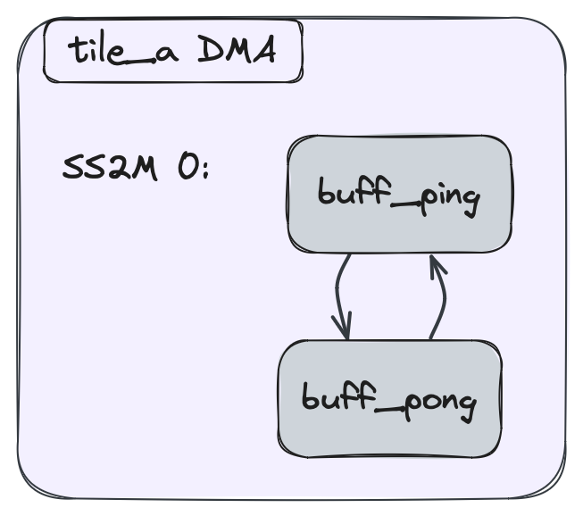

<!---//===- README.md ---------------------------------------*- Markdown -*-===//
//
// Copyright (C) 2024-2026 Advanced Micro Devices, Inc.
// SPDX-License-Identifier: Apache-2.0 WITH LLVM-exception
//
//===----------------------------------------------------------------------===//-->

# Section 2g - Data Movement Without ObjectFifos

* [Section 2 - Data Movement (ObjectFifos)](../../section-2/)
    * [Section 2a - Introduction](../section-2a/)
    * [Section 2b - Key ObjectFifo Patterns](../section-2b/)
    * [Section 2c - Data Layout Transformations](../section-2c/)
    * [Section 2d - Runtime Data Movement](../section-2d/)
    * [Section 2e - Programming for multiple cores](../section-2e/)
    * [Section 2f - Practical Examples](../section-2f/)
    * Section 2g - Data Movement Without ObjectFifos
    * [Section 2h - Advanced ObjectFifo + Cross-Tile Buffer](../section-2h/)

-----

Not all data movement patterns fit cleanly into ObjectFifos.  This
**advanced** section goes into detail about how to express data
movement directly in terms of the underlying hardware pieces: per-tile
Direct Memory Access (DMA) channels, buffer descriptors, hardware
locks, and the AXI-stream routes between them.  To better understand
the code and concepts here, it is recommended to first read the
[Advanced Topic of Section 2a on DMAs](../section-2a/README.md#advanced-topic-direct-memory-access-channels).

IRON exposes the same surface in two tiers — both fully supported,
both lower into the same `aie.flow` / `aie.lock` / `aie.mem` /
`aie.memtile_dma` / `aie.shim_dma` ops:

* **IRON Python primitives** (the rest of this section).  First-class
  Python classes — `Flow`, `Lock`, `TileDma`, `DmaChannel`, `Bd`,
  `Acquire`, `Release` — that compose into a regular `@iron.jit`
  design alongside `Worker` and `Runtime`, plus `tile_dma_task` /
  `tile_dma_chain` for tile DMAs driven from the runtime sequence.  Use this tier when you
  want to hand-wire DMA programs but still get the `@iron.jit`
  lifecycle (content-addressed caching, `iron.tensor` host I/O,
  `aiecc` lowering).
* **AIE dialect Python** ([§Lowered-equivalent dialect](#lowered-equivalent-dialect-aie-dialect-python)
  at the end).  Raw `@mem` / `@memtile_dma` / `@shim_dma` /
  `aie.flow` / `aie.lock` decorators from
  [`python/dialects/aie.py`](../../../python/dialects/aie.py).
  Useful for pure-dialect lit tests and for the rare design that
  needs an op the IRON primitives don't expose yet.

## <u>Hardware background</u>

The AIE architecture has three types of tiles — compute tiles, mem
tiles, and shim tiles (external memory interface).  Each has its own
compute and memory characteristics, but the DMAs share a common
design.  Each tile's DMA exposes some number of input (`S2MM`) and
output (`MM2S`) channels — compute and shim tiles have two of each;
mem tiles have six of each.

The data movement on each channel is described by a chain of *buffer
descriptors* (BDs).  Each BD says which buffer is being moved and how
it synchronizes — locks acquired before the transfer starts and
released after it completes.  BDs in a chain link to a `next` BD,
forming a loop that keeps streaming as long as the lock protocol
permits.

A *flow* connects two channels (or a channel to another endpoint kind)
across the AXI stream switch fabric.  Flows are direction-agnostic at
the API level — the lowering reads direction off the source and
destination tiles.

## <u>IRON Python: structural primitives</u>

These classes live under `aie.iron`:

| Class | What it lowers to | Defined in |
|-------|-------------------|-----------|
| `Buffer(tile, type, initial_value=None, name)` | `aie.buffer` on the given tile | [`python/iron/buffer.py`](../../../python/iron/buffer.py) |
| `Lock(tile, lock_id=None, init=0, name)` | `aie.lock` with explicit id + init count | [`python/iron/lock.py`](../../../python/iron/lock.py) |
| `Flow(src, dst \| [dsts], *, src_port=DMA, src_channel=None, dst_port=DMA, dst_channel=None)` | `aie.flow` when both channels are given; otherwise `aie.route_endpoint`s joined by an `aie.route`, whose DMA channels the compiler assigns.  A list of `dst`s broadcasts | [`python/iron/dataflow/flow.py`](../../../python/iron/dataflow/flow.py) |
| `PacketFlow(pkt_id, src, dst, *, src_channel=0, dst_channel=0, extra_dsts=[PacketDest(...)], keep_pkt_header=False)` | `aie.packetflow` tagged with `pkt_id`.  With a shim end it has `fill` / `drain` like a `Flow`, and `fill` stamps `pkt_id` on the input | same file |
| `TileDma(tile, channels=[DmaChannel(...)])` | `aie.mem` (compute), `aie.memtile_dma` (memtile), or `aie.shim_dma` (shim) — picked by tile type | [`python/iron/dataflow/tile_dma.py`](../../../python/iron/dataflow/tile_dma.py) |
| `DmaChannel(direction, channel, bds=[Bd(...)], pad_value=0, repeat_count=0, out_of_order=False, loop=True)` | One `@dma(dir, ch)` chain inside the TileDma's region.  `channel` is an index or a `flow.endpoint(tile)` | same |
| `Bd(buffer, offset=0, length=None, sizes=[], strides=[], acquires=[...], releases=[...], next=None\|"self"\|int, packet=None, bd_id=None, pad_dimensions=None, iteration=None, out_of_order_id=None)` | One BD block: acquires + `aie.dma_bd` + releases + `aie.next_bd` | same |
| `BdIteration(size, stride, current=0)` | The `iteration` state of one `aie.dma_bd`: the BD's base advances by `stride` elements per execution and wraps after `size` | same |
| `Acquire(lock, value=1, greater_equal=True)` | `aie.use_lock(..., AcquireGreaterEqual\|Acquire)` at BD start | same |
| `Release(lock, value=1)` | `aie.use_lock(..., Release)` at BD end | same |

`Bd.next` mirrors the dialect's `aie.next_bd` chain wiring:

* `None` (default) — follow the channel.  The BD points at the next entry
  in `bds`, and the last entry either loops back to the first or leaves the
  chain, per `DmaChannel.loop`.  This is the common case, so most BDs say
  nothing about `next` at all.
* `"self"` — loop back to this BD regardless of what the channel says.
* an `int` `i` — point at the i-th BD in this `DmaChannel`'s `bds` list
  (zero-based).  Useful for explicit cycles in multi-BD chains.

`DmaChannel.loop` decides what the end of the chain does:

* `True` (default) — the last BD chains back to the first, so the channel
  streams forever.  A single-BD channel therefore self-chains, which is the
  "keep streaming" pattern.
* `False` — the last BD chains to the region's `aie.end`, which the dialect
  reads as "the chain ends here".  Only then is the chain a task the channel
  can finish, which is what makes a queue-push `repeat_count` mean anything:
  an endless chain never completes, so there is nothing to repeat.

`Bd.packet = (pkt_type, pkt_id)` stamps a packet header on every
transfer this BD emits — pair it with a `PacketFlow` carrying the same
`pkt_id` so the routing fabric dispatches correctly.  From the shim,
`packet_flow.fill(a)` stamps the header itself, so several `PacketFlow`s
leaving one shim channel are told apart by which one you fill (see
[`packet_switch`](../../../programming_examples/basic/packet_switch/)).  `Bd.bd_id` pins
the descriptor's hardware id; the others are allocated around it.

A few more `Bd` fields cover hardware features that would otherwise need
extra descriptors:

* `iteration=BdIteration(size, stride)` lets one BD walk `size`
  sub-buffers, advancing its base by `stride` elements on each execution,
  where an unrolled chain would need `size` BDs.  Values are in elements;
  the lowering applies the hardware's `-1` bias.  See
  [`test/npu-xrt/bd_iteration`](../../../test/npu-xrt/bd_iteration/bd_iteration.py).
* `pad_dimensions=[(before, after), ...]` (mem tile only) pads each
  dimension of the access pattern with `DmaChannel.pad_value`.  See
  [`dma_padding`](../../../programming_examples/basic/dma_padding/).
* `DmaChannel(..., out_of_order=True)` on an S2MM channel places each
  arriving packet in the BD whose `bd_id` matches the out-of-order id in
  its header.  The sender stamps that id with `Bd.out_of_order_id`.  See
  [`test/npu-xrt/dma_s2mm_ooo`](../../../test/npu-xrt/dma_s2mm_ooo/).

### Wiring everything into the `Runtime`

Three registrations on the `Runtime` object pull the structural
primitives into the resolved program.  All three accept one object per
call:

```python
def sequence(a, b):
    ...                     # host-side data movement (or raw npu_* ops)

rt = Runtime(sequence, [in_ty, out_ty])
rt.add_flow(my_flow)        # one call per Flow / PacketFlow
rt.add_lock(my_lock)        # one call per Lock
rt.add_tile_dma(my_dma)     # one call per TileDma program
```

The sequence body can also program mem and compute tile DMAs itself
(see [Tile DMAs from the runtime sequence](#tile-dmas-from-the-runtime-sequence)).
If even that is too high a level, drop into raw `npu_*` ops
(`npu_writebd`, `npu_address_patch`, `npu_push_queue`, `npu_sync`,
`npu_write32`) directly.  Setting a lock doesn't need a raw register
write: `lock.set(value)` resolves the lock's address for you.

```python
def sequence(a, b):
    memtile_lock.set(1)
    npu_writebd(bd_id=0, buffer_length=..., column=col, row=0, ...)
    npu_address_patch(...)
    npu_push_queue(...)
    npu_sync(column=col, row=0, ...)

rt = Runtime(sequence, [in_ty, out_ty])

Program(device, rt, workers=[worker]).resolve_program()
```

The sequence body runs inside the runtime sequence's MLIR region with
the host-side tensor handles already in scope — writing raw `npu_*` ops
directly is exactly what `fill` / `drain` are built on top of, but with
no protocol assumptions baked in.

### Worked example: tile-to-tile copy

The dialect example we will mirror has `tile_a` (compute) streaming
256 `int32`s to `tile_b` (compute) on `tile_a`'s output channel 0 →
`tile_b`'s input channel 1.  In IRON Python:

```python
import numpy as np
import aie.iron as iron
from aie.iron import (
    Acquire, Bd, Buffer, DmaChannel, Flow, Lock, Release, TileDma,
    Worker, Runtime, Program,
)
from aie.iron.device import Tile
from aie.dialects._aie_enum_gen import AIETileType, DMAChannelDir, WireBundle

tile_a = Tile(col=1, row=2, tile_type=AIETileType.CoreTile)
tile_b = Tile(col=1, row=3, tile_type=AIETileType.CoreTile)
vec_ty = np.ndarray[(256,), np.dtype[np.int32]]

prod_lock_a = Lock(tile=tile_a, lock_id=0, init=1, name="prod_a")
cons_lock_a = Lock(tile=tile_a, lock_id=1, init=0, name="cons_a")
buff_a      = Buffer(tile=tile_a, type=vec_ty, name="buff_a")

prod_lock_b = Lock(tile=tile_b, lock_id=0, init=1, name="prod_b")
cons_lock_b = Lock(tile=tile_b, lock_id=1, init=0, name="cons_b")
buff_b      = Buffer(tile=tile_b, type=vec_ty, name="buff_b")

# One AXI-stream route, source-to-destination, direction inferred.
a_to_b = Flow(
    src=tile_a, dst=tile_b,
    src_port=WireBundle.DMA, src_channel=0,
    dst_port=WireBundle.DMA, dst_channel=1,
)

# Per-tile DMA programs.  Each has one channel with one BD, which the
# default loop=True chains back to itself so it keeps streaming.
dma_a = TileDma(tile=tile_a, channels=[
    DmaChannel(
        direction=DMAChannelDir.MM2S, channel=0,
        bds=[Bd(
            buffer=buff_a,
            acquires=[Acquire(cons_lock_a)],   # wait for "data ready"
            releases=[Release(prod_lock_a)],   # signal "buffer free"
        )],
    ),
])
dma_b = TileDma(tile=tile_b, channels=[
    DmaChannel(
        direction=DMAChannelDir.S2MM, channel=1,
        bds=[Bd(
            buffer=buff_b,
            acquires=[Acquire(prod_lock_b)],   # wait for "buffer free"
            releases=[Release(cons_lock_b)],   # signal "data ready"
        )],
    ),
])

def sequence(a, b):
    pass  # data flow is driven entirely by the tile DMA programs below

rt = Runtime(sequence, [vec_ty, vec_ty])
for lk in (prod_lock_a, cons_lock_a, prod_lock_b, cons_lock_b):
    rt.add_lock(lk)
rt.add_flow(a_to_b)
rt.add_tile_dma(dma_a)
rt.add_tile_dma(dma_b)
```

The locks follow AIE-ML semantics: each `Lock` starts at `init`, an
`Acquire` waits until the value is `>= value` (default 1) and
decrements it on success, `Release` increments by `value` (default 1).
With `prod_a = 1` and `cons_a = 0`, `tile_a`'s DMA blocks on
`cons_lock_a` until the compute core fills `buff_a` and releases it
— matching the protocol the dialect example expressed with
`AcquireGreaterEqual` / `Release`.

### Multi-BD chains (ping-pong)

Extending the channel above to a ping-pong pair is two BDs with two
buffers, chained to each other rather than to themselves, plus a second
producer-lock token so both buffers can be in flight at once:

```python
buff_ping = Buffer(tile=tile_a, type=vec_ty, name="buff_ping")
buff_pong = Buffer(tile=tile_a, type=vec_ty, name="buff_pong")
prod_lock = Lock(tile=tile_a, lock_id=0, init=2, name="prod_pp")  # 2 tokens
cons_lock = Lock(tile=tile_a, lock_id=1, init=0, name="cons_pp")

ping_pong = TileDma(tile=tile_a, channels=[
    DmaChannel(
        direction=DMAChannelDir.S2MM, channel=0,
        bds=[
            Bd(buffer=buff_ping,
               acquires=[Acquire(prod_lock)],
               releases=[Release(cons_lock)],
               next=1),                        # point at the next BD
            Bd(buffer=buff_pong,
               acquires=[Acquire(prod_lock)],
               releases=[Release(cons_lock)],
               next=0),                        # close the loop
        ],
    ),
])
```

`Bd.next=1` points the first BD at the second; `next=0` on the second
points back at the first.  The pair behaves the same way as the
ObjectFifo lowering for a double-buffered fifo.

Both are spelled out here to show the wiring, but this particular chain is
what the defaults already do: leaving `next` off each BD walks `bds` in
order, and `loop=True` closes the cycle.  Reach for explicit indices when
the cycle is not simply "in order, then back to the start".



### Letting the compiler pick channels

The worked example names a channel at both ends of its `Flow` and
repeats each index in the matching `DmaChannel`.  Leave the channels
off the `Flow` and the compiler assigns them; each DMA program then
names the end of the flow it runs on with `flow.endpoint(tile)` instead
of an index:

```python
a_to_b = Flow(tile_a, tile_b)          # no channels: the compiler picks

dma_a = TileDma(tile=tile_a, channels=[
    DmaChannel(direction=DMAChannelDir.MM2S, channel=a_to_b.endpoint(tile_a),
               bds=[...]),
])
dma_b = TileDma(tile=tile_b, channels=[
    DmaChannel(direction=DMAChannelDir.S2MM, channel=a_to_b.endpoint(tile_b),
               bds=[...]),
])
```

The endpoints lower to `aie.route_endpoint`s, and
`--aie-objectfifo-allocate` gives each one a channel that no ObjectFifo
and no explicitly numbered channel on that tile uses.  The tiles need not be
pinned either: `Tile(tile_type=AIETileType.MemTile)` and friends are
placed alongside everything else.  A list of destinations,
`Flow(mem, [core0, core1])`, is a circuit-switched broadcast with one
endpoint per destination.  A flow with a shim end still supports
`flow.fill(...)` / `flow.drain(...)` from the sequence.

[`test/npu-xrt/flow_endpoints`](../../../test/npu-xrt/flow_endpoints/flow_endpoints.py)
is a hardware-tested design built this way, with no tile or channel
pinned anywhere.

### Tile DMAs from the runtime sequence

A `TileDma` is configured once, when the design is loaded.  The
sequence body can instead configure and start a mem or compute tile
DMA itself, which lets a descriptor change from one call to the next —
for example to re-read an operand held in a mem tile with a size that
is only known at dispatch time:

| Call | What it does |
|------|--------------|
| `tile_dma_task(tile, direction, channel, buffer, sizes=, strides=, offset=, transfer_len=, wait=False, acquire=, release=)` | One BD, configured and started.  Its fields may be dispatch-time values, and `channel` may be a `flow.endpoint(tile)` |
| `tile_dma_chain(tile, direction, channel, bds=[Bd(...)], repeat_count=0, wait=False, out_of_order=False)` | A chain of `Bd`s run in order as one task, `repeat_count + 1` times.  `channel` may be a `flow.endpoint(tile)`.  With `out_of_order=True` it arms an S2MM channel as `DmaChannel.out_of_order` does, and `repeat_count` counts packets |
| `task.start(repeat_count=None)` | Push an already-configured task again, optionally with a different repeat count |
| `lock.set(value)` | Overwrite a `Lock`'s value from the host (`aiex.set_lock`) |
| `rt.add_buffer(buf)` | Register a `Buffer` that only the sequence body touches |

The `Bd`s are the same class a `TileDma` uses, so locks, packet headers
and access patterns are written the same way.  The one exception is
`iteration`: a runtime chain takes it from the outermost `sizes` /
`strides` dimension instead.  A runtime BD takes both lock operations
or neither, so `tile_dma_task` needs `acquire` and `release` together,
and both calls reject anything else.  With `wait=True`, a mem or
compute tile reports completion over a route back to the shim that the
compiler adds, so `task.await_()` works on any tile.  A repeat count larger
than one queue push carries is split into several pushes by the
compiler, so the chain below can run any number of passes:

```python
def sequence(a, c):
    into.fill(a)
    task = tile_dma_chain(
        mem, DMAChannelDir.MM2S, spread.endpoint(mem),
        [Bd(staged, acquires=[Acquire(staged_full)], releases=[Release(staged_free)])],
        repeat_count=passes - 1,
    )
    out.drain(c, wait=True)

rt.add_buffer(staged)
```

A tile's DMA can only address buffers on that tile; only a shim DMA
reaches host memory, and that is still what `fill` / `drain` do.  The
device limits these calls work within are available from the device
itself — `dev.max_lock_value`, `dev.max_repeat_count`,
`dev.dma_task_queue_depth` and `dev.get_num_bds(tile_type)` — rather
than being hardcoded.

### Canonical end-to-end demo

The runnable example for this whole surface is
[`programming_examples/basic/chaining_channels/chaining_channels.py`](../../../programming_examples/basic/chaining_channels/chaining_channels.py)
— an `@iron.jit` design that chains MemTile MM2S → shim DMA → compute
tile S2MM with:

* explicit `Buffer` + `Lock` on each tile;
* two `Flow`s (memtile → shim, shim → compute);
* two `TileDma`s with self-looping `Bd` chains and the
  acquire/release lock-protocol pairs;
* a `Worker` running a tiny lock-flipping spinner on the compute
  tile;
* a runtime sequence whose body sets the MemTile lock with `lock.set`
  and opens the data flow with `npu_writebd` /
  `npu_address_patch` / `npu_push_queue` / `npu_sync` written directly
  — the *teaching point* of the example, because the manual BD writes
  are exactly what `fill` / `drain` normally hide.

That design is the right starting place when copying this pattern.

## <u>Lowered-equivalent dialect (AIE dialect Python)</u>

The same hardware concepts are also exposed as raw decorators in the
`aie` dialect Python API
([`python/dialects/aie.py`](../../../python/dialects/aie.py)).  Reach
for them when you need an op the IRON primitives above don't surface,
or when writing pure-dialect lit tests that bypass the IRON runtime.

The three DMA region decorators pick by tile type:

```python
@mem(tile)          # compute tile DMA region
@memtile_dma(tile)  # mem tile DMA region
@shim_dma(tile)     # shim tile DMA region
```

A channel inside a region uses the unified `dma` constructor:

```python
def dma(
    channel_dir,
    channel_index,
    *,
    num_blocks=1,
    loop=None,
    repeat_count=None,
    sym_name=None,
    loc=None,
    ip=None,
)
```

The same `tile_a → tile_b` flow as the IRON example above, written at
the dialect level:

```python
tile_a = tile(1, 2)
tile_b = tile(1, 3)

prod_lock_a = lock(tile_a, lock_id=0, init=1)
cons_lock_a = lock(tile_a, lock_id=1, init=0)
buff_a = buffer(tile=tile_a, datatype=np.ndarray[(256,), np.dtype[np.int32]])

prod_lock_b = lock(tile_b, lock_id=0, init=1)
cons_lock_b = lock(tile_b, lock_id=1, init=0)
buff_b = buffer(tile=tile_b, datatype=np.ndarray[(256,), np.dtype[np.int32]])

aie.flow(tile_a, WireBundle.DMA, 0, tile_b, WireBundle.DMA, 1)

@mem(tile_a)
def mem_body():
    @dma(MM2S, 0)
    def dma_out_0():
        use_lock(cons_lock_a, AcquireGreaterEqual)
        dma_bd(buff_a)
        use_lock(prod_lock_a, Release)

@mem(tile_b)
def mem_body():
    @dma(S2MM, 1)
    def dma_in_1():
        use_lock(prod_lock_b, AcquireGreaterEqual)
        dma_bd(buff_b)
        use_lock(cons_lock_b, Release)
```

Extending a channel's BD chain at the dialect level uses
`@another_bd(prev_bd)` (the IRON-Python equivalent is just appending
to `DmaChannel.bds=[...]`):

```python
@mem(tile_a)
def mem_body():
    @dma(S2MM, 0, num_blocks=2)
    def dma_in_0():
        use_lock(prod_lock, AcquireGreaterEqual)
        dma_bd(buff_ping)
        use_lock(cons_lock, Release)

    @another_bd(dma_in_0)
    def dma_in_1():
        use_lock(prod_lock, AcquireGreaterEqual)
        dma_bd(buff_pong)
        use_lock(cons_lock, Release)
```

> **NOTE:** This DMA configuration is equivalent to what the Object
> FIFO lowering looks like for double buffers.

`flow(source, source_bundle, source_channel, dest, dest_bundle, dest_channel)`
takes both tiles + their `WireBundle` (typically `WireBundle.DMA`) +
channel indices; the lowering infers direction from `source` vs
`dest`.

### Manual stream routing (`switchbox` / `connect`)

Almost always, `Flow` (IRON) or `flow` (dialect) is the right tool: you
name the two *endpoints* and the `--aie-create-pathfinder-flows` pass
picks the switchbox connections in between.  The rare exception is when
you need to pin the *exact* path — reproducing a specific hardware
configuration, or steering around a resource the router would otherwise
take.

There is no dedicated IRON class for this, and none is needed.  A
`switchbox` region hangs off a tile and holds `connect` ops, each wiring
one input port to one output port of that tile's stream switch (a full
crossbar); a shim endpoint also needs a `shim_mux` translating its DMA
ports to the stream switch.  Both are ordinary `aie` dialect ops, and
IRON already has a generic way to emit device-level ops: any object with
`tiles()` and `resolve()` (the `Resolvable` protocol) handed to a
`Worker` via `fn_args` is resolved at device scope, with its tiles
placed first.  So a small user-side class emits the configuration with
no new API:

```python
from aie.dialects.aie import switchbox, connect, EndOp
from aie.dialects._aie_enum_gen import WireBundle

class PinnedSwitchbox:
    def __init__(self, tile, conns):
        self._tile, self._conns = tile, conns

    def tiles(self):                       # placed before resolve()
        return [self._tile]

    def resolve(self, loc=None, ip=None):
        @switchbox(self._tile.op)
        def _sb():
            for sb, sc, db, dc in self._conns:
                connect(sb, sc, db, dc)
            EndOp()                        # aie.switchbox needs an explicit terminator

# pin one hop; hand it to a Worker in fn_args (the core_fn ignores it):
sb = PinnedSwitchbox(compute_tile, [(WireBundle.South, 1, WireBundle.DMA, 0)])
worker = Worker(core_fn, [..., sb], tile=compute_tile)
```

`connect` takes `(source_bundle, source_channel, dest_bundle,
dest_channel)`, and a single `switchbox` may hold as many `connect` ops
as the hardware has ports.

Two things to know before reaching for this:

* **The ports must match what the router would pick.**  A hand-written
  connection only carries data if its source/destination ports (and the
  matching DMA channels) line up with the rest of the path.  The
  reliable way to get them right is to build the equivalent `Flow`/
  `ObjectFifo` design first and dump the connections the pass generates
  (`aie-opt --aie-place-tiles --aie-objectFifo-stateful-transform
  --aie-create-pathfinder-flows`), then reproduce those exact ports.

* **Manual and automatic routing don't share a hop.**  If a pinned
  `connect` competes with a `flow` the pathfinder is also trying to
  route through the same ports, routing fails ("Unable to find a legal
  routing").  Pin connections on a *disjoint* segment (the pathfinder
  augments the rest of that tile's switchbox around them), or pin the
  whole path and use no `flow` at all.

A complete, hardware-verified example that pins every hop of a
shim → compute → shim passthrough by hand lives in
[`programming_examples/basic/manual_switchbox`](../../../programming_examples/basic/manual_switchbox/).

### MLIR ↔ C kernel ABI

External kernels are bound through
[`external_func` / `ExternalFunction`](../../kernels_library.md), which
hides the calling convention.  At the dialect tier the binding is a
`func.func` whose argument types follow the MLIR
[bare-pointer calling convention](https://mlir.llvm.org/docs/TargetLLVMIR/#bare-pointer-calling-convention-for-ranked-memref)
— a `memref` becomes a plain C pointer (no descriptor struct), and C++
name mangling is not applied, so the C function must be `extern "C"` or
a plain C symbol:

| MLIR type | C type    |
| --------- | --------- |
| `i32`     | `int32_t` |
| `f32`     | `float`   |
| `memref`  | C pointer |
| `index`   | `int64_t` |

The dialect tier is what `@iron.jit` ultimately lowers into.  For
designs you intend to ship as part of the IRON examples, prefer the
IRON Python primitives at the top of this page — they give you the
caching, host-side tensor surface, and `--emit-mlir` introspection
for free.

-----
[Prev](../section-2f/) &middot; [Top](..) &middot; [Next](../section-2h/)
