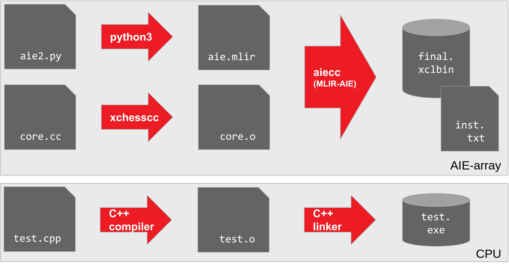
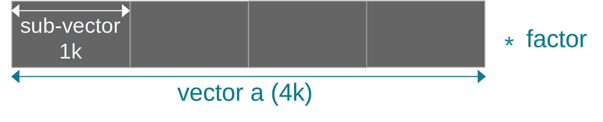
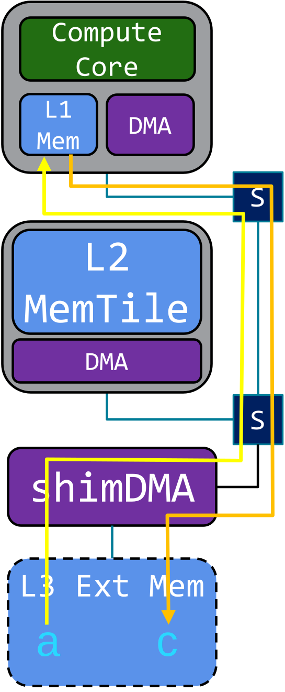
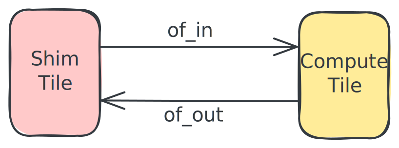

<!---//===- README.md --------------------------*- Markdown -*-===//
//
// This file is licensed under the Apache License v2.0 with LLVM Exceptions.
// See https://llvm.org/LICENSE.txt for license information.
// SPDX-License-Identifier: Apache-2.0 WITH LLVM-exception
//
// Copyright (C) 2022, Advanced Micro Devices, Inc.
// 
//===----------------------------------------------------------------------===//-->

# <ins>Section 3 - My First Program</ins>



This section creates a first program that will run on the AIE-array. As shown in the figure on the right, we will have to create both binaries for the AIE-array (device) and CPU (host) parts. For the AIE-array, a structural description and kernel code is compiled into the AIE-array binaries. The host code loads the AIE-array binaries and contains the test functionality.

For the AIE-array structural description we will combine what you learned in [section-1](../section-1) for defining a basic structural design in python with the data movement part from [section-2](../section-2).

For the AIE kernel code, we will start with non-vectorized code that will run on the scalar processor part of an AIE. [section-4](../section-4) will introduce how to vectorize a compute kernel to harvest the compute density of the AIE.

The host code can be written in either C++ (as shown in the figure) or in Python. We will also introduce some convenience utility libraries for typical test functionality and to simplify context and buffer creation when the [Xilinx RunTime (XRT)](https://github.com/Xilinx/XRT) is used, for instance in the [AMD XDNA Driver](https://github.com/amd/xdna-driver) for Ryzen™ AI devices.



Throughout this section, a [vector scalar multiplication](../../programming_examples/basic/vector_scalar_mul/) (c = a * factor) will be used as an example. Vector scalar multiplication takes an input vector a and computes the output vector c by multiplying each element of a with a factor. In our example, the total vector size is set to 4096 integers (32b) that will processed in chunks of 1024.
This design is also available in the [programming_examples](../../programming_examples) of this repository. We will first introduce the AIE-array structural description, the review the kernel code and then introduce the host code. Finally we will show ho to run the design on Ryzen™ AI enabled hardware.

## AIE-array Structural Description



The [aie2.py](../../programming_examples/basic/vector_scalar_mul/aie2.py) AIE-array structural description (see [section-1](../section-1) deploys both a compute core (green) for the multiplication in the operations and a shimDMA (purple) for data movement both input vector a and output vector c residing in external memory.

```python
# Device declaration - here using aie2 device NPU
@device(AIEDevice.ipu)
def device_body():

    # Tile declarations
    ShimTile = tile(0, 0)
    ComputeTile2 = tile(0, 2)
```

We also need to declare that the compute core will run an external function: a kernel written in C++ that will be linked into the design as pre-compiled kernel (more details in the next subsection). With as goal to get our initial design running on the AIE-array, we will run a generic version of the vector scalar multiply run on the scalar processor of the AIE.

```python
        # Type declarations
        memRef_ty = T.memref(1024, T.i32())

        # AIE Core Function declarations
        scale_scalar_int32 = external_func("scale_scalar_int32", inputs=[memRef_ty, memRef_ty])
```

Since the compute core can only access L1 memory, input data needs to be explicitly moved to (yellow arrow) and from (orange arrow) the L1 memory of the AIE. We will use the objectFIFO data movement primitive (introduced in [section-2](../section-2/)).



This enables looking at the data movement in the AIE-array from a logical view where we deploy 2 objectFIFOs: "of_in" to bring in the vector a and "of_out" to move the output vector c using a shimDMA. Note that the objects are declared to have the `memRef_ty` type: 1024 int32 elements.

```python
        # AIE-array data movement with object fifos
        of_in = object_fifo("in", ShimTile, ComputeTile2, 2, memRef_ty)
        of_out = object_fifo("out", ComputeTile2, ShimTile, 2, memRef_ty)

```
We also need to set up the data movement to/from the AIE-array: configure n-dimensional DMA transfers in the shimDMAs to read/write to/from L3 external memory. For NPU, this is done with the `ipu_dma_memcpy_nd` function (more details in [section 2-g](../section-2/section-2g)). Note that the n-dimensional transfer has a size of 4096 int32 elements. 

```python
        # To/from AIE-array data movement
        tensor_ty = T.memref(4096, T.i32())

        @FuncOp.from_py_func(tensor_ty, tensor_ty)
        def sequence(A, C):
            ipu_dma_memcpy_nd(metadata="out", bd_id=0, mem=C, sizes=[1, 1, 1, 4096])
            ipu_dma_memcpy_nd(metadata="in", bd_id=1, mem=A, sizes=[1, 1, 1, 4096])
            ipu_sync(column=0, row=0, direction=0, channel=0)
```

Finally, we need to configure how the compute core accesses the data moved to its L1 memory, in objectFIFO terminology: we need to program the acquire and release patterns of "of_in" and "of_out". For every processing iteration , we need to acquire and object of 1024 integers to read from from "of_in" and and one similar sized object from "of_out". Then we call our previously declared external function with the acquired objects as operands. After the vector scalar operation, we need to release both objects to their respective objectFIFO.
This access and execute pattern runs on the AIE compute core `ComputeTile2` and needs to get linked against the precompiled external function "scale.o". We run this pattern in a very large loop to enable enqueuing multiple rounds vector scalar multiply work from the host code.

```python
        @core(ComputeTile2, "scale.o")
        def core_body():
            # Effective while(1)
            for _ in for_(sys.maxsize):
                # Number of sub-vector "tile" iterations
                for _ in for_(4):
                    elem_out = of_out.acquire(ObjectFifoPort.Produce, 1)
                    elem_in = of_in.acquire(ObjectFifoPort.Consume, 1)
                    call(scale_scalar_int32, [elem_in, elem_out])
                    of_in.release(ObjectFifoPort.Consume, 1)
                    of_out.release(ObjectFifoPort.Produce, 1)
                    yield_([])
                yield_([])
```

## Kernel Code

## Host Code

## Running the Program

-----
[[Prev - Section 2](../section-2/)] [[Top](..)] [[Next - Section 4](../section-4/)]
