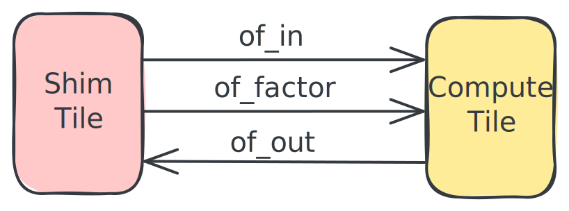

<!---//===- README.md --------------------------*- Markdown -*-===//
//
// This file is licensed under the Apache License v2.0 with LLVM Exceptions.
// See https://llvm.org/LICENSE.txt for license information.
// SPDX-License-Identifier: Apache-2.0 WITH LLVM-exception
//
// Copyright (C) 2022, Advanced Micro Devices, Inc.
// 
//===----------------------------------------------------------------------===//-->

# <ins>Section 3 - My First Program</ins>


This section creates the first program that will run on the AIE-array. As shown in the figure on the right, we will have to create both binaries for the AIE-array (device) and CPU (host) parts. For the AIE-array, a structural description and kernel code is compiled into the AIE-array binaries: an XCLBIN file ("final.xclbin") and an instruction sequence ("insts.bin"). The host code ("test.exe") loads these AIE-array binaries and contains the test functionality.

For the AIE-array structural description we will combine what you learned in [section-1](../section-1) for defining a basic structural design in Python with the data movement part from [section-2](../section-2).

For the AIE kernel code, we will start with non-vectorized code that will run on the scalar processor part of an AIE. [Section-4](../section-4) will introduce how to vectorize a compute kernel to harvest the compute density of the AIE.

The host code can be written in either C++ (as shown in the figure) or in Python. We will also introduce some convenience utility libraries for typical test functionality and to simplify context and buffer creation when the [Xilinx RunTime (XRT)](https://github.com/Xilinx/XRT) is used, for instance in the [AMD XDNA Driver](https://github.com/amd/xdna-driver) for Ryzen™ AI devices.


Throughout this section, a [vector scalar multiplication](../../programming_examples/basic/vector_scalar_mul/) (`c = a * factor`) will be used as an example. Vector scalar multiplication takes an input vector `a` and computes the output vector `c` by multiplying each element of `a` with a `factor`. In this example, the total vector size is set to 4096 (32b) that will processed in chunks of 1024.

This design is also available in the [programming_examples](../../programming_examples) of this repository. We will first introduce the AIE-array structural description, review the kernel code and then introduce the host code. Finally we will show how to run the design on Ryzen™ AI enabled hardware.

## AIE-array Structural Description


The [aie2.py](./aie2.py) AIE-array structural description (see [section-1](../section-1)) deploys both a compute core (green) for the multiplication and a shimDMA (purple) for data movement of both input vector `a` and output vector `c` residing in external memory.

The compute core will run an external function: a kernel written in C++ that will be linked into the design as pre-compiled kernel (more details below). To get our initial design running on the AIE-array, we will run a generic version of the vector scalar multiply design here in this directory that is run on the scalar processor of the AIE. This local version will use `int32_t` datatype instead of the default `int16_t`for the [programming_examples version](../../programming_examples/basic/vector_scalar_mul/).

```python
tensor_size = 4096
tile_size = data_size // 4

# Define tensor types
tensor_ty = np.ndarray[(tensor_size,), np.dtype[np.int32]]
tile_ty = np.ndarray[(tile_size,), np.dtype[np.int32]]
scalar_ty = np.ndarray[(1,), np.dtype[np.int32]]

# External, binary kernel definition
scale_fn = Kernel(
    "vector_scalar_mul_aie_scalar",
    "scale.o",
    [tile_ty, tile_ty, scalar_ty, np.int32],
)
```

Since the compute core can only access L1 memory, input data needs to be explicitly moved to (yellow arrow) and from (orange arrow) the L1 memory of the AIE. We will use the Object FIFO data movement primitive (introduced in [section-2](../section-2/)).



This enables looking at the data movement in the AIE-array from a logical view where we deploy 3 Object FIFOs: `of_in` to bring in the vector `a`, `of_factor` to bring in the scalar factor, and `of_out` to move the output vector `c`, all using shimDMA. Note that the objects for `of_in` and `of_out` are declared to have the `tile_ty` type: 1024 int32 elements, while the `factor` is an object containing a single integer. All Object FIFOs are set up using a depth size of 2 to enable the concurrent execution to the Shim Tile and Compute Tile DMAs with the processing on the compute core.

```python
# Input data movement
of_in = ObjectFifo(tile_ty, name="in")
of_factor = ObjectFifo(scalar_ty, name="infactor")

# Output data movement
of_out = ObjectFifo(tile_ty, name="out")
```
We also need to set up the data movement to/from the AIE-array: configure n-dimensional DMA transfers in the shimDMAs to read/write to/from L3 external memory. For NPU, this is done in the runtime sequence (more details in [section 2d](../section-2/section-2d)). Note that the n-dimensional transfer has a size of 4096 int32 elements and that the `fill()` and `drain()` runtime functions have the `ObjectFifoHandle` argument match either a producer handle (for `of_in` and `of_factor`) or a consumer handle (for `of_out`).
Note that for transfers into the AIE-array that we want to explicitly wait on, we must specify `wait=True`.

```python
# Runtime operations to move data to/from the AIE-array
rt = Runtime()
with rt.sequence(tensor_ty, scalar_ty, tensor_ty) as (a_in, f_in, c_out):
    rt.start(my_worker)
    rt.fill(of_in.prod(), a_in)
    rt.fill(of_factor.prod(), f_in)
    rt.drain(of_out.cons(), c_out, wait=True)
```

Finally, we need to configure how the compute core accesses the data moved to its L1 memory, in Object FIFO terminology: we need to program the acquire and release patterns of `of_in`, `of_factor` and `of_out`. Only a single factor is needed for the complete 4096 vector, while for every processing iteration on a sub-vector, we need to acquire an object of 1024 integers to read from `of_in` and one similar sized object from `of_out`. Then we call our previously declared external function with the acquired objects as operands. After the vector scalar operation, we need to release both objects to their respective `of_in` and `of_out` Object FIFOs. Finally, after the 4 sub-vector iterations, we release the `of_factor` Object FIFO.

This access and execute pattern runs on the AIE compute core and needs to get linked against the precompiled external function `scale.o`. We run this pattern in a very large loop to enable enqueuing multiple rounds of vector scalar multiply work from the host code.

```python
# Task for the core to perform
def core_fn(of_in, of_factor, of_out, scale_scalar):
    elem_factor = of_factor.acquire(1)
    for _ in range_(4):
        elem_in = of_in.acquire(1)
        elem_out = of_out.acquire(1)
        scale_scalar(elem_in, elem_out, elem_factor, 1024)
        of_in.release(1)
        of_out.release(1)
    of_factor.release(1)


# Create a worker to perform the task
my_worker = Worker(core_fn, [of_in1.cons(), of_factor.cons() of_out1.prod(), scale_fn])
```

## Kernel Code

We can program the AIE compute core using C++ code and compile it with the selected single-core AIE compiler into a kernel object file. For our local version of vector scalar multiply, we will use a generic implementation of the `scale.cc` source (called [vector_scalar_mul.cc](./vector_scalar_mul.cc)) that can run on the scalar processor part of the AIE. The `vector_scalar_mul_aie_scalar` function processes one data element at a time, taking advantage of AIE scalar datapath to load, multiply and store data elements.

```c
void vector_scalar_mul_aie_scalar(int32_t *a_in, int32_t *c_out,
                                  int32_t *factor, int32_t N) {
  for (int i = 0; i < N; i++) {
    c[i] = *factor * a[i];
  }
}
```

[Section-4](../section-4/) will introduce how to exploit the compute dense vector processor.

Note that since the scalar factor is communicated through an object, it is provided as an array of size one to the C++ kernel code and hence needs to be dereferenced.

## Host Code

The host code acts as an environment setup and testbench for the Vector Scalar Multiplication design example. The code is responsible for loading the compiled XCLBIN file, configuring the AIE module, providing input data, and kick off the execution of the AIE design on the NPU. After running, it verifies the results and optionally outputs trace data (to be covered in [section-4b](../section-4/section-4b/)). Both C++ [test.cpp](./test.cpp) and Python [test.py](./test.py) variants of this code are available.

For convenience, a set of test utilities support common elements of command line parsing, the XRT-based environment setup and testbench functionality: [test_utils.h](../../runtime_lib/test_lib/test_utils.h) or [test.py](../../python/utils/test.py).   

The host code contains the following sections (with C/C++ code examples):

1. *Parse program arguments and set up constants*: the host code typically requires the following 3 arguments: 
    * `-x` the XCLBIN file
    * `-k` kernel name (with default name "MLIR_AIE")
    * `-i` the instruction sequence file as arguments 
    
    This is because it is its task to load those files and set the kernel name. Both the XCLBIN and instruction sequence are generated when compiling the AIE-array structural description and kernel code with `aiecc.py`.

    ```c
    // Program arguments parsing
    po::options_description desc("Allowed options");
    po::variables_map vm;
    test_utils::add_default_options(desc);

    test_utils::parse_options(argc, argv, desc, vm);
    int verbosity = vm["verbosity"].as<int>();

    // Declaring design constants
    constexpr bool VERIFY = true;
    constexpr int IN_SIZE = 4096;
    constexpr int OUT_SIZE = IN_SIZE;
    ```

1. *Read instruction sequence*: load the instruction sequence from the specified file in memory

    ```c
    // Load instruction sequence
    std::vector<uint32_t> instr_v =
        test_utils::load_instr_sequence(vm["instr"].as<std::string>());
    ```

1. *Create XRT environment*: so that we can use the XRT runtime

    ```c
    xrt::device device;
    xrt::kernel kernel;

    test_utils::init_xrt_load_kernel(device, kernel, verbosity,
                                    vm["xclbin"].as<std::string>(),
                                    vm["kernel"].as<std::string>());
    ```

1. *Create XRT buffer objects* for the instruction sequence, inputs (vector `a` and `factor`) and output (vector `c`). 

    XRT currently supports the mapping of up to 5 inout buffers to the kernel. The AIE array does not have a limit to how many inout buffers its data movers can map to but for the sake of simplicity, XRT limits this to 5. If more than 5 is needed, we can map multiple data movers to the same inout buffer with an offset for each data mover. Most of the examples only use 2 inout buffers (1 input, 1 output) or 3 inout buffers (2 inputs, 1 output). Later on, when we introduce tracing, we will use another inout buffer dedicated to trace data.

    Note that the `kernel.group_id(<number>)` needs to match the order of `def sequence(A, F, C):` in the data movement to/from the AIE-array of python AIE-array structural description, starting with ID number 3 for the first sequence argument and then incrementing by 1. So the 1 input, 1 output pattern maps to group_id=3,4 while the 2 input, 1 output pattern maps to group_id=3,4,5 as shown below.

    This mapping is described as well in the [python utils documentation](../../python/utils/README.md#configure-shimdma). 

    ```c
    // set up the buffer objects
    auto bo_instr = xrt::bo(device, instr_v.size() * sizeof(int),
                            XCL_BO_FLAGS_CACHEABLE, kernel.group_id(1));
    auto bo_inA = xrt::bo(device, IN_SIZE * sizeof(DATATYPE),
                            XRT_BO_FLAGS_HOST_ONLY, kernel.group_id(3));
    auto bo_inFactor = xrt::bo(device, 1 * sizeof(DATATYPE),
                                XRT_BO_FLAGS_HOST_ONLY, kernel.group_id(4));
    auto bo_outC = xrt::bo(device, OUT_SIZE * sizeof(DATATYPE),
                            XRT_BO_FLAGS_HOST_ONLY, kernel.group_id(5));
    ```

1. *Initialize and synchronize*: host to device XRT buffer objects.

    Here, we iniitliaze the values of our host buffer objects (including output) and call `sync` to synchronize that data to the device buffer object accessed by the kernel.

    ```c
    // Copy instruction stream to xrt buffer object
    void *bufInstr = bo_instr.map<void *>();
    memcpy(bufInstr, instr_v.data(), instr_v.size() * sizeof(int));

    // Initialize buffer bo_inA
    DATATYPE *bufInA = bo_inA.map<DATATYPE *>();
    for (int i = 0; i < IN_SIZE; i++)
        bufInA[i] = i + 1;

    // Initialize buffer bo_inFactor
    DATATYPE *bufInFactor = bo_inFactor.map<DATATYPE *>();
    *bufInFactor = scaleFactor;

    // Zero out buffer bo_outC
    DATATYPE *bufOut = bo_outC.map<DATATYPE *>();
    memset(bufOut, 0, OUT_SIZE * sizeof(DATATYPE));

    // sync host to device memories
    bo_instr.sync(XCL_BO_SYNC_BO_TO_DEVICE);
    bo_inA.sync(XCL_BO_SYNC_BO_TO_DEVICE);
    bo_inFactor.sync(XCL_BO_SYNC_BO_TO_DEVICE);
    bo_outC.sync(XCL_BO_SYNC_BO_TO_DEVICE);
    ```
1. *Run on AIE and synchronize*: Execute the kernel, wait to finish, and synchronize device to host XRT buffer objects

    ```c
    unsigned int opcode = 3;
    auto run =
        kernel(opcode, bo_instr, instr_v.size(), bo_inA, bo_inFactor, bo_outC);
    run.wait();

    // Sync device to host memories
    bo_outC.sync(XCL_BO_SYNC_BO_FROM_DEVICE);
    ```

1. *Run testbench checks*: Compare device results to reference and report test status

    ```c
    // Compare out to golden
    int errors = 0;
    if (verbosity >= 1) {
        std::cout << "Verifying results ..." << std::endl;
    }
    for (uint32_t i = 0; i < IN_SIZE; i++) {
        int32_t ref = bufInA[i] * scaleFactor;
        int32_t test = bufOut[i];
        if (test != ref) {
        if (verbosity >= 1)
            std::cout << "Error in output " << test << " != " << ref << std::endl;
        errors++;
        } else {
        if (verbosity >= 1)
            std::cout << "Correct output " << test << " == " << ref << std::endl;
        }
    }
    ```

## Running the Program

To compile the design and C/C++ host code:

```sh
make
```

To run the design:

```sh
make run
```

### Python Testbench

To compile the design and run the Python host code:

```sh
make
```

To run the design:

```sh
make run_py
```

## Host code templates and design practices
Because our design is defined in several different files such as:
* top level design - aie2.py
* kernel source - vector_scalar_mul.cc
* host code - test.cpp/test.py

ensuring that top level design parameters stay consistent is important so we don't, for example, get system hangs when buffer sizes in the host code don't match the buffer size in the top level design. To help with this, we will share example design templates in [section-4b](../section4/section-4b) which puts these top level parameters in the `Makefile` and passes them to the other design files. More details will be described in [section-4b](../section-4/section-4b) or can be directly seen in example designs like [vector_scalar_mul](../../programming_examples/basic/vector_scalar_mul).

-----
[[Prev - Section 2](../section-2/)] [[Top](..)] [[Next - Section 4](../section-4/)]
