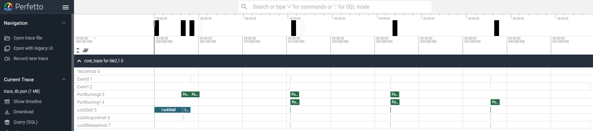

<!---//===- README.md --------------------------*- Markdown -*-===//
//
// This file is licensed under the Apache License v2.0 with LLVM Exceptions.
// See https://llvm.org/LICENSE.txt for license information.
// SPDX-License-Identifier: Apache-2.0 WITH LLVM-exception
//
// Copyright (C) 2024, Advanced Micro Devices, Inc.
//
//===----------------------------------------------------------------------===//-->

# <ins>Section 4b - Trace</ins>

* [Section 4 - Performance Measurement & Vector Programming](../../section-4)
    * [Section 4a - Timers](../section-4a)
    * Section 4b - Trace
    * [Section 4c - Kernel Vectorization and Optimization](../section-4c)

-----

In the previous [section-4a](../section-4a), we looked at how timers can be used to get an overview of application performance. However, for kernel programmers that want to optimize the AIE hardware to its fullest potential, being able to see how efficiently the AIE cores and data movers are running is important. As such, the AIEs are equipped with tracing hardware that provides a cycle accurate view of hardware events. More detailed specification of the AIE2 trace unit can be found at in [AM020](https://docs.amd.com/r/en-US/am020-versal-aie-ml/Trace).

Enabling trace support can be done with the following steps:

## <u>Steps to Enable Trace Support</u>
1. [Enable and configure AIE trace units](#1-enable-and-configure-aie-trace-units)
1. [Configure host code to read trace data and write it to a text file](#2-configure-host-code-to-read-trace-data-and-write-it-to-a-text-file)
1. [Parse text file to generate a waveform json file](#3-parse-text-file-to-generate-a-waveform-json-file)
1. [Open json file in a visualization tool like Perfetto](#4-open-json-file-in-a-visualization-tool-like-perfetto)
* [Additional Debug Hints](#additional-debug-hints)


## <u>1. Enable and configure AIE trace units</u>

Enabling tracing means (1a) configuring the trace units for a given tile and then (1b) routing the generated events packets through the stream switches to the shim DMA where we can write them to a buffer in DDR for post-runtime processing.

### <u>(1a) Configure trace units for an AIE tile</u>
The first necessary component for trace configuration is setting the right values for the trace control registers for each tile that we want to enable tracing for. In addition, the generated trace packets will need to be routed to shimDMA and then written to one of the 3 inout buffers. We have abstracted these two steps with the python wrapper function `configure_packet_tracing_aie2` which is in [python/utils/test.py](../../../python/utils/test.py) and is described in more detail the [README](../../../python/utils) under `python/utils`. An example of how this function is used is shown below for quick reference
```python
    trace_utils.configure_packet_tracing_aie2(tiles_to_trace, ShimTile, opts.trace_size, 4096*4)
```
The arguments for this example are
* *tiles_to_trace* - array of compute tiles we want to trace
* *ShimTile* - shim tile that the trace is going out to
* *opts.trace_size* - the trace buffer size in bytes
* *4096*4* - the output buffer offset in bytes where the trace data begins

This block is defined within the sequence definition for `@runtime_sequence` where we define the shimDMA data movement to the 3 inout buffers.
> **Note** This simplified wrapper is an enahnced version of the simpler `configure_simple_tracing_aie2` used previously which routed the trace from a single compute tile using circuit switched routing. This enhanced version relies on packet swtiched routing and supports tracing from multiple tiles by synchronizing the start event for each tile's trace unit to a user generated event. More details can be found in the [README](../../../python/utils) under `python/utils` for more guidance on how to customize the trace configuration.

### <u>(1b) Define trace event routes from tile to shimDMA</u>
Once the trace units and shimDMA are configured, we need to define how the trace packets are routed from compute tile to shim tile. This is done via circuit switched flows or packet switched flows as described below. Note that trace units in the MemTile and ShimTile can also be configured and routed.

We can simplify the defining the packet switched flows for the tiles we're tracing with the function `configure_packet_tracing_flow` defined in [python/utils/test.py](../../../python/utils/test.py) and is described in more detail the [README](../../../python/utils) under `python/utils`. An example of how this function is used is shown below for quick reference
```python
    trace_utils.configure_packet_tracing_flow(tiles_to_trace, ShimTile)
```
The arguments for this example are
* *tiles_to_trace* - array of compute tiles we want to trace
* *ShimTile* - shim tile that the trace is going out to

> **Note** The synchronization of this function with the previous is `configure_packet_tracing_aie` is important because we track the route IDs and bd numbers of each configured trace. Do not mix and match these with circuit switched routing as they are intended to work together as a packet tracing pair.

More details about the mechanics for circuit and packet switched flows is described below if interested. Otherwise, you can skip ahead to 2. Configure host code to read trace data and write it to a text file.

#### <u>Circuit switched flows</u>
An example of a simple circuit switch routing flow to route trace event packets from a compute tile to a shimDMA would be:

```python
flow(ComputeTile, WireBundle.Trace, 0, ShimTile, WireBundle.DMA, 1)
```

`flow` creates a circuit switched flow between src and dest and has the general syntax of:
```python
flow(source, source_bundle, source_channel, dest, dest_bundle, dest_channel)
```
* *source* - source tile of the flow
* *source_bundle* - type of source WireBundle (see full list in [AIEAttrs.td](../../../include/aie/Dialect/AIE/IR/AIEAttrs.td))
* *source_channel* - source channel index
* *dest* - destination tile of the flow
* *dest_bundle* - type of destination WireBundle (see full list in [AIEAttrs.td](../../../include/aie/Dialect/AIE/IR/AIEAttrs.td))
* *dest_channel* - destination channel index

It is important to consider the path this routing might take and how many other streams might be using that same path. This points to whether our design may experience stream routing congestion or not. While capturing trace events are non-intrusive (does not affect the performance of the AIE cores), the routing of these trace packets need to be balanced in your design to prevent congestion.

#### <u>Packet switched flows</u>
The alternative to circuit switched routes is packet switched routes. The benefit of this is the ability to share a single stream switch routing channel between multiple routes. The drawback is the slight overhead of data packet headers as well as needing to gauge how much congestion might be present on a shared route given the data movement requirement of the AIE array design. This means that if multiple flows are sharing the same channel, any particular flow might experience backpressure while another flow is serviced. Depending on the performance requirement of the design, this may or may not have a performance impact.

In IRON Python bindings, we declare packet flows with the following syntax:
```python
packetflow(pkt_id, source, source_port, source_channel, dest, dest_port, dest_channel, keep_pkt_header)
```
* *pkt_id* - unique packet ID
* *source* - source tile of the packet flow
* *source_port* - type of source WireBundle (see full list in [AIEAttrs.td](../../../include/aie/Dialect/AIE/IR/AIEAttrs.td)). Some examples include `WireBundle.Trace`, `WireBundle.DMA`, `WireBundle.North`
* *source_channel* - source channel index. For a given port, we often use multiple channels such as DMA channel 0 and DMA channel 1. In AIE2 core tiles, trace ports use channel 0 for the tile core and 1 for the tile memory.
* *dest* - destination tile of the packet flow
* *dest_port* - type of destination WireBundle (see full list in [AIEAttrs.td](../../../include/aie/Dialect/AIE/IR/AIEAttrs.td))
* *dest_channel* - destination channel index
* *keep_pkt_header* - boolean flag to keep header


MLIR examples are similar and are included below for quick reference but are more fully defined in the [AIE Dialect online documentation](https://xilinx.github.io/mlir-aie/AIEDialect.html):
```mlir
packetflow(1) {
    aie.packet_source<%tile02, Trace : 0> // core trace
    aie.packet_dest<%tile00, DMA : 1>
} {keep_pkt_header = "true"}
```

To support packet switched flows, we need to declare packet flows and attach both a `packet ID` and `packet type` to the packets. `Packet type` in particular is needed to distinguish packets coming from different tiles types (tile core, tile memory, memtiles, shimtiles). The association between tile trace units and packet types are as follows:

| Tile trace unit | packet type |
|-----------------|-------------|
| Tile core       | 0           |
| Tile memory     | 1           |
| ShimTile        | 2           |
| MemTile         | 3           |

> **NOTE**: Quick reminder that most source flow channels from `WireBundle.Trace` will use channel 0, but the `Tile memory` actually uses channel 1.

The `packet IDs`, on the other hand, an be variable but must be globally unique to distinguish routes from one another. An example is shown below for two tiles where both tile core and tile memory trace units are routed. Note the `packet ID` used after the `packetflow` keyword. Also note that we set `keep_pkt_header = true` as we would like to keep the packet headers when they are moved to DDR so we can distinguish the packets during post-run parsing.

```python
packetflow(1, ComputeTile2, WireBundle.Trace, 0, ShimTile, WireBundle.DMA, 1, keep_pkt_header=True) # core trace
packetflow(2, ComputeTile2, WireBundle.Trace, 1, ShimTile, WireBundle.DMA, 1, keep_pkt_header=True) # core mem trace
packetflow(3, ComputeTile3, WireBundle.Trace, 0, ShimTile, WireBundle.DMA, 1, keep_pkt_header=True) # core trace
packetflow(4, ComputeTile3, WireBundle.Trace, 1, ShimTile, WireBundle.DMA, 1, keep_pkt_header=True) # core mem trace
```

## <u>2. Configure host code to read trace data and write it to a text file</u>

Once the trace units are configured and enabled, we want the host code to read the trace data from DDR and write it out to a text file for post-run processing. To give a better sense of how this comes together, this section provides an example design that is again a simplifed version of the [Vector Scalar Multiply example](../../../programming_examples/basic/vector_scalar_mul/).

### <u>AIE structural design code ([aie2.py](./aie2.py))</u>
In order to write the DDR data to a text file, we need to decide where we want the DDR data to first be stored and then read from that location, before writing to a text file. This starts inside the [aie2.py](./aie2.py) file where we use the `configure_simple_tracing_aie2` function call to configure the trace units and program the shimDMA to write to 1 of the 3 inout buffers. There are many ways to configure our structural design to write this data out but one pattern is the following: `inout0` is for input data, `inout1` is for output data, and `inout2` is for output trace data as illustrated below:

| inout0 | inout1 | inout2 |
|--------|--------|--------|
| input A  | output C | trace  |

Another common pattern is the case where we have two input buffers and one output buffer. Since we only have 3 inout buffers, we need to append trace data to the end of the output buffer.

| inout0 | inout1 | inout2 |
|--------|--------|--------|
| input A  | input B | (output C + trace)  |

As described in [python/utils](../../../python/utils) for `trace.py`, we configure the `ddr` argument to match which buffer the trace is writing out to in `configure_simple_tracing_aie2`.
| ddr ID value | buffer |
|-----------|--------|
| 0 | inout0 |
| 1 | inout1 |
| 2 | inout2 |

In our simplified vector scalar multiply example, we are using the second inout mapping pattern (inputA, inputB, outputC + trace) as seen in the [aie2.py](./aie.py) source where `inout0` is called `A` (the vector input), `inout1` is called `F` (the scalar input) and `inout2` is called `C` (the vector output). Since the trace is mapped to `inout2`, we set `ddr_id=2` and set the offset to be the output data buffer size given the trace is appended after the data (`offset=4096*4`).

Once [aie2.py](./aie2.py) is configured to output trace data through one of the 3 inout buffers with matching `ddr_id` config and `offset`, we turn our attention to the host code to read the DDR data and write it to a file.

> **NOTE** In our example design ([aie2.py](./aie2.py), [Makefile](./Makefile)), we provide a Makefile target `run` for standard build and `trace` for trace-enabled build. The trace-enabled build passes the trace buffer size as an argument to [aie2.py](./aie2.py) which conditionally enables the trace `flow` and calls `configure_simple_tracing_aie2` as long as `trace_size` is > 0. This is also true for the [Vector Scalar Multiply example](../../../programming_examples/basic/vector_scalar_mul).

### <u>(2a) C/C++ Host code ([test.cpp](./test.cpp))</u>
The main changes needed for [test.cpp](./test.cpp) is the increase in the output buffer size to account for the trace buffer size, being careful to read only the output buffer portion when verifying correctness of the results. We also need to be sure to pass the correct buffer offset which points to the trace buffer data when calling `write_out_trace`.

You can see in [test.cpp](./test.cpp) that trace_size is set based on an input argument of `-t $(trace_size)` which is defined and passed in the [Makefile](./Makefile). The `trace` target from the [Makefile](./Makefile) is shown below.

```Makefile
trace: ${targetname}.exe build/final.xclbin build/insts.txt
	${powershell} ./$< -x build/final.xclbin -i build/insts.txt -k MLIR_AIE -t 8192
	../../../programming_examples/utils/parse_trace.py --filename trace.txt --mlir build/aie.mlir --colshift 1 > trace_4b.json
```
Following the invocation of the executable, we call the `parse_trace.py` python script which we will cover in more detail in step 3.
Within the [test.cpp](./test.cpp), we redefine OUT_SIZE to be the sum of output buffer size (in bytes) and the trace buffer size.
```c++
    int OUT_SIZE = IN_SIZE + trace_size;
```
All subsequent references to the output buffer size should use `OUT_SIZE`. The exception is when we want to verify the output results which should be bounded by the original output buffer size, in this case `IN_SIZE`.

Finally, the function to write the trace output to a file as defined in `aie.utils.trace` is `write_out_trace` and we need to pass it the pointer in the output buffer where the trace data begins, the trace buffer size and the trace file name (default is `trace.txt`).
```c++
      test_utils::write_out_trace(((char *)bufOut) + IN_SIZE, trace_size,
                                  vm["trace_file"].as<std::string>());
```

### <u>(2b) Python Host code ([test.py](./test.py))</u>
In the [Makefile](./Makefile), we also have a `trace_py` target which calls the python host code `test.py`. Here in addition to the `-t ${trace_size}`, we also define the `-s ${data_size}` which is the data size (in int32) for our version of the vector scalar multiply kernel.
```Makefile
trace_py: build/final_trace_${data_size}.xclbin build/insts_${data_size}.txt
	${powershell} python3 test.py -x build/final_trace_${data_size}.xclbin -i build/insts_${data_size}.txt -k MLIR_AIE -t ${trace_size} -s ${data_size}
	../../utils/parse_eventIR.py --filename trace.txt --mlir build/aie_trace_${data_size}.mlir --colshift 1 > parse_eventIR_vs.json
```
The python equivalent host code performs the same steps as the C/C++ host code as we redefine `OUT_SIZE` to include the `trace_size`.
```python
    OUT_SIZE = INOUT2_SIZE + int(opts.trace_size)
```
During verification, the `output_buffer` excludes the trace data and uses the `read` function as follows:
```python
    entire_buffer = bo_inout2.read(OUT_SIZE, 0).view(np.uint32)
    output_buffer = entire_buffer[:INOUT2_VOLUME]
```
Finally, we read `trace buffer` from the entire_buffer starting at the offset of the `INOUT2_VOLUME` and pass the trace buffer to the python equivalent of `write_out_trace` which is defined in `aie.utils.trace`.
> **Note** This version doesn't need the trace_size as our python function recognizes when the array is empty.
```python
    if opts.trace_size > 0:
        trace_buffer = entire_buffer[INOUT2_VOLUME:]
        trace_utils.write_out_trace(trace_buffer, str(opts.trace_file))
```

## <u>3. Parse text file to generate a waveform json file</u>
Once the packet trace text file is generated (`trace.txt`), we use a python-based trace parser ([parse_trace.py](../../../programming_examples/utils/parse_trace.py)) to interpret the trace values and generate a waveform json file for visualization (with Perfetto).
```Makefile
	../../../programming_examples/utils/parse_trace.py --filename trace.txt --mlir build/aie_trace.mlir --colshift 1 > trace_vs.json
```
This leverages the python parse scripts under [programming_examples/utils](../../../programming_examples/utils/). Follow [this link](../../../programming_examples/utils/) to get more details about how to use the python parse scripts.

## <u>4. Open json file in a visualization tool like Perfetto</u>
Open https://ui.perfetto.dev in your browser and then open up the waveform json file generated in step 3. You can navigate the waveform viewer as you would a standard waveform viewer and can even zoom/pan the waveform with the a,s,w,d keyboard keys.

## <u>Additional Debug Hints</u>
* If you are getting 0's in your trace outputs. Check these things:
    * Buffer offset for the DMA is the right size (based on output buffer size)
    * The correct tile is being routed to the the correct shim DMA. It's not uncommon in a multi core design to route the wrong tile, espeically if the tile names might be very similar.
    * For packet-routed flows, check correctly matching packet IDs. The packet flow ID must match the configured ID value in Trace Control 1 register or else the packets don't get routed.

## <u>Exercises</u>
1. Let's give tracing a try. In this directory, we're been examining a simplified version of the `vector ccalar multiply` example. Run `make trace`. This compiles the design, generates a trace data file, and run `prase_trace.py` to generate the `trace_4b.json` waveform file.

    > **NOTE** In this example, `make`, `make run` and `make trace` will all build a structural design with tracing enabled to keep things simple. But only `make trace` will enable tracing in the host code and call `parse_trace.py`. In contrast, the reference `vector scalar multiply example` has a more robust `Makefile` where `make` and `make run` builds the structural design with tracing disabled.

    Open this waveform json in http://ui.perfetto.dev. If you zoom into the region of interest with the keyboard shortcut key W and S to zoom in and out respectively and A and D to pan left and right. You should seem a wave like the following:

    

    Based on this wave, You can mouse over each chunk of continguous data for `PortRunning0` (input dma port) and `PortRunning1` (output dma port). What is the chunk size?  How many input and output chunks are there?  This should match iteration loop bounds in our example design.

    Here, there are a few common events in our waveform that's further described below.
    * `INSTR_EVENT_0` - The event marking the beginning of our kernel. See [vector_scalar_mul.cc](./vector_scalar_mul.cc) where we added the function `event0()` before the loop. This is generally a handy thing to do to attach an event to the beginning of our kernel.
    * `INSTR_EVENT_1` - The event marking the end of our kernel. See [vector_scalar_mul.cc](./vector_scalar_mul.cc) where we added the function `event1()` after the loop. Much like event0, attaching event1 to the end of our kernel is also helpful.
    * `INSTR_VECTOR` - Vector instructions like vector MAC or vector load/store. Here, we are running a scalar implementation so there are no vector events.
    * `PORT_RUNNING_0` up to `PORT_RUNNING_7` - You can listen for a variety of events, such as `PORT_RUNNING`, `PORT_IDLE` or `PORT_STALLED` on up to 7 ports. To select which port to listen to, use the `PortEvent` Python class as your event. For example, to listen to master port 1:
        ```
        from aie.utils.trace import configure_simple_tracing_aie2, PortEvent
        from aie.utils.trace_events_enum import CoreEvent, MemEvent, PLEvent, MemTileEvent
        trace_utils.configure_simple_tracing_aie2(
            # ... other arguments as above
            events=[trace_utils.PortEvent(CoreEvent.PORT_RUNNING_0, 1, master=True)]
        )
        ```
    * `PORT_RUNNING_1` - Mapped to Port 1 which is by default configured to the MM2S0 output (DMA from local memory to stream). This is usually the first output.
    * `LOCK_STALL` - Any locks stalls
    * `INSTR_LOCK_ACQUIRE_REQ` - Any lock acquire requests
    * `INSTR_LOCK_RELEASE_REQ` - Any lock release requests

    We will look at more exercises with Trace and performance measurement in the next [section](../section-4c).

-----
[[Prev]](../section-4a) [[Up]](../../section-4) [[Next]](../section-4c)
