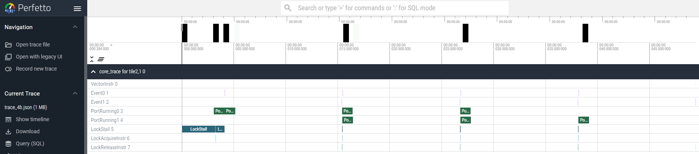

<!---//===- README.md --------------------------*- Markdown -*-===//
//
// This file is licensed under the Apache License v2.0 with LLVM Exceptions.
// See https://llvm.org/LICENSE.txt for license information.
// SPDX-License-Identifier: Apache-2.0 WITH LLVM-exception
//
// Copyright (C) 2024-2026, Advanced Micro Devices, Inc.
//
//===----------------------------------------------------------------------===//-->

# <ins>Section 4b - Trace</ins>

* [Section 4 - Performance Measurement & Vector Programming](../../section-4)
    * [Section 4a - Timers](../section-4a)
    * Section 4b - Trace
    * [Section 4c - Kernel Vectorization and Optimization](../section-4c)

-----

In the previous [section-4a](../section-4a), we looked at how timers can be used to get an overview of application performance. However, for kernel programmers that want to optimize the AIE hardware to its fullest potential, being able to see how efficiently the AIE cores and data movers are running is important. As such, the AIEs are equipped with tracing hardware that provides a cycle accurate view of hardware events. More detailed specification of the AIE2 trace unit can be found at in [AM020](https://docs.amd.com/r/en-US/am020-versal-aie-ml/Trace).

Enabling trace support can be done with the following steps:

## <u>Steps to Enable Trace Support</u>
1. [Enable and configure trace](#1-enable-and-configure-aie-trace)
1. [Configure host code to read trace data and write it to a text file](#2-configure-host-code-to-read-trace-data-and-write-it-to-a-text-file)
1. [Parse text file to generate a waveform json file](#3-parse-text-file-to-generate-a-waveform-json-file)
1. [Open json file in a visualization tool like Perfetto](#4-open-json-file-in-a-visualization-tool-like-perfetto)
* [Additional Debug Hints](#additional-debug-hints)

## <u>1. Enable and configure AIE trace</u>

Enabling tracing means configuring the trace units for a given tile and then routing the generated event packets through the stream switches to the shim DMA where we can write them to a buffer in DDR for post-runtime processing. For our high-level IRON descriptions, we abstract these steps into a single runtime function `enable_trace` within the larger runtime sequence as shown below:
```python
rt = Runtime()
with rt.sequence(tensor_ty, scalar_ty, tensor_ty) as (a_in, f_in, c_out):
    rt.enable_trace(trace_size, workers=[my_worker])
    ...
```

An alternative is to add a `trace` parameter to the worker declaration:

```python
worker = Worker(
    core_body,
    fn_args=[of_in.cons(), of_factor.cons(), of_out.prod(), scale],
    trace=1,
)
...
rt = Runtime()
with rt.sequence(tensor_ty, scalar_ty, tensor_ty) as (a_in, f_in, c_out):
    rt.enable_trace(trace_size)
    ...
```
Here, we add `trace=1` to indicate that worker should be traced. And we can omit the `workers` argument from the `enable_trace` call in the runtime sequence.

>**NOTE**: The `workers` argument in the runtime sequence `enable_trace` always takes precedence over the `trace=1` argument of the worker. So if you define both, we will go with the definition of the `enable_trace` argument.

Configuring the trace unit in each core tile and routing the trace packets to a valid shim tile is then done automatically.

>**NOTE**: The unplaced `enable_trace` API can only trace workers (core tiles). To trace mem tiles, shim tiles, or use the full `PortEvent` API, use the placed design API described in [README-placed](./README-placed.md).

### <u>Customizing Trace Behavior</u>

The trace configuration chooses helpful default settings so you can trace your design with little additional customization. However, if you want more control over some of these configuration, additional arguments are available in `enable_trace`:
* `ddr_id` - XRT buffer index (0-4) to write trace data to, mapping to group_id (3-7). Defaults to 4 (group_id 7). Set to -1 to append trace data after the last runtime_sequence tensor argument. See [below](#2-configure-host-code-to-read-trace-data-and-write-it-to-a-text-file) for more details on XRT buffers.
* `coretile_events` - which 8 events do we use for all coretiles in array. Search under https://xilinx.github.io/mlir-aie/AIEXDialect.html for CoreEvent for the target device [[aie1](https://xilinx.github.io/mlir-aie/AIEXDialect.html#coreeventaie)][[aie2](https://xilinx.github.io/mlir-aie/AIEXDialect.html#coreeventaie2)][[aie2p](https://xilinx.github.io/mlir-aie/AIEXDialect.html#coreeventaie2p)].
* `coremem_events` - which 8 events do we use for all core mem in array. Search under https://xilinx.github.io/mlir-aie/AIEXDialect.html for MemEvent for the target device [[aie1](https://xilinx.github.io/mlir-aie/AIEXDialect.html#coreeventaie)][[aie2](https://xilinx.github.io/mlir-aie/AIEXDialect.html#coreeventaie2)][[aie2p](https://xilinx.github.io/mlir-aie/AIEXDialect.html#coreeventaie2p)].
* `memtile_events` - which 8 events do we use for all memtiles in array. Search under https://xilinx.github.io/mlir-aie/AIEXDialect.html for MemTileEvent for the target device [[aie1](https://xilinx.github.io/mlir-aie/AIEXDialect.html#memevent)][[aie2](https://xilinx.github.io/mlir-aie/AIEXDialect.html#memevent2)][[aie2p](https://xilinx.github.io/mlir-aie/AIEXDialect.html#memevent2p)]
* `shimtile_events` - which 8 events do we use for all shimtiles in array. Search under https://xilinx.github.io/mlir-aie/AIEXDialect.html for ShimTileEvent for the target device [[aie1](https://xilinx.github.io/mlir-aie/AIEXDialect.html#shimtileevent)][[aie2](https://xilinx.github.io/mlir-aie/AIEXDialect.html#shimtileevent2)][[aie2p](https://xilinx.github.io/mlir-aie/AIEXDialect.html#shimtileevent2p)]

    ```python
    ...
    rt = Runtime()
    with rt.sequence(tensor_ty, scalar_ty, tensor_ty) as (a_in, f_in, c_out):
        rt.enable_trace(
            trace_size = trace_size,
            ddr_id = 4,
            coretile_events = [
                    trace_utils.CoreEvent.INSTR_EVENT_0,
                    trace_utils.CoreEvent.INSTR_EVENT_1,
                    trace_utils.CoreEvent.INSTR_VECTOR,
                    trace_utils.CoreEvent.MEMORY_STALL,
                    trace_utils.CoreEvent.STREAM_STALL,
                    trace_utils.CoreEvent.LOCK_STALL,
                    trace_utils.CoreEvent.ACTIVE,
                    trace_utils.CoreEvent.DISABLED]
        )
    ```

Additional customizations are available in the closer-to-metal IRON and is described more in [README-placed](./README-placed.md).

## <u>2. Configure host code to read trace data and write it to a text file</u>

Once the trace units are configured and routed, we want the host code to read the trace data from DDR and write it out to a text file for post-run processing. To give a better sense of how this comes together, this section provides an example design that is again a simplifed version of the [Vector Scalar Multiply example](../../../programming_examples/basic/vector_scalar_mul/).

### <u>AIE structural design code ([aie2.py](./aie2.py))</u>
In order to write the DDR data to a text file, we need to know where in DDR the trace data is stored and then read from that location. This starts inside the [aie2.py](./aie2.py) file where the `enable_trace` function under the hood expands to calls to configure the trace units and program the shimDMA to write to one of XRT inout buffers. It is helpful to have a more in-depth understanding about the *XRT buffer objects* described in [section 3](../../section-3). There we had described that our XRT supports up to 5 inout buffer objects. Common usage patterns include 1 input/ 1 output and 2 input/ 1 output. These patterns then map in the following way where the *group_id* is listed next to each XRT buffer object, `inoutN (group_id)`.

| inout0 (3) | inout1 (4) |
|--------|--------|
| input A  | output C |

| inout0 (3) | inout1 (4) | inout2 (5) |
|--------|--------|--------|
| input A  | input B | output C  |

To support trace, we will configure a shim tile to move the trace packet data to DDR through one of these XRT buffer objects. For simplicity, we choose `inout4 (7)` as the default case such that the new trace enabled mapping is:

| inout0 (3)| inout1 (4) | inout2 (5) | inout3 (6)| inout4 (7)|
|--------|--------|--------|--------|--------|
| input A  | output C | unused | unused | trace  |

| inout0 (3)| inout1 (4)| inout2 (5)| inout3 (6)| inout4 (7)|
|--------|--------|--------|--------|--------|
| input A  | input B | output C | unused | trace  |

In some designs, we have also used a pattern where we share an XRT buffer object where the trace data is written to same buffer object as the output by setting `ddr_id=-1`. This is helpful if we do not have a spare buffer object dedicated to trace, but requires precise declaration of offset size. See [Conv2d example](../../../programming_examples/ml/conv2d/).

| inout0 (3)| inout1 (4)| inout2 (5)|
|--------|--------|--------|
| input A  | input B | (output C + trace) |

By specifying `inout4 (7)` as the default case, we can leave the parameters for `enable_trace()` / `start_trace()` to their default values other than `trace_size`. However, if we do decide to customize the XRT buffer object used, we can do so through `ddr_id` (to specify the buffer to use). Setting `ddr_id=-1` appends trace data after the last output tensor, using the last argument's buffer index and a byte offset equal to the tensor size.

Once the design is configured to a XRT buffer object, we turn our attention to the host code to read the DDR data and write it to a file.

> **NOTE** In our example design, we provide a [Makefile](./Makefile) target `run` for standard build and `trace` for trace-enabled build. The trace-enabled build passes the trace buffer size as an argument which is used under the hood to conditionally enable tracing as long as `trace_size` is > 0. This is also true for the [Vector Scalar Multiply example](../../../programming_examples/basic/vector_scalar_mul).

### <u>(2a) C/C++ Host code ([test.cpp](./test.cpp), [../../../runtime_lib/test_lib/xrt_test_wrapper.h](../../../runtime_lib/test_lib/xrt_test_wrapper.h))</u>
The main changes needed for the host code is declare a buffer object for trace data and pass that buffer object to the XRT kernel function call. This looks like the following snippets of code:

```c
    auto bo_trace = xrt::bo(device, tmp_trace_size, XRT_BO_FLAGS_HOST_ONLY,
                            kernel.group_id(7));

    ...

    char *bufTrace = bo_trace.map<char *>();
    memset(bufTrace, 0, myargs.trace_size);
    bo_trace.sync(XCL_BO_SYNC_BO_TO_DEVICE);

    ...

    auto run = kernel(opcode, bo_instr, instr_v.size(), bo_in1, bo_in2, bo_out, 0, bo_trace);
    bo_trace.sync(XCL_BO_SYNC_BO_FROM_DEVICE);
```
Once the design has been executed. We can then use the convenience function `write_out_trace` to write the buffer contents to a file for post-processing.
```c
    test_utils::write_out_trace((char *)bufTrace, myargs.trace_size, myargs.trace_file);
```

#### Templated host code (test.cpp)
Because the code patterns for measuring host code timing and configuring trace are so often repeated, they have been further wrapped into the convenience function `setup_and_run_aie` in [xrt_test_wrapper.h](../../../runtime_lib/test_lib/xrt_test_wrapper.h) which then allows us to create a simpler top level host code [test.cpp](./test.cpp).

In our template host code [test.cpp](./test.cpp) for 2 inputs and 1 output, we customize the following:
* Input and output buffer size (in bytes) - Specified in the [Makefile](./Makefile) and [CMakeLists.txt](./CMakeLists.txt) and then passed into the [aie2_placed.py](./aie2_placed.py) and [test.cpp](./test.cpp)
    ```Makefile
        in1_size = 16384 # in bytes
        in2_size = 4 # in bytes, should always be 4 (1x int32)
        out_size = 16384 # in bytes, should always be equal to in1_size
    ```
* Buffer data types - Defined in [aie2_placed.py](./aie2_placed.py) and [test.cpp](./test.cpp). The types should match but even if they don't, the buffer size will match and prevent hangs.

    In [aie2_placed.py](./aie2_placed.py):
    ```Python
        in1_dtype = np.int32
        in2_dtype = np.int32
        out_dtype = np.int32
    ```
    In [test.cpp](./test.cpp)
    ```C
        using DATATYPE_IN1 = std::int32_t;
        using DATATYPE_IN2 = std::int32_t;
        using DATATYPE_OUT = std::int32_t;
    ```
* Buffer initialization functions, Verificiation function - Defined in [test.cpp](./test.cpp) and passed into `setup_and_run_aie` as shown below:
    ```C
    // Initialize Input buffer 1
    void initialize_bufIn1(DATATYPE_IN1 *bufIn1, int SIZE) {
    for (int i = 0; i < SIZE; i++)
        bufIn1[i] = i + 1;
    }

    // Initialize Input buffer 2
    void initialize_bufIn2(DATATYPE_IN2 *bufIn2, int SIZE) {
    bufIn2[0] = 3; // scaleFactor
    }

    // Initialize Output buffer
    void initialize_bufOut(DATATYPE_OUT *bufOut, int SIZE) {
    memset(bufOut, 0, SIZE);
    }

    // Functional correctness verifyer
    int verify_vector_scalar_mul(DATATYPE_IN1 *bufIn1, DATATYPE_IN2 *bufIn2,
                                DATATYPE_OUT *bufOut, int SIZE, int verbosity) {
    int errors = 0;

    for (int i = 0; i < SIZE; i++) {
        int32_t ref = bufIn1[i] * bufIn2[0];
        int32_t test = bufOut[i];
        if (test != ref) {
        if (verbosity >= 1)
            std::cout << "Error in output " << test << " != " << ref << std::endl;
        errors++;
        } else {
        if (verbosity >= 1)
            std::cout << "Correct output " << test << " == " << ref << std::endl;
        }
    }
    return errors;
    }
    ```

* Setup and run program - The function wrapper `setup_and_run_aie` then sets up the device and XRT buffers and runs the program as defined within [../../../runtime_lib/test_lib/xrt_test_wrapper.h](../../../runtime_lib/test_lib/xrt_test_wrapper.h). Here, we see that `setup_and_run_aie` also handles the trace configuration, trace buffer setup and synchronization, and writing trace data to an output file.

In the example simplified `vector_scalar_mul` design, we can build the complete design, including the C/C++ host code [test.cpp](./test.cpp) by running:
```bash
make trace
```


### <u>(2b) Python Host code ([test.py](./test.py), [../../../python/utils/xrt.py](../../../python/utils/xrt.py))</u>
In the [Makefile](./Makefile), we also have a `trace_py` target which calls the python host code `test.py` instead of the C/C++ host code `test.cpp`.

#### test_utils (recommended)

The recommended approach is to use `test_utils.create_npu_kernel`, which creates both a [`TraceConfig`](../../../python/utils/trace/config.py) and an [`NPUKernel`](../../../python/utils/npukernel.py) from command-line arguments:

```python
import aie.utils.test as test_utils
...
npu_opts = test_utils.create_npu_kernel(opts)
res = DefaultNPURuntime.run_test(npu_opts.npu_kernel, ...)
```

The relevant CLI arguments (from `test_utils.create_default_args()`) are:
- `--trace-sz` (`-t`): Trace buffer size in bytes. Tracing is enabled when this is > 0.
- `--trace-file`: Path to write raw trace data (default: `trace.txt`).
- `--ddr-id`: DDR buffer index for trace (0-4, or -1 to append after last tensor). Default is 4.

> **IMPORTANT**: The `ddr_id` value (set via `--ddr-id`) **must match** the `ddr_id` parameter in your IRON `enable_trace()` (unplaced) / `start_trace()` (placed) call, or buffer allocation will be incorrect.

#### TraceConfig (manual setup)

For custom host code, you can create a [`TraceConfig`](../../../python/utils/trace/config.py) directly and pass it to [`NPUKernel`](../../../python/utils/npukernel.py):

```python
from aie.utils.trace import TraceConfig
from aie.utils.npukernel import NPUKernel

trace_config = TraceConfig(
    trace_size=8192,                # Buffer size in bytes
    trace_file="trace.txt",         # Output file for raw trace data (default)
)

npu_kernel = NPUKernel(
    xclbin_path="build/final.xclbin",
    insts_path="build/insts.txt",
    trace_config=trace_config,
)
```

Under the hood, the [DefaultNPURuntime](../../../python/utils/hostruntime/hostruntime.py) uses `TraceConfig` to allocate the trace XRT buffer, synchronize it after execution, and write the trace data to the output file -- similar to the C++ `write_out_trace` function and `setup_and_run_aie` wrapper in [xrt_test_wrapper.h](../../../runtime_lib/test_lib/xrt_test_wrapper.h).

## <u>3. Parse text file to generate a waveform json file</u>
Once the packet trace text file is generated (`trace.txt`), we use a python-based trace parser ([parse.py](../../../python/utils/trace/parse.py)) to interpret the trace values and generate a waveform json file for visualization (with Perfetto). This is a step in the [Makefile](./Makefile) but can be executed from the command line as well.

The `--mlir` argument should point to `input_with_addresses.mlir` from the `.prj` work directory, not the original source MLIR. This file contains the lowered register writes produced by the trace passes, which the parser uses to map raw trace packets back to named events.

```bash
python ../../../python/utils/trace/parse.py \
    --input trace.txt \
    --mlir build/aie.mlir.prj/input_with_addresses.mlir \
    --output trace.json
```

In our example [Makefile](./Makefile), we also run [get_trace_summary.py](../../../python/utils/trace/get_trace_summary.py) to analyze the generated JSON trace file to count the number of invocations of the kernel and the cycle count of those invocations. This depends on the kernel having an `event0` and `event1` function call at the beginning and end of the kernel, which our example does. `event0` and `event1` are functions that generate an internal event and is helpful for us to mark the boundaries of a function call.

## <u>4. Open json file in a visualization tool like Perfetto</u>
Open https://ui.perfetto.dev in your browser and then open up the waveform json file generated in step 3. You can navigate the waveform viewer as you would a standard waveform viewer and can even zoom/pan the waveform with the a,s,w,d keyboard keys.

## <u>Additional Debug Hints</u>
* If you are not getting valid trace data out (e.g. empty `trace.txt` or just 0's), then trace packets were not written to a file successfully. There could be a number of reasons for this but some things to check are:
    * Did you write to the correct XRT buffer object that your host code is reading from? The default is `ddr_id=4` (`group_id=7`), which means trace data is written to a dedicated XRT buffer. If using `ddr_id=-1`, trace data is appended after the last tensor argument.
        * If using the **Python host** (`DefaultNPURuntime` / `TraceConfig`), buffer management is handled automatically. However, `ddr_id` in `TraceConfig` must match the corresponding parameter in your IRON `enable_trace()` / `start_trace()` call.
        * If using a **C/C++ host** with `ddr_id=-1`, trace data is appended to the last `runtime_sequence` argument's buffer at an offset equal to the output size. Allocate that buffer large enough for both output and trace data, and do **not** create a separate `bo_trace` at `group_id(7)`.
    * It's possible that a simple core may have too few events to create a valid trace packet. For placed designs, you can work around this by adding a ShimTile to the `tiles_to_trace` array in `configure_trace()` to generate additional trace data.
    * Check that the correct tile is being routed to the correct shim DMA. Using the declarative trace API handles this automatically.
    * You may get an invalid tile error if the `colshift` doesn't match the actually starting column of the design. This should automatically be set by the `parse.py` script but can also be specified manually. Phoenix (npu) devices should have `colshift=1` while Strix (npu2) should have `colshift=0` when allocated to an unused NPU.
    * For designs with packet-routing flows, check for correctly matching packet flow IDs. The packet flow ID must match the configured ID value in Trace Control 1 register or else the packets don't get routed. Using the declarative trace API handles this automatically.

## <u>Exercises</u>
1. Let's give tracing a try. In this directory, we will be examining a simplified version of the `vector scalar multiply` example. Run `make trace`. This compiles the design, generates a trace data file, and runs `parse.py` to generate the `trace_4b.json` waveform file.

    Open this waveform json in http://ui.perfetto.dev. If you zoom into the region of interest with the keyboard shortcut keys W and S to zoom in and out respectively and A and D to pan left and right. You should see a wave like the following:

    

    Based on this wave, You can mouse over each chunk of continguous data for `PortRunning0` (input dma port) and `PortRunning1` (output dma port). What is the chunk size?  How many input and output chunks are there?  This should match iteration loop bounds in our example design.

    There are a few common events in our waveform that are described below:
    * `INSTR_EVENT_0` - The event marking the beginning of our kernel. See [vector_scalar_mul.cc](./vector_scalar_mul.cc) where we added the function `event0()` before the loop. This is generally a handy thing to do to attach an event to the beginning of our kernel.
    * `INSTR_EVENT_1` - The event marking the end of our kernel. See [vector_scalar_mul.cc](./vector_scalar_mul.cc) where we added the function `event1()` after the loop. Much like event0, attaching event1 to the end of our kernel is also helpful.
    * `INSTR_VECTOR` - Vector instructions like vector MAC or vector load/store. Here, we are running a scalar implementation so there are no vector events.
    * `PORT_RUNNING_0` up to `PORT_RUNNING_7` - You can listen for a variety of events, such as `PORT_RUNNING`, `PORT_IDLE` or `PORT_STALLED` on up to 8 ports. To select which port to listen to, use the `PortEvent` Python class. See [README-placed](./README-placed.md#portevent-api) for the full `PortEvent` API and examples.
    * `PORT_RUNNING_1` - Mapped to Port 1 which is configured to the MM2S0 output (DMA from local memory to stream) in this example. This is usually the first output based on routing algorithm.
    * `LOCK_STALL` - Any locks stalls.
    * `INSTR_LOCK_ACQUIRE_REQ` - Any lock acquire requests.
    * `INSTR_LOCK_RELEASE_REQ` - Any lock release requests.

    We will look at more exercises with Trace and performance measurement in the next [section](../section-4c).

-----
[[Prev]](../section-4a) [[Up]](../../section-4) [[Next]](../section-4c)
