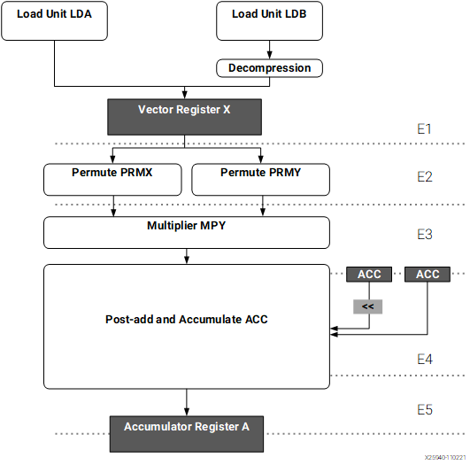
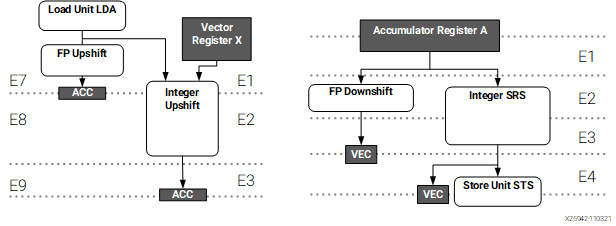
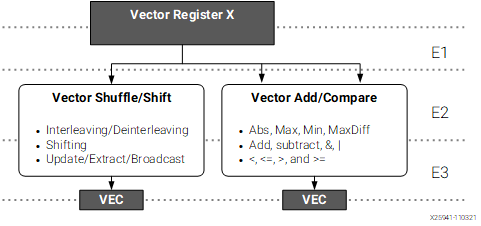
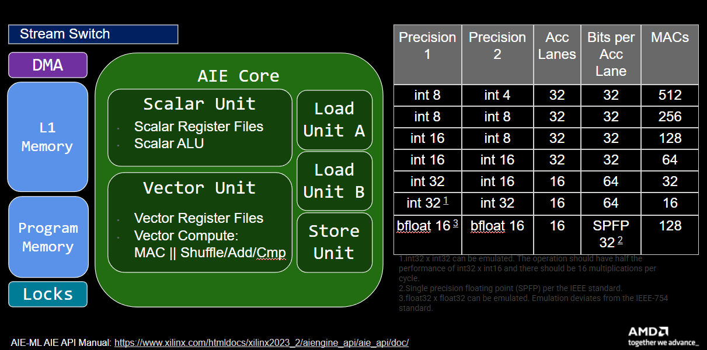
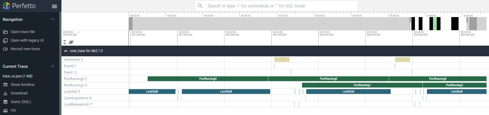

<!---//===- README.md --------------------------*- Markdown -*-===//
//
// This file is licensed under the Apache License v2.0 with LLVM Exceptions.
// See https://llvm.org/LICENSE.txt for license information.
// SPDX-License-Identifier: Apache-2.0 WITH LLVM-exception
//
// Copyright (C) 2024, Advanced Micro Devices, Inc.
// 
//===----------------------------------------------------------------------===//-->

# <ins>Section 4c - Kernel Vectorization and Optimization</ins>

* [Section 4 - Performance Measurement & Vector Programming](../../section-4)
    * [Section 4a - Timers](../section-4a)
    * [Section 4b - Trace](../section-4b)
    * Section 4c - Kernel Vectorization and Optimization

-----

Now that we are able to measure the total application time ([section-4a](../section-4a/)) and have seen how we can look at kernel performance via tracing ([section-4b](../section-4b)), we will take a closer look at kernel vectorization and compare perfomance using trace. We will be now switch to using the [vector-scalar multiply example](../../../programming_examples/basic/vector_scalar_mul/) rather than a local copy of that same design to illustrate kernel vectorization concepts. Note that by default, that example design is working with 16-bit data (vs 32-bit in our previous setion-4 examples) and has `vectorized=True`.

Go ahead and read the design example summary for [vector-scalar multiply](../../../programming_examples/basic/vector_scalar_mul/) first to get an idea of the different components of this example design. Then, let's take a closer look at the kernel source file ([scale.cc](../../../aie_kernels/aie2/scale.cc)).

In [scale.cc](../../../aie_kernels/aie2/scale.cc), we see that the scalar code is relatively straight forward and similar to the scalar code we used in [section-4bb](../section-4b):
```C++
template <typename T>
void scale_scalar(T *a, T *c, T factor, const int32_t N) {
  event0();
  for (int i = 0; i < N; i++) {
    c[i] = factor * a[i];
  }
  event1();
}
```

Here, the code iterates over the input vector (`a`) and multiplies each element from the vector with a scalar value (`factor`) before storing the results in output vector (`c`). The simple C/C++ code for this consists of a for-loop, with a simple read and scalar multiply operation inside the loop.

### <u>AIE API</u>
To vectorize this, we first need to familiarize ourselves with the AIE API which abstracts the underlying AIE processor and associated low-level intrinsics with an higher level C++ API. Documentation for AIE API (2023.2 Vitis tools) can be found [here](https://www.xilinx.com/htmldocs/xilinx2023_2/aiengine_api/aie_api/doc/modules.html). To view details on the vector x scalar multiplier, on the left pane, navigate to *AI Engine API User Guide -> API Reference -> Arithmetic* and select the first `aie::mul` which shows a `Vec * E` where `E` is an elementary data type like a scalar int. 

To be able to use this AIE API function in our kernel code, we first need to include the AIE API headers in our kernel source.
```C++
#include <aie_api/aie.hpp>
```

#### <u>Vector Registers</u>
Then, we declare a vector as follows:
```C++
aie::vector<T, vec_factor> my_vector
```
* T - data type, such as `int16_t`
* vec_factor - vector size, such as 32. 

The size of the vector depends on the type. For example, the standard vector register in AIE2 is **512 bits**. For `int16_t`, that means we can store 32 of them in 1x 512b vector register. Extending this to the other supported data types, we have the following abbreviated table:

| Data type | Vector size |
|-----------|-------------|
| int32_t   | 16 |
| int16_t   | 32 |
| int8_t   | 64 |
| int4_t   | 128 |

A more complete table of supported vectors can be found in the AIE API User Guide [here](https://www.xilinx.com/htmldocs/xilinx2023_2/aiengine_api/aie_api/doc/group__group__basic__types.html). Note that if the listed data types * vector size ends up being larger than 512-bits, that just means it's stored in 2+ vector registers instead of just one.

#### <u>Vector Load</u>

We can load the vector register from local L1 memory with the `aie::load_v` function, defined as follows:
```C++
      T *__restrict pA1 = a;

      aie::vector<T, vec_factor> A0 = aie::load_v<vec_factor>(pA1);
```
Here, we use `__restict` to qualify the pointer to indicate that it's a restrict pointer which says that the pointer is the only thing that accesses the underlying object. It eliminates the potential for pointer aliasing, enabling better optimization by the compiler.

The vector load has a template argument `vec_factor` to match the one used in the `aie::vector` declaration.

#### <u>Vector Multiply and Store</u>

Finally, we get to the `aie::mul` call which takes a vector and a scalar as arguments and stores the result in an accumulator register designated by:
```C++
      aie::accum<acc32, vec_factor> cout
```
The accumulator data type in this case is 32x 32-bit accumulator. We store the computed results back to local memory using the vector store function `aie::store_v`. Note that for `int32_t` datatypes, we require a larger accumulator (`acc64`).
```C++
      T *__restrict pC1 = c;

      aie::store_v(pC1, cout.template to_vector<T>(0)):
```
Here, the accumulator type can be shift-round-saturated back to a vector register with the `.template to_vector<T>(0)` call where `T` is the vector register type and the single integer argument `(0)` is the shift amount.

The entire vector block is then:
```C++
template <typename T>
void scale_vectorized(T *a, T *c, int32_t factor, const int32_t N) {
  event0();
  constexpr int vec_factor = 32;
  T *__restrict pA1 = a;
  T *__restrict pC1 = c;
  const int F = N / vec_factor;
  T fac = factor;
  for (int i = 0; i < F; i++)
    chess_prepare_for_pipelining chess_loop_range(16, )
  {
      aie::vector<T, vec_factor> A0 = aie::load_v<vec_factor>(pA1);
      pA1 += vec_factor;
      aie::accum<acc32, vec_factor> cout = aie::mul(A0, fac);
      aie::store_v(pC1, cout.template to_vector<T>(0));
      pC1 += vec_factor;
  }
  event1();
}
```

In this example, the vectorization strategy was relatively straight forward. Instead of iterating over a vector of values and doing a single scalar multiply, we load a vector of input values, iterate over a smaller loop to perform a vector*scalar operation using the AIE API functions, and then store the vector of results back to local memory.

> **NOTE** - AIE API is a portable programming interface that is implemented as a C++ header-only library providing types and operations that get translated into generation specific efficient low-level intrinsics. AIE kernels can also be programmed directly in these low-level C++ intrinsics: [AIE1 Intrinsics User Guide - v2023.2](https://www.xilinx.com/htmldocs/xilinx2023_2/aiengine_intrinsics/intrinsics/index.html) and [AIE2 Intrinsics User Guide - v2023.2](https://www.xilinx.com/htmldocs/xilinx2023_2/aiengine_ml_intrinsics/intrinsics/index.html)

## <u>Vectorization Exercises</u>
1. Let's take a look at the trace for our vector scalar design. First, let's edit our [vector_scalar_mul design](../../../programming_examples/basic/vector_scalar_mul/) so that the [aie2.py](../../../programming_examples/basic/vector_scalar_mul/aie2.py) source file has `vectorized=False`. In the [aie2.py](../../../programming_examples/basic/vector_scalar_mul/aie2.py) source code, we now have selected the scalar version of the kernel function. Then run `make trace`. After the trace compilation is complete, open `trace_vs.json` in https://ui.perfetto.dev and measure the delta between `event 0` and `event 1`. Note that in the Perfetto waveform, 1 us is equal to 1 clock cycle. How many cycles did you measure?  

1. Now let's turn vectorization back on by changing `vectorized=True`. But we're also going to disable an pragma guided optimization first to see its effect. In the [scale.cc](../../../aie_kernels/aie2/scale.cc), comment out the line after the `for loop` that says `chess_prepare_for_pipelining chess_loop_range(16, )`. **NOTE** Be sure you're editing the general template and not the `int32_t` template specialization. The general version should be the first one. Then rerun the compilation (`make clean; make trace`). Measure the delta between `event 0` and `event 1` again. What value do you see now? 


    That's quite an improvemnt, ~20X reduction in compute latency. However, there's more optimization that can be had with vetor code and that involves compilation pragmas. 

1. Go back to [scale.cc](../../../aie_kernels/aie2/scale.cc) and uncomment the line with `chess_prepare_for_pipelining chess_loop_range(16, )` to enable those pragmas. Then rerun the compilation (`make clean; make trace`). Measure the delta between `event 0` and `event 1` again. What value do you see now? 

    Now, we're really seeing some savings (another factor ~6X savings or ~140X compare to the scalar version) The line we added helps guide the compiler to find optimal schedules. For kernel loops, `chess_prepare_for_pipelining` and `chess_loop_range(16, )` are particularly useful.
    * `chess_prepare_for_pipelining` - Used in the innermost loop to tell the compiler to enable software pipelining. This is needed to enable subsequent loop optimization pragmas.
    * `chess_loop_range(MIN, MAX)` - An extremely helpful pragma. This tells the compiler the minimum or maximum iterations we expect this loop to have. We often parameterize loop bounds based on size and even if the loop size is declared as a const, it's still a runtime computed value. Giving the MIN value in this pragma is particular helpful because it guides the scheduler to know how many iterations we have and can therefore properly schedule the loop instructions for that number rather than the worse case of 1.

## Optimization - Coding for the Architecture

At this point, we've vectorized our code to better leverage the AIE hardware and saw significant performance gains, but is our design fully optimized? How do we know if we've used the powerful AIE hardware to its full potential? This requires a deeper understanding of the underlying AIE architecture and coding for performance with the hardware in mind. For this next section, we will focus on **AIE2** (aka AIE-ML) that's at the heart of the Ryzen™ AI NPU. AIE2 is optimized for ML workloads which means multiply-accumulate operations like matrix multiplication style compute would leverage the hardware the best. We will also start our exploration by continuing with the vector-scalar multiply example. While it does not expose a sufficient amount of compute to exploit every optimization, it still provides a good starting point in understanding what design considerations are needed to code optimal designs.

### The Vector Unit - Loads

The first step in optimizing our code even further is to have a picture of the AIE Vector Unit which can be found in the [AIE-ML architecture manual (am020)](https://docs.amd.com/r/en-US/am020-versal-aie-ml/Fixed-Point-Vector-Unit). Below is a diagram of the vector unit from the manual.



As we can see, vector registers are loaded from 2 parallel Load Units, each capable of loading 256 bits per clock cycle from local L1 memory. We have 12 512-bit vector registers which feed into each Permute block and eventually, the Multiplier block. It is important then to always think in terms of 2 256-bit parallel loads per clock cycle. If, for example, you try to load 2048-bits of data per clock in order to do your compute, it would be less efficient as that would require multiple cycles. Another important note is that the loads must come from different L1 memory banks or else a bank conflict will occur. The bank conflict penalty is small but would reduce opitimal performance.

### The Vector Unit - Multiply and Add (MAC)

Once data is loaded and permuted, it passes to the Multiplier block which supports a wide list of AIE data types. The multiply results then pass through an optional post-add step (very common for matrix multiply) before eventually being stored in the accumulator registers. There are 9x 512-bit accumulator registers. Accumulator registers are larger so data precision can be maintained. A well optimized piece of code would strive to schedule 1 vector MAC (VMAC) every cycle.

### The Vector Unit - SRS and Stores

Once data has been computed (either in 1 cycle or accumulated over a number of cycles), the results can be then be written back out to local L1 memory via the Store Unit. This mirrors the 2 Load Units except there is a just 1 Store Unit. Bridging between the accumulator registers and vector registers or local L1 memory utilizes the SRS Unit (shift-round-saturate) which shifts, rounds and saturates with a number of configurable rounding and saturation modes. 



The SRS path is on the right of the diagram above with the corollary path, the Upshift (UPS) path on the left. Upshift move data from vector resgister to accumulator registers.

### The Vector Unit - Shift/ Shuffle/ Adder Path

Finally, we have an additional parallel processing path which performs shift, shuffle, simple addition, comparison and a number of other vector functions. This path runs in parallel with the main integer vector datapath and may be tasked to do the aforementioned functions without the need of the VMAC datapath. 



It is very helpful to have in mind this processing datapath and the way in which data is loaded and stored to/from local memory. The next step then is to see how close we are to the ideal performance in our application and then examine the results in more detail to better understand where we might be able to improve.


### <u>Multiplier Utilization Efficiency</u>

Now that we have a better understanding of the architecture, let's take a closer look at hardware efficiency.The following diagram shows the various AIE architecture blocks we talked about along with a table of generalized compute.



> **NOTE** - Matrix multiplication mode table is in the AIE API User Guide [here](https://www.xilinx.com/htmldocs/xilinx2023_2/aiengine_api/aie_api/doc/group__group__mmul.html). Another way to see the total number of MACs for different bit precisions is the `Table: Supported Precision Width of the Vector Data Path` in the [AM020 spec](https://docs.amd.com/r/en-US/am020-versal-aie-ml/Functional-Overview).

This table tells us that for 16-bit x 16-bit compute, we have 64 MACs available per cycle. However, these MACs are targeting matrix multiplication (with its accompanying post-addition steps). In practice, we have 32 accumulator lanes available. That means for eltwise operations, we can only use 32 MACs per cycle. 

#### <u>MAC efficiency</u>
Using this information and our Vector Scalar Multiply example, we know that each call to the kernel passes in an array of 1024 16-bit data. With 32 MACs available, our `vector_factor` is 32 and therefore, we would ideally need 1024 / 32 = 32 cycles to process this amount of data given our 32 MACs-per-clock eltwise vector MAC configuration. Our final optimized cycle count for the kernel was 72 cycles or roughly 2x the ideal number of cycles.

Total MAC efficiency is a product of the (MAC schedule efficiency) x (per clock MAC utilization efficiency). 
* MAC schedule efficiency - Ideal MAC cycles / Actual MAC cycles (e.g. 32/ 72 = 44%)
* per clock MAC utilization efficiency - # of MACs used/ total # of MACs available (e.g. 32/ 64 = 50%)
Therefore, the total MAC efficiency is 44% x 50% = 22%.

Let's file that result away but look at our algorithm from load/store bandwidth perspective. 

#### <u>Load/ Store Bandwidth efficiency</u>

To process a vector of 32 int16 values times a scalar, let's ignore the scalar load and focus only on the vector one. 32 int16 = 512-bits which would take 2x 256-bit loads or 2 cycles. It might be possible to do it in a single cycle if the data is interleaved across banks. We also need to store 2x 256-bits which will take 2 cycles since we only have 1 Store Unit. This means that even if we could do a VMAC every cycle, we need 2 cycles to load the inputs and store the outputs. This explains why our optimized vector results was 72, since based on this 2 cycle requirement, our minimum cycles for our data size is 64 cycles. The remaining 6 cycles is loop preamble, loop postamble and function initialization and cleanup overhead.

#### <u>Data routing efficiency</u>
The load/store bandwidth is already a bottleneck in our 16-bit Vector Scalar Multiply example for the compute. But what about data movement via streams and DMAs. We need to process 1024 chunks of 16-bit data or 512 32-bit quantities. Because our stream switch moves data in 32-bit granularity, we need 512 cycles in order to load in the data to L1 and to move the data out of L1 to L2/L3.

#### <u>Hardware efficiency summary</u>

| Component | # of Cycles | Efficiency |
|-----------|-------------|------------|
| MAC       | 72          | 22%        |
| Load/Store| 64          | 50% / 100% |
| DMA       | 512         | 100%       |

Looking at this table, we quickly see that the data movement is the bottleneck for the overall kernel.

## <u>Optimization Exercises - Part 1</u>
1. Rerun the final optimized code and take a look at the resulting waveform.

    

    Mouse over the blocks of PortRuning0 and PortRunning1, what is the measured number of cycles per chunk?  This matches what we expected to see. But note how it's obvious from the waveform how dominant data movement is as compared to compute. 

1. We can already see that our design is inbalanced between data movement and compute where we have 72 cycles for compute and 512 cycles for data movement. Let's take a look at the [Matrix Multiply Example](../../../programming_examples/basic/matrix_multiplication/) and see if we can do better. Take a look at the Matrix Multiply example. In the description, talks about each iteration of the kernel is by default configured for MxKxN values of 64x64x64 giving us 262,144 MACs. Given that we're working with `int16_t` datatype which has 64 MACs per clock, how many cycles will the ideal case take?   Given that the A and B matrix are each 64x64 x `int16_t` and our stream switch channels are are 32-bits wide, how many cycles does it take to move data to the compute tile (bear in mind A and B can be moved in parallel via separate channels). 

1. So this example should be perfectly balanced between compute and data movment! Navigate to the [Matrix Multiply Example](../../../programming_examples/basic/matrix_multiplication/) and run the trace build (`make clean; make trace`). Then open the generated waveform json (`trace_mm.json`) and measure the delta between `event 0` and `event 1` in the first run. What value did you get and how close is it to ideal?  You should now see that both the compute cycles and the data movement cycles are much more closely matched!

## <u>Diving Deep - Examining the Microcode</u>
Let's take another look at the results of our [vector_scalar_mul design](../../../programming_examples/basic/vector_scalar_mul/). Let's also go back one step and comment out `chess_prepare_for_pipelining chess_loop_range(16, )` and rerun the compilation (`make clean; make trace`). 

At this point, we can actually take a look at the `microcode`. The `microcode` is the precise schedule of instructions that our AIE executes in order to run the kernel program. This microcode can usually be found under `build/core_0_2.elf.lst` where the two numbers for the core indicates its column and row position respectively. So if your design has multiple cores, then each core will have its own `.lst` file. If you were to open the file, you will see a lot of information. Comment lines will have a . in front of it. The other lines are the instructions and are structured as follows:

```
Instruction Line Number ---- Encoded Instruction ---- 1 or more slots of ISA commands
```

| Example ISA commands | Description |
|----------------------|-------------|
| NOP .. | No op |
| JL #XXX | Jump and link to instruction line # |
| MOV r1, r2 | Move register values from r2 to r1 |
| LD .. | Scalar load |
| ST ..  | Scalar store |
| VLDA | Vector load unit A, |
| VLDB | Vector load unit B, |
| VMUL ..  | Vector multiply |
| VMAC ..  | Vector multiply and accumulate |
| VST .. | Vector store |
| VSRS .. | Vector SRS |
| VSHUFFLE .. | Vector shuffle |

Fully analyzing and understanding this microcode is beyond the scope of this programming guide but we will focus on key parts of this microcode, labeled by 3 types of comments in particular: 

`.label vector_scalar_mul_aie` followed by `.function_start` - The start of the function we're interested in. The name after the label is the function name but this might have additional characters if the function is generated from a template.

`.label ZLS_...` - The start of a zero-overhead loop

`.label ZLE_...` - The end of a zero-overhead loop. 
> **NOTE** The line after this label is the last line within the loop, not just the lines strictly between `ZLS` and `ZLE`. In general, labels are for the line after the label.

Let's examine this more closely in our example.

## <u>Optimization Exercises - Part 2</u>
1. Go back and comment out the pragma lines (`chess_prepare_for_pipelining chess_loop_range(16, )`) again and rerun the build (`make clean; make trace`). Open `build/core_0_2.elf.lst` and take a look through the file. You'll see a lot of helpful comments but it may be a bit too much comments to be able to see patterns in the microcode clearly. Run a simple cleanup script from within the vector_scalar_mul example directory 

    `../../utils/clean_microcode.sh build/core_0_2.elf.lst`

    This will remove some of the extra comments. Open up the `core_0_2.elf.lst` file again and search for `.label vector_scalar_mul_int16_vector`. Then scroll down until you see the first `.label ZLS ..` line after that. Count the number of lines until you reach the first `.label ZLE ..` line and add 1 to that total (since the line after ZLE is within the loop). How many lines are in this inner loop?  

1. Now look at each line (including the one after ZLE) and count how many lines contain a `VMUL` or `VMAC` in it? What number do you get? 

1. The number you got gives us a rough idea of how optimized the innermost loop of our algorithm is. In this case, we have 1 VMAC out of 15 cycles or ~6% MAC utilization. If the inner loop take 15 cycles and we iterate 32 times, how many cycles should this version take and how close are we to the measured cycle count?  

1. Now go back and uncomment the pragma lines again and rerun the build and cleanup script (`make clean; make trace; ../../utils/clean_microcode.sh build/core_0_2.elf.lst`). Search for `vector_scalar_mul_int16_vector` again and cound the number of inner loop lines, as well as `VMUL/VMAC` lines again. How many do you see?  This matches with our hand calculation that the inner loop is limited to 2 because of the vector stores. 


-----
[[Prev]](../section-4b) [[Up]](../../section-4) [[Next - Section 5]](../../section-5)

