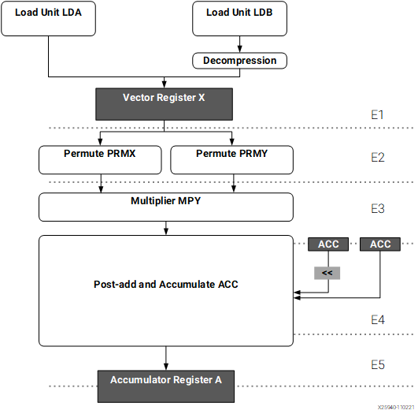
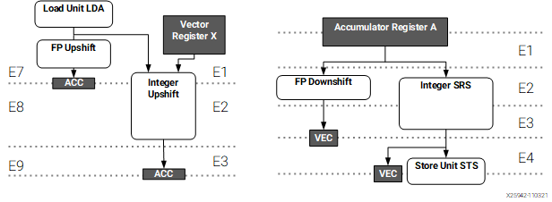
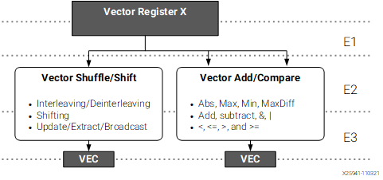
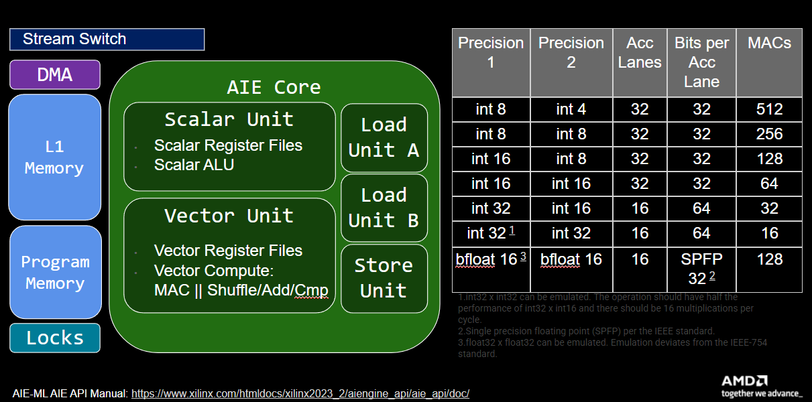
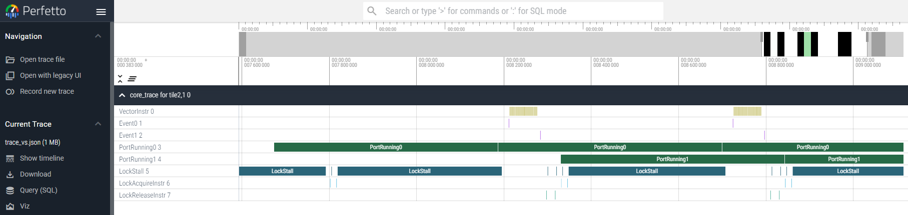

<!---//===- README.md --------------------------*- Markdown -*-===//
//
// Copyright (C) 2024-2026 Advanced Micro Devices, Inc.
// SPDX-License-Identifier: Apache-2.0 WITH LLVM-exception
//
//===----------------------------------------------------------------------===//-->

# Section 4c - Kernel Vectorization

* [Section 4 - Performance Measurement & Vector Programming](../../section-4)
    * [Section 4a - Timers](../section-4a)
    * [Section 4b - Trace](../section-4b)
    * Section 4c - Kernel Vectorization
    * [Section 4d - Measure-First Kernel Optimization](../section-4d)

-----

In [section-4a](../section-4a) we timed a whole application, and in [section-4b](../section-4b) we used trace to count the cycles a kernel spends between `event0()` and `event1()`. This section uses those cycle counts to look at a kernel from the inside: how the scalar version turns into vector code, how the compiler schedules the vector loop, and how close that schedule gets to what the hardware can do.

We switch from the local copy in section-4b to the [vector-scalar multiply example](../../../programming_examples/basic/vector_scalar_mul/). By default it works on 16-bit data and uses the vectorized kernel. Read the example's summary first, then open its kernel source, [scale.cc](../../../aie_kernels/eltwise/scale.cc). The same `scale.cc` is compiled for both AIE2 (npu1, Phoenix/Hawk Point) and AIE2P (npu2, Strix-class) devices.

Unless a number says otherwise, the cycle counts in this section were measured on an npu2 (AIE2P) device with the default compiler, Peano (llvm-aie). Where the proprietary Chess compiler behaves differently, both numbers are shown. Each kernel call processes 1024 elements. Your counts may be off by a cycle or two, and will move more with a different compiler version.

### <u>Before you start: make sure your edits are compiled</u>

The exercises below ask you to edit `scale.cc` and to switch the design between its scalar and vector kernels. Three settings control what actually gets built:

* **Which `aie_kernels/` is compiled.** The kernel library compiles the *installed* copy of `aie_kernels/` (inside the wheel or the install tree), not the file in your clone. To compile the clone's sources instead, point `MLIR_AIE_KERNEL_SOURCES` at the checkout before you run `make` (see [Kernel sources](../../iron_configuration.md#kernel-sources-mlir_aie_kernel_sources)):
    ```bash
    export MLIR_AIE_KERNEL_SOURCES=<mlir-aie>
    ```
    Without it, edits to `<mlir-aie>/aie_kernels/eltwise/scale.cc` are silently ignored. The kernel's source bytes are part of the build cache key, so an edited kernel is always recompiled.
* **Scalar or vector.** [vector_scalar_mul.py](../../../programming_examples/basic/vector_scalar_mul/vector_scalar_mul.py) takes `vectorized: CompileTime[bool] = True`. There is no command-line flag for it: edit the default to `False` to build the scalar kernel.
* **Data type and compiler.** `make int_bit_width=32 trace` builds the 32-bit version (the default is 16). `make CHESS=true trace` compiles the kernel with Chess instead of Peano, if you have the AIE tools installed.

Run `make clean` between configurations.

### <u>The scalar kernel</u>

The scalar code in [scale.cc](../../../aie_kernels/eltwise/scale.cc) is close to the code we traced in section-4b:
```C++
template <typename T>
void scale_scalar(T *a, T *c, T factor, const int32_t N) {
  event0();
  for (int i = 0; i < SCALE_ELEMS; i++) {
    c[i] = factor * a[i];
  }
  event1();
}
```

The loop reads each element of `a`, multiplies it by the scalar `factor`, and stores it to `c`. `SCALE_ELEMS` is a macro: the kernel library passes `-DSCALE_ELEMS=<tile_size>` when it compiles the kernel, so the trip count is a compile-time constant (1024 here). The `N` argument is still passed at runtime, and if `SCALE_ELEMS` is not defined, the loop falls back to `N`. We come back to why this matters in [Trip counts](#trip-counts).

### <u>AIE API</u>

To vectorize this loop we use the AIE API, a header-only C++ library that wraps the processor's low-level intrinsics in portable types and operations. The same source then compiles to efficient instructions for each AIE generation. The [AIE API documentation](https://xilinx.github.io/aie_api/topics.html) covers every type and operation, with per-architecture tables. The vector-times-scalar multiply we need is the `aie::mul` overload taking a vector and a scalar, under [Arithmetic](https://xilinx.github.io/aie_api/group__group__arithmetic.html).

Include the API header in the kernel source:
```C++
#include <aie_api/aie.hpp>
```

#### <u>Vector registers</u>

A vector is declared as:
```C++
aie::vector<T, vec_factor> my_vector
```
* `T` - the element type, such as `int16_t`
* `vec_factor` - the number of elements, such as 32

A native vector register is **512 bits** on both AIE2 and AIE2P, so it holds 32 `int16_t` values:

| Data type | Elements in 512 bits |
|-----------|-------------|
| int32_t   | 16 |
| int16_t   | 32 |
| int8_t    | 64 |
| int4_t    | 128 |

The full table of supported vectors is in the AIE API [basic types](https://xilinx.github.io/aie_api/group__group__basic__types.html) page. A vector wider than 512 bits is legal; it is simply held in two or more registers.

#### <u>Vector load</u>

`aie::load_v` loads a vector register from local L1 memory:
```C++
      T *__restrict pA1 = a;

      aie::vector<T, vec_factor> A0 = aie::load_v<vec_factor>(pA1);
```
`__restrict` promises the compiler that `pA1` is the only pointer used to access this buffer. Without it, the compiler must assume that a store through the output pointer could change the input, and it cannot overlap one iteration's loads with the previous iteration's stores. The template argument `vec_factor` matches the one in the vector declaration.

#### <u>Vector multiply and store</u>

`aie::mul` takes a vector and a scalar and returns its products in an accumulator register:
```C++
      aie::accum<acc32, vec_factor> cout
```
Accumulators are wider than the vector registers so that sums of products keep their precision. `acc32` holds 32-bit lanes. Multiplying two `int32_t` values needs a 64-bit accumulator (`acc64`), and a 512-bit register then only holds 16 lanes.

The result goes back to memory with `aie::store_v`:
```C++
      T *__restrict pC1 = c;

      aie::store_v(pC1, cout.template to_vector<T>(0));
```
`.template to_vector<T>(shift)` converts the accumulator back to a vector of `T`. On the way it shifts right by `shift` bits, rounds, and saturates (SRS). The rounding follows the core's rounding-mode register (`aie::set_rounding`).

The whole vector kernel is then:
```C++
template <typename T>
void scale_vectorized(T *__restrict a, T *__restrict c, int32_t factor,
                      const int32_t N) {
  event0();
  constexpr int vec_factor = 32;
  T *__restrict pA1 = a;
  T *__restrict pC1 = c;
  const int F = SCALE_ELEMS / vec_factor;
  T fac = factor;

  AIE_PREPARE_FOR_PIPELINING
  for (int i = 0; i < F; i++) {
    aie::vector<T, vec_factor> A0 = aie::load_v<vec_factor>(pA1);
    pA1 += vec_factor;
    aie::accum<acc32, vec_factor> cout = aie::mul(A0, fac);
    aie::store_v(pC1, cout.template to_vector<T>(0));
    pC1 += vec_factor;
  }
  event1();
}
```

[scale.cc](../../../aie_kernels/eltwise/scale.cc) also has a specialization for `int32_t`. It is the same loop with `vec_factor = 16` and an `acc64` accumulator.

Instead of one multiply per element, each iteration now loads 32 elements, multiplies them in one vector operation, and stores 32 results, so the loop runs `SCALE_ELEMS / 32` times. `AIE_PREPARE_FOR_PIPELINING` is a loop pragma from [aie_kernel_utils.h](../../../aie_kernels/aie_kernel_utils.h). What it does depends on the compiler, as we will see below.

> **NOTE** - AIE kernels can also be written directly with the low-level intrinsics that the AIE API is built on. Intrinsics are specific to one AIE generation, while the AIE API is portable across them.

### <u>AIE API quick reference</u>

The operations used most often in kernel code:

| Signature | Description | Example |
|-----------|-------------|---------|
| `aie::vector<T, N> v` | A vector of `N` elements of type `T`. | `aie::vector<int16_t, 32> v;` |
| `aie::load_v<N>(ptr)` | Load `N` contiguous elements into a vector. | `auto a = aie::load_v<32>(pA);` |
| `aie::store_v(ptr, v)` | Store a vector to local memory. | `aie::store_v(pC, v);` |
| `aie::mul(a, b)` / `aie::mac(acc, a, b)` | Vector multiply / multiply-accumulate into an accumulator. `b` may be a vector or a scalar. | `auto acc = aie::mul(a, fac);` |
| `aie::accum<AccT, N> acc` | An accumulator of `N` lanes, such as `acc32`, `acc64` or `accfloat`. | `aie::accum<acc32, 32> acc;` |
| `acc.to_vector<T>(shift)` | Shift, round and saturate an accumulator back to a vector. | `auto v = acc.to_vector<int16_t>(0);` |
| `aie::begin_restrict_vector<N>(ptr)` | A vector iterator over a non-aliased buffer. `*it++` loads or stores one vector and advances. | `auto pC = aie::begin_restrict_vector<32>(c);` |
| `aie::reduce_add(v)` | Sum the lanes of a vector to one scalar. | `int32_t s = aie::reduce_add(v);` |
| `aie::max(a, b)` / `aie::inv(v)` | Lane-wise maximum; lane-wise reciprocal. | `auto r = aie::inv(v);` |

## <u>Vectorization Exercises</u>

1. Let's trace the scalar kernel first. Set `vectorized: CompileTime[bool] = False` in [vector_scalar_mul.py](../../../programming_examples/basic/vector_scalar_mul/vector_scalar_mul.py) and build the 32-bit version of the design with `make clean; make int_bit_width=32 trace`. The `int_bit_width` argument sets the data type and buffer sizes in both the design (`vector_scalar_mul.py`) and the host code (`test.cpp`). Open `trace_vector_scalar_mul.json` in https://ui.perfetto.dev and measure the time between `event 0` and `event 1`. In the Perfetto waveform, 1 us is one clock cycle. How many cycles did you measure?
    <details markdown="1"><summary>Show answer</summary>
    10761 cycles with Peano (10245 with Chess). That is about 10.5 cycles per element.
    </details>

    The `trace` target also runs [get_trace_summary.py](../../../python/utils/trace/get_trace_summary.py), which pairs every `event 0` with the next `event 1` and prints the number of kernel invocations and the first/min/avg/max cycles. It is a handy summary for single-core designs like this one. [Section 4d](../section-4d#cycles-you-can-trust) covers what it can and cannot tell you in larger designs.

1. Now set `vectorized` back to `True` and rebuild the 32-bit version (`make clean; make int_bit_width=32 trace`). How many cycles now?
    <details markdown="1"><summary>Show answer</summary>
    338 cycles with Peano (336 with Chess), about 32x faster than the scalar kernel.
    </details>

1. Finally, build the default 16-bit version (`make clean; make trace`). How many cycles now, and why is it faster than the 32-bit vector kernel?
    <details markdown="1"><summary>Show answer</summary>
    46 cycles with Peano (44 with Chess). The 16-bit scalar kernel takes the same 10761 cycles as the 32-bit one, so this is about 234x faster than scalar. Two things help. Each iteration handles 32 elements instead of 16, so there are half as many iterations. And a 16-bit multiply is a single native vector instruction, while a 32-bit multiply is built from several 16-bit partial products, which we will see in the disassembly below.
    </details>

## <u>How the Compiler Schedules a Loop</u>

The cycle counts above are set almost entirely by how the compiler schedules the inner loop. Three ideas explain them.

**VLIW bundles.** The AIE core is a VLIW processor. Each instruction word, or *bundle*, has slots for several operations that issue in the same cycle: two loads, one store, scalar ALU work, a vector multiply, a move, and so on. A bundle takes one cycle whether its slots are full or empty (`nop`).

**Software pipelining.** A loop iteration is a chain: load, then multiply, then store. Each step waits several cycles for the one before it. Run iterations one after another and most bundles are empty. A software-pipelined loop overlaps them: while iteration *i* stores, *i+1* multiplies and *i+2* loads. Two numbers describe the result:
* **II (initiation interval)** - the number of cycles between the starts of two iterations, which is also the number of bundles in the steady-state loop body. The loop costs about II cycles per iteration.
* **Stages** - how many iterations are in flight at once. The compiler emits a *prologue* before the loop to fill the pipeline and an *epilogue* after it to drain it.

**Zero-overhead loops (ZOL).** The core has loop hardware (the loop start, loop end and loop count registers `ls`, `le`, `lc`) that jumps back from the last bundle of a loop body to the first at no cost. A loop that uses it spends no cycles on branch instructions.

Together they give a rule of thumb:

```
cycles ≈ II × trips + prologue/epilogue + function entry/exit
```

Predict the count before you measure. When the prediction and the trace disagree, one of them is not measuring what you think.

### <u>Reading the schedule: static remarks</u>

You do not need hardware to see the schedule. `aie.utils.compile.remarks` compiles each kernel library build exactly as the JIT does and reports every loop's II, stages, bundle count and whether it is a zero-overhead loop. It honours `MLIR_AIE_KERNEL_SOURCES`, so with that exported as above it reads your edited sources; without it, it compiles the installed copy:
```bash
python -m aie.utils.compile.remarks --target aie2p --only scale --out scale.json --meta scale_meta.json
```
`scale.json` is a list of rows in the benchmark-chart format. Each loop gets one row, whose `name` is `<kernel>/loop/<function>/<block>/II`, whose `value` is the II, and whose `range` holds the rest of the schedule:
```json
{"name": "scale/loop/vector_scalar_mul_vector/for.body.i/II", "unit": "cycles", "value": 5,
 "range": "NS=5 pro=23 epi=20 zol=True via=postpipeliner at vector.hpp:1105"}
```
Read it as: II 5, 5 stages, a 23-bundle prologue and a 20-bundle epilogue, a zero-overhead loop, placed by Peano's post-pass pipeliner, attributed to line 1105 of an AIE API header (the loop was inlined from there). Per-kernel rows follow the same pattern: `scale/unpipelined_loops`, `scale/non_zol_loops`, `scale/pm_bytes` (program memory) and `scale/pass_failed_warnings` (loop pragmas the compiler could not apply). `scale_meta.json` holds the same data as one record per loop, with `ii`, `ns`, `prologue_bundles`, `epilogue_bundles`, `zol`, `pipelined`, `bundle_count`, `file` and `line`, plus the scheduler's notes per kernel. Use `--target aie2` for AIE2. The tool builds the `scale` kernel for 32-bit data only. See [kernels_library.md](../../kernels_library.md#static-checks) for the rest of its output, and [section 4d](../section-4d#reading-the-static-report) for how to use it when optimizing.

### <u>Reading the schedule: disassembly</u>

The disassembly shows the exact bundles. The kernel object and the core's linked ELF are in the build's project directory, for the default 16-bit build:
```
build/final_trace_8192.prj/vector_scalar_mul_vector_<hash>.o
build/final_trace_8192.prj/elfs_main_core_0_2/elfs_main_core_0_2.elf
```
The 32-bit build uses `final_trace_16384.prj`. The two numbers in `core_0_2` are the core's column and row. A design with several cores has one ELF per core. Disassemble with the `llvm-objdump` that ships with Peano:
```bash
$PEANO_INSTALL_DIR/bin/llvm-objdump -d -z build/final_trace_8192.prj/vector_scalar_mul_vector_*.o > disassembly.txt
```
`-z` prints bundles that are entirely `nop`s; without it they are elided as `...` and you will miscount. Function symbols carry a short hash prefix, for example `<1846b0bf_vector_scalar_mul_vector>`. Each line is one bundle: an address, the encoded bundle, then the operations in its slots separated by `;`.

| Example operations | Description |
|----------------------|-------------|
| `nop`, `nopa`, `nopb`, `nopx`, ... | An empty slot |
| `mov`, `add`, `mul` | Scalar move and arithmetic |
| `lda`, `st` | Scalar load / store |
| `vlda`, `vldb` | Vector load on load unit A / B |
| `vmul`, `vmac` | Vector multiply / multiply-accumulate |
| `vst`, `vst.srs` | Vector store / store through the SRS path |
| `vshuffle` | Vector shuffle |
| `event` | The `event0()` / `event1()` markers |

A zero-overhead loop is set up by writes to `ls`, `le` and `lc`, and its body is marked by two labels:
* `<.LBB?_?>:` - the first bundle of the loop body.
* `<.L_LEnd?>:` - the **last** bundle of the loop body. A label names the bundle on the line after it, so the loop body is everything from the `.LBB` label up to *and including* the bundle after `.L_LEnd`. When the loop is a single bundle, both labels point at the same address.

## <u>Schedule Exercises</u>

1. Run the remarks tool on the shipped `scale.cc`. What II does it report for the vector loop (`vector_scalar_mul_vector/for.body.i`) and for the scalar loop (`vector_scalar_mul_scalar/for.body.i`)?
    <details markdown="1"><summary>Show answer</summary>
    Vector: II 5 with 5 stages, pipelined, ZOL (`NS=5 ... zol=True via=postpipeliner`). Scalar: II 42, not software-pipelined (`NS=1 ... via=None`), ZOL. The compiler unrolled the scalar loop four times, so 42 cycles cover 4 elements.
    </details>

1. Use the rule of thumb to predict the two 32-bit cycle counts from Exercises 1 and 2. How close are you?
    <details markdown="1"><summary>Show answer</summary>
    Vector: 1024 / 16 = 64 iterations × 5 = 320, plus about 18 cycles of fill, drain and function overhead = 338, exactly what the trace shows. Scalar: 1024 / 4 = 256 iterations × 42 = 10752, plus 9 = 10761.
    </details>

1. Build the default 16-bit design and disassemble the kernel object. Find `vector_scalar_mul_vector` and its `.LBB` / `.L_LEnd` labels. How many bundles are in the loop body, and which vector operations are in it? How does that explain 46 cycles?
    <details markdown="1"><summary>Show answer</summary>
    One bundle: `vldb x4, [p0], #0x40` (a 64-byte load), `vst.srs.2x ... [p1], #0x40` (a 64-byte store through SRS) and `vmul`. It is II 1: the loop loads, multiplies and stores one full 32-element vector every cycle, so 1024 / 32 = 32 cycles, plus 14 of fill, drain and overhead = 46. The bundles before the loop are the prologue: the same `vldb`/`vmul` repeated while the pipeline fills.
    </details>

1. Now look at the 32-bit specialization in the same file (the `scale_vectorized<int32_t>` symbol is emitted even in the 16-bit build). Its loop has 5 bundles. Which vector operations are in it?
    <details markdown="1"><summary>Show answer</summary>
    One `vmul` and three `vmac`, plus `vshuffle`s. AIE2P has no single 32-bit × 32-bit vector multiply, so the product is assembled from 16-bit partial products. That is why the 32-bit loop is II 5 on 16 lanes, and the 16-bit loop is II 1 on 32 lanes.
    </details>

1. Compile the 16-bit design for AIE2. You do not need an npu1 device to compile: `make clean; make devicename=npu build/final_8192.xclbin`, then disassemble the kernel object in `build/final_8192.prj/`. How many bundles is the AIE2 loop?
    <details markdown="1"><summary>Show answer</summary>
    Two. On AIE2 each vector load moves 256 bits, so the 512-bit input takes a `vlda` plus a `vldb`, and the output takes two 256-bit `vst.srs` stores. With only one store unit, two stores need two cycles, so II 2 is the floor on AIE2. AIE2P moves 512 bits per load and per store here, so it reaches II 1. The 32-bit loop is II 8 on AIE2. On an npu1 the 16-bit kernel measured 78 cycles for 1024 elements: 32 iterations at II 2 plus 14 cycles of pipeline fill, drain and call.
    </details>

## <u>Trip Counts</u>

A software-pipelined loop needs enough iterations to fill its stages. If the compiler cannot prove that the loop runs at least that many times, it has to pick between a slower schedule that is correct for any count and a guarded fast path. So the compiler's knowledge of the trip count matters as much as the loop body.

In the shipped `scale.cc` the trip count is `SCALE_ELEMS / 32`, a compile-time constant, so the compiler knows the loop runs exactly 32 times. Kernels whose size arrives as the runtime `N` argument do not get that for free. Two pragmas from [aie_kernel_utils.h](../../../aie_kernels/aie_kernel_utils.h) tell the compiler what to expect:
* `AIE_LOOP_MIN_ITERATION_COUNT(MIN)` - the loop always runs at least `MIN` times.
* `AIE_LOOP_RANGE(MIN, MAX)` - the loop runs between `MIN` and `MAX` times. It is only a trip-count hint: it does not unroll anything.

This is also where the two compilers differ most:
* Under **Chess**, `AIE_PREPARE_FOR_PIPELINING` (`chess::prepare_for_pipelining`) is what enables software pipelining for the loop. Trip-count hints refine the schedule it picks.
* Under **Peano**, `AIE_PREPARE_FOR_PIPELINING` expands to nothing. Peano tries to pipeline every innermost loop whose body is a single basic block (no `if` inside) on its own, so the trip count it can prove, from a constant or from a hint, decides the schedule.

## <u>Trip Count Exercises</u>

1. In your `MLIR_AIE_KERNEL_SOURCES` copy of `scale.cc`, change `const int F = SCALE_ELEMS / vec_factor;` to `const int F = N / vec_factor;` in both vector templates, so the trip count is only known at runtime. Rebuild and trace the 16-bit and the 32-bit designs. What changed?
    <details markdown="1"><summary>Show answer</summary>
    With Peano, 16-bit: 46 → 464 cycles; 32-bit: 338 → 1426. The data and the loop body are unchanged, but the 16-bit loop is now II 14 (14 × 32 + 16 = 464) and the 32-bit loop II 22 (22 × 64 + 18 = 1426). In the 16-bit disassembly the loop is still one `vldb`, one `vmul` and one `vst.srs`, now spread over 14 bundles that are mostly `nop`s, with a branch before it that skips the loop when `N` is below 32.

    With Chess, 16-bit: 62; 32-bit: 355. `AIE_PREPARE_FOR_PIPELINING` still lets Chess pipeline the loop.
    </details>

1. Now add `AIE_LOOP_MIN_ITERATION_COUNT(16)` on the line after `AIE_PREPARE_FOR_PIPELINING` in both templates. Rebuild and trace again.
    <details markdown="1"><summary>Show answer</summary>
    Peano: back to 46 and 338 cycles, the same schedules as the compile-time constant. Chess: 44 and 335.
    </details>

1. Which pragma did the work? Remove `AIE_PREPARE_FOR_PIPELINING` but keep the hint, and build the 32-bit design with each compiler. Then remove both.
    <details markdown="1"><summary>Show answer</summary>

    | 32-bit, runtime `N` | Peano | Chess |
    |---|---|---|
    | `AIE_PREPARE_FOR_PIPELINING` + `MIN_ITERATION_COUNT(16)` | 338 | 335 |
    | `MIN_ITERATION_COUNT(16)` only | 338 | 1415 |
    | `AIE_PREPARE_FOR_PIPELINING` only | 1426 | 355 |
    | neither | 1426 | 1426 |

    Under Peano the two builds with and without `AIE_PREPARE_FOR_PIPELINING` produce byte-identical code: the hint does all the work. Under Chess the hint alone does nothing and `AIE_PREPARE_FOR_PIPELINING` does most of it. Kernels that must build with both compilers use both pragmas, which is why they appear together throughout `aie_kernels/`.
    </details>

1. Why 16? Try `AIE_LOOP_MIN_ITERATION_COUNT(4)` on the 16-bit build with Peano and count the loop bundles.
    <details markdown="1"><summary>Show answer</summary>
    Four bundles (II 4). In the compiler's output, Peano settles at II 7 for a minimum of 1 or 2, II 4 for 4, II 2 for 8 and II 1 for 16. (Only the 16 case was traced for this section, at 46 cycles.) The II 1 schedule has 14 stages, so the compiler needs to know at least that many iterations will run. The hint is a promise, not a request: the compiler may drop its short-loop path, so the count must be true for every caller. Give the smallest count that holds for all of them.
    </details>

## <u>Coding for the Architecture</u>

The vectorized kernel is 234x faster than scalar, but is it good? To answer that we compare it with what the hardware can do. The vector unit diagrams below are from the [AIE-ML (AIE2) architecture manual (am020)](https://docs.amd.com/r/en-US/am020-versal-aie-ml/Fixed-Point-Vector-Unit). AIE2P has the same overall structure, with the differences listed in the table after them.

### The Vector Unit - Loads



Vector registers are filled by two load units working in parallel from local L1 memory. They feed the permute blocks and then the multiplier. Not every load instruction exists on both units: in [section 4d](../section-4d#a-worked-example-add), a converting bf16 load that exists only on load unit A sets the pace of a loop.

### The Vector Unit - Multiply and Add (MAC)

The multiplier supports the AIE data types. An optional post-add step (heavily used by matrix multiplication) sums products before they land in the accumulator registers. The best-scheduled code issues one vector MAC every cycle.

### The Vector Unit - SRS and Stores

Results go back to L1 through a single store unit. The SRS (shift-round-saturate) path converts accumulators to vectors on the way out; the upshift (UPS) path goes the other way, from vectors to accumulators.



### The Vector Unit - Shift/ Shuffle/ Adder Path

A parallel path performs shifts, shuffles, simple additions, comparisons and other vector functions without using the multiplier.



### AIE2 and AIE2P differences that change this example

| | AIE2 (npu1) | AIE2P (npu2) |
|---|---|---|
| Loads in the 16-bit `scale` loop | `vlda` + `vldb`, 256 bits each | one `vldb`, 512 bits |
| Stores in the 16-bit `scale` loop | two 256-bit `vst.srs` | one 512-bit `vst.srs.2x` |
| 16-bit `scale` loop | II 2 | II 1 |
| 32-bit `scale` loop | II 8 | II 5 (32-bit multiply built from 16-bit partial products) |
| int16 matrix-multiply instruction | 4x4x4, 64 MACs | 4x4x8, 128 MACs |
| `float` vector multiply | no native instruction; emulated with several bf16 multiplies | no native instruction; emulated with several bf16 multiplies |
| Scalar `float` multiply and divide | library calls (`__mulsf3`, `__divsf3`) | library calls (`__mulsf3`, `__divsf3`) |

The first four rows are Peano's output for this example. The matrix-multiply shapes are from the AIE API [matrix multiplication](https://xilinx.github.io/aie_api/group__group__mmul.html) table. The last row applies to scalar `float` code with Peano on both architectures: every scalar `float` multiply or divide in a hot loop is a function call. [Section 4d](../section-4d#reading-the-static-report) shows how to find them, and [what removing them gained](../section-4d#1-take-library-calls-and-emulated-float-math-out-of-the-loop).

### <u>Multiplier Utilization Efficiency</u>



The table in this diagram gives the number of MACs per cycle for each precision. Another source is `Table: Supported Precision Width of the Vector Data Path` in the [AM020 spec](https://docs.amd.com/r/en-US/am020-versal-aie-ml/Functional-Overview) for AIE2. Those peak figures are for matrix multiplication, where the post-add step sums several products into each accumulator lane. An elementwise multiply produces one result per lane, so it uses at most one multiplier per accumulator lane: 32 lanes of 16-bit data per instruction.

#### <u>MAC efficiency</u>

Each kernel call multiplies 1024 16-bit values. At 32 per cycle the ideal is 1024 / 32 = **32 cycles**; on AIE2P we measured 46.

Total MAC efficiency is the product of two ratios:
* MAC schedule efficiency: ideal MAC cycles / actual cycles = 32 / 46 = 70%.
* Per-clock MAC utilization: MACs used / MACs available = 32 / 128 = 25% on AIE2P (32 / 64 = 50% on AIE2).

Total: 70% × 25% ≈ 17%. That sounds poor, but an elementwise multiply simply has no sums for the matrix hardware to do. The more useful question is what limits the schedule.

#### <u>Load/ Store bandwidth efficiency</u>

On AIE2P the loop issues one 512-bit load, one multiply and one 512-bit store every cycle. II 1 is the smallest II any loop can have, so the loop body is as fast as it can be; the remaining 14 cycles are filling and draining a 14-stage pipeline and entering and leaving the function. On AIE2 the two 256-bit stores per vector need two cycles through the single store unit, so the compiler's AIE2 schedule cannot beat 64 cycles for this kernel regardless of the multiplier; an npu1 measured 78.

#### <u>Data movement efficiency</u>

Compute is only half the picture. Each call's 1024 × 16-bit input has to arrive through a DMA and its output has to leave through one. The next exercise measures how long that takes.

## <u>Optimization Exercises</u>

1. Trace the default 16-bit design again and open the waveform. Hover over the blocks of `PortRunning0` (input DMA) and `PortRunning1` (output DMA). How many cycles does each 2 KiB chunk take?

    

    <details markdown="1"><summary>Show answer</summary>
    About 256 cycles on npu2 (8 bytes per cycle). The 32-bit design moves 4 KiB per chunk in about 512 cycles. The kernel needs only 46 cycles per chunk, so this design is limited by data movement by a factor of about 5: the core waits for data most of the time. Making `scale` faster would not make the application faster.
    </details>

1. A kernel with more compute per byte balances this better. The [single-core matrix multiply](../../../programming_examples/basic/matrix_multiplication/single_core) example by default multiplies 512x512x512 `int16_t` matrices in kernel calls of m×k×n = 32x32x32 (32,768 MACs per call). The AIE2P int16 kernel uses the 4x4x8 matrix-multiply instruction, 128 MACs. What is the ideal cycle count per call?
    <details markdown="1"><summary>Show answer</summary>
    32,768 / 128 = 256 cycles.
    </details>
    Each call reads a 32x32 `int16_t` tile of A and of B, 2 KiB each, on separate channels. At the rate you measured in the previous exercise, how long does moving them take?
    <details markdown="1"><summary>Show answer</summary>
    About 256 cycles for each tile, in parallel. On paper compute and data movement are balanced.
    </details>

1. Navigate to the [single-core matrix multiply](../../../programming_examples/basic/matrix_multiplication/single_core) example, run `make clean; make trace`, and look at the `get_trace_summary.py` output. What are the first and min cycle counts?
    <details markdown="1"><summary>Show answer</summary>
    First 537, min 70 (Peano, npu2). 537 is the matrix-multiply kernel: its inner loop is II 4 with four 4x4x8 MACs per iteration, one MAC instruction per cycle, and the whole call is predicted at 536 cycles including each block's prologue and epilogue. That is 48% of the 256-cycle ideal and well above the data movement time.

    The min of 70 is *not* a faster matmul call. The same core also runs a `zero` kernel that clears the output accumulator before each block, and it carries its own `event0()`/`event1()`. The summary pools both kernels into one list. The summary also counted fewer invocations than the design makes, because the trace buffer filled. [Section 4d](../section-4d#cycles-you-can-trust) explains how to separate the two populations and why you should check before quoting any trace-summary number.
    </details>

## <u>Loop Pragma Reference</u>

The macros in [aie_kernel_utils.h](../../../aie_kernels/aie_kernel_utils.h) let one kernel source carry hints for both compilers. Put them on the line directly before the `for`. Each expands differently under each compiler, and several do nothing under Peano:

| Macro | Peano (`#pragma clang loop ...`) | Chess | Notes |
|---|---|---|---|
| `AIE_LOOP_MIN_ITERATION_COUNT(n)` | `min_iteration_count(n)` | `chess::min_loop_count(n)` | Must be true for every call. Measured: 1426 → 338 on the 32-bit `scale` with a runtime `N` ([Trip Count Exercises](#trip-count-exercises)). On AIE2 it let `axpy`'s runtime-count loop overlap (269 → 87), with a plain loop kept for shorter rows. In two other kernels the compiler reported that it cost the zero-overhead loop, so check `zol` after adding it. |
| `AIE_LOOP_MAX_ITERATION_COUNT(n)` | `max_iteration_count(n)` | `chess::max_loop_count(n)` | |
| `AIE_LOOP_RANGE(a, b)` | min + max iteration count | min + max loop count | A trip-count hint only. It does not unroll. |
| `AIE_LOOP_UNROLL(n)` | `unroll_count(n)` | `chess::unroll_loop(n)` | Measured: ×4 on a latency-bound loop took `add` from 390 to 150 cycles ([4d](../section-4d#3-fill-the-empty-bundles)). |
| `AIE_LOOP_UNROLL_FULL` | `unroll(full)` | `chess::unroll_loop()` | Needs a constant trip count. Measured: keeping an accumulator array in registers took `conv2dk1_i8` from 7623 to 504 cycles ([4d](../section-4d#2-keep-arrays-and-addresses-in-registers)). |
| `AIE_LOOP_NO_UNROLL` | `unroll(disable)` | `chess::no_unroll` | |
| `AIE_TRY_INITIATION_INTERVAL(n)` | `pipeline_initiation_interval(n)` | nothing | Asks Peano's pipeliner to try this II. Not measured in this guide. |
| `AIE_PREPARE_FOR_PIPELINING` | **nothing** | `chess::prepare_for_pipelining` | Enables pipelining under Chess. Under Peano the code is byte-identical with or without it. |
| `AIE_PREPARE_FOR_POSTPIPELINING` | **`pipeline(disable)`** | nothing | Under Peano this *turns pipelining off* for the loop. |
| `AIE_LOOP_HINT(key, value)` / `AIE_LOOP_GPR_REALLOC` | `hint(key, value)` / `hint(aie-gpr-realloc, 1)` | nothing | Peano back-end tuning hints. |
| `AIE_NO_PREPARE_FOR_PIPELINING`, `AIE_MODULO_SCHEDULING_BUDGET_RATIO(n)`, `AIE_KEEP_SW_LOOP`, `AIE_PEEL_PIPELINED_LOOP(n)`, `AIE_KEEP_FREE_FOR_PIPELINING(r)`, `AIE_ALLOCATE(r)`, `AIE_NO_HW_LOOP`, `AIE_LOOP_FLATTEN` | **nothing** | the matching Chess attribute | Chess-only scheduling controls. |

Two per-architecture definitions from [aie_arch.h](../../../aie_kernels/aie_arch.h) sit beside these pragmas in library kernels: `AIE_BF16_LANES` is the bf16 vector-multiply width (16 on AIE2, 32 on AIE2P), and `AIE2_RESTRICT` puts `__restrict` on a pointer parameter only on AIE2, whose pipeliner needs it to overlap a streaming loop.

The Peano expansions are the ones active by default. Check [aie_kernel_utils.h](../../../aie_kernels/aie_kernel_utils.h) for the exact spelling before relying on a macro. A pragma that expands to nothing leaves the compiled code byte-identical, so the quickest way to know whether a pragma did anything is to compare the II the remarks tool reports, or the disassembly, with and without it. Whether it made the kernel faster is a question for the hardware: [section 4d](../section-4d) shows how to answer it with the kernel benchmark.

Peano flags that are not pragmas can be passed to one kernel through the `compile_flags` of its `ExternalFunction`. [Section 4d](../section-4d#3-fill-the-empty-bundles) has one measured example, a higher pipeliner stage limit.

-----
[Prev](../section-4b) &middot; [Top](../../section-4) &middot; [Next](../section-4d)
