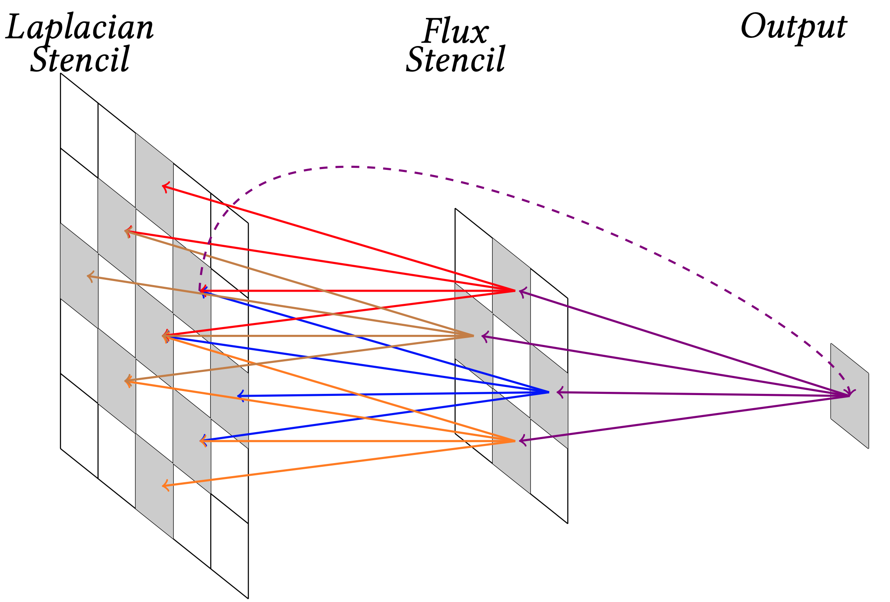
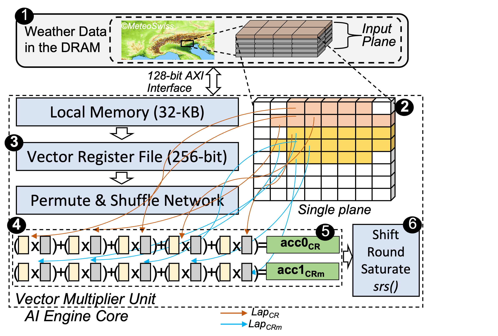
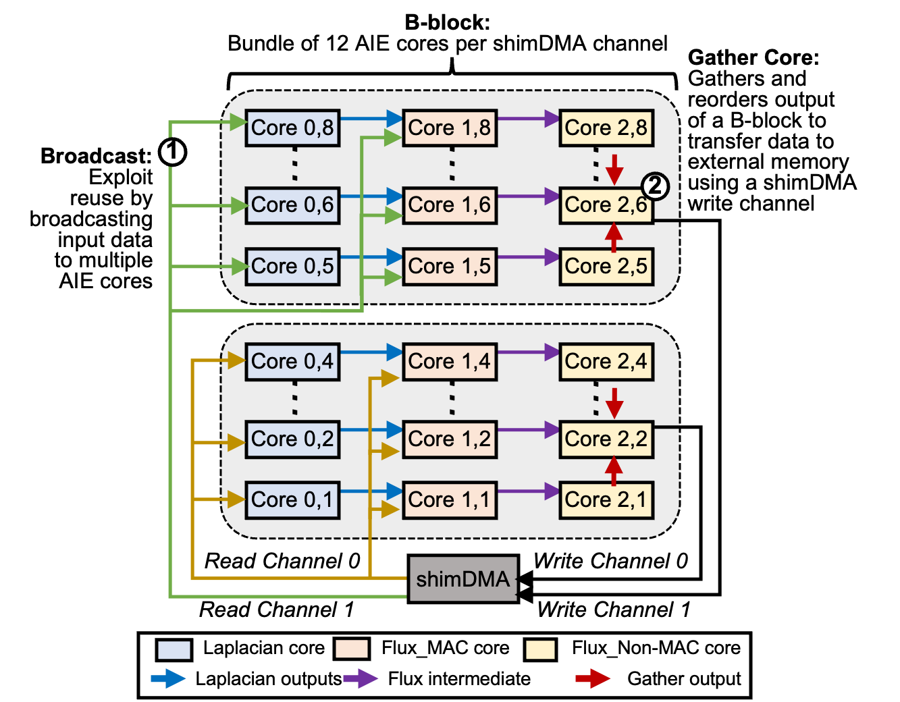

# SPARTA: Spatial Acceleration for Efficient and Scalable Horizontal Diffusion Weather Stencil Computation

## Introduction
A stencil operation sweeps over an input grid, updating values based on a fixed pattern. High-order stencils are applied to multidimensional grids that have sparse and irregular memory access patterns, limiting the achievable performance. In addition, stencils have a limited cache data reuse which further enhances memory access pressure. 

Real-world climate and weather simulations involve the utilization of complex compound stencil kernels, which are composed of a combination of different stencils. Horizontal diffusion (hdiff) is one such important compound stencil found in many regional global climate and weather prediction models.  It is a mathematical technique to help smooth out small-scale variations in the atmosphere and reduce the impact of numerical errors.  hdiff iterates over an input grid performing Laplacian and flux as depicted in Figure 1 to calculate different grid points. A Laplacian stencil accesses the input grid at five memory offsets in horizontal dimensions. The Lapalacian results together with input data are used to calculate the flux stencil. 


<p align="center">
  <picture>
  	<source media="(prefers-color-scheme: light)" srcset="img/hdiff_comp.png">
  
  </picture>
  <br>
  <b>Figure 1: Horizontal diffusion (hdiff) kernel composition using Laplacian and flux stencils in a two dimensional plane</b>
</p>

Our goal is to mitigate the performance bottleneck of memory-bound weather stencil computation using AMD-Xilinx Versal AI Engine (AIE). To this end, we introduce SPARTA, a novel spatial accelerator for horizontal diffusion stencil computation. We exploit the two-dimensional spatial architecture to efficiently accelerate horizontal diffusion stencil. We design the first scaled-out spatial accelerator using MLIR (multi-level intermediate representation) compiler framework.

## Directory Structure
```
horizontal_diffusion
├───1. HDIFF_single_AIE_objectFIFO
├───2. HDIFF_single_AIE_objectFIFO_ping_pong
├───3. HDIFF_dual_AIE_objectFIFO_ping_pong
├───4. HDIFF_tri_AIE_objectFIFO_ping_pong
├───5. HDIFF_tri_AIE_objectFIFO_ping_pong_scaled
├───img
```

1. **HDIFF_single_AIE_objectFIFO:** A single AIE core that performs both Laplacian and flux computations (single-AIE).
2. **HDIFF_single_AIE_objectFIFO_ping_pong:** A single AIE core with ping-pong buffers that performs both Laplacian and flux computations (single-AIE).
3. **HDIFF_dual_AIE_objectFIFO_ping_pong:** Two independent cores for Laplacian and flux computation.
4. **HDIFF_tri_AIE_objectFIFO_ping_pong:** We further split flux computation and map MAC operation and non-MAC operations onto different AIE cores.
5. **HDIFF_tri_AIE_objectFIFO_ping_pong_scaled:** We scale the tri_AIE design across the AIE cores while balancing compute, communication, and memory requirements.

## Mapping onto the AI Engine Cores
We implement two different design strategies: (1) a single AIE core that performs both Laplacian and flux computations (single-AIE), and (2) splitting Laplacian and flux stencils onto multiple AIE cores (multi-AIE). We carefully hand-tune the code to overlap memory operations with arithmetic operations, to improve performance. In multi-AIE, we use the AIE data forwarding interfaces to forward the results from the first AIE core (used for Laplacian calculation) to another AIE core (used for flux calculation). This approach allows for the concurrent execution of multiple stencil calculations, which can increase the overall performance and throughput of the hdiff design.

## Single-AIE Core Mapping
Figure 2 shows the mapping of two Laplacian stencils, lapCR and lapCRm (out of the five Laplacian stencils and four flux
stencils needed for a single hdiff computation) onto an AIE core. The weather data is stored in the DRAM. We parallelize the computation across input planes. A single hdiff output computation requires access to data from five input rows of a single plane. Therefore, five rows are loaded into the local memory of an AIE core using a shim_dma core. We employ the double buffering (ping-pong) technique between the shim_dma and the core local memory to hide the transfer latency. From the local memory, the data is loaded into vector registers to perform the computations required for all the different Laplacian and flux stencils. We vectorize all the stencil operations, e.g., lapCR and lapCRm perform five element-wise operations each using the vector multiplier unit. We store partial results from each vector operation of a stencil in the same accumulator register. We allocate vector and accumulator registers among Laplacian and flux stencil computation making sure that there is no unnecessary spilling. It is essential to perform as many operations as possible while the data is in the accumulator register. 

<p align="center">
  <picture>
  	<source media="(prefers-color-scheme: light)" srcset="img/aie_hdiff.png">
  
  </picture>
  <br>
  <b>Figure 2: Mapping of two Laplacian stencils onto an AIE core datapath. We use the same AIE core to perform the remaining Laplacian and flux computations</b>
</p>

For flux stencil, the non-MAC operations, such as addition/subtraction, vector compare, and vector selection, do not store data in an accumulator register as it uses pre-adder units that only have access to vector registers. Therefore, to continue with flux calculations after performing Laplacian operations, we need to send the data back from the accumulator registers to the vector registers using srs() operation (from shift round saturate unit to vector register file). This operation has a long latency (4 cycles), which reduces the number of instructions that can be completed within one cycle. Therefore, this process of moving data between registers can negatively impact performance and requires manual hand- tuning of the algorithm to hide latency. To overcome this, we carefully rearrange load/store, MAC/MUL, and non-MAC operations to fill the VLIW pipeline of the AIE core while avoiding NOPs. This rearrangement assists the compiler in proper scheduling and prevents multiple sequential load oper- ations to fill the vector registers, which could lead to unfilled VLIW slots and decreased performance.


## Multi-AIE Core Mapping
With our single-AIE design we make the following two observations. First, the compute-to-memory intensity ratio of the Laplacian is more balanced compared to the compute to memory intensity ratio of the flux. The flux stencil has a higher compute bound than the memory bound. Third, the non-MAC operations (subtract, compare, and select) in the flux stencil lead to higher compute cycles due to the frequent movement of data between vector registers. 
We conclude that to achieve the maximum throughput, we need to split the hdiff computation over multiple AIE cores. By splitting the hdiff computation over multiple cores, we get two main benefits. First, the compute-bound can be distributed among different cores, allowing for the concurrent execution of multiple stencil calculations, which can increase the overall performance and throughput of the hdiff algorithm. Second, it allows for the use of more number of parallel AIE cores to achieve higher throughput.

We design two multi-AIE designs: dual-AIE and tri-AIE. Figure 3 shows the multi-AIE design approach for hdiff, where the flux stencil uses the results of the Laplacian stencil and input data to perform its computation. We also show the dataflow sequence from the external DRAM memory to the AIE cores. Instead of waiting for the Laplacian AIE core to complete all five Laplacian stencils required for a single hdiff output, we forward the result for each Laplacian stencil to the flux AIE core, thereby allowing both cores to remain active. In tri-AIE design, we further split flux computation and map MAC operation and non-MAC operations onto different AIE cores.

<p align="center">
  <picture>
  	<source media="(prefers-color-scheme: light)" srcset="img/multi_aie.png">
  
  </picture>
  <br>
  <b>Figure 3: Multi-AIE design for hdiff computation to balance the compute and the memory bound. We show the dataflow sequence from the DRAM memory to the AIE cores via shim_dma</b>
</p>
Both Laplacian and flux computations require access to the input data, which is stored in the external DRAM . Therefore, we broadcast the input data onto the local memory of both Laplacian and Flux AIE cores using a single shim_dma channel. In dual-AIE design, a single Flux core is responsible for performing all MAC and non-MAC operations.  As mentioned above, flux operations have an imbalance between compute and memory bounds. Therefore, to further improve the compute performance, we split flux operations over two AIE cores in our tri-AIE design.

## Scaling Accelerator Design
The performance of the hdiff implementation can be maximized by scaling it out across as many AIE cores as possible while avoiding data starvation. As there are only 32 shim_dma interfaces for 400 AIE cores, system architects need to develop a design that can balance compute and memory resources without starving the available cores. 

We develop a *bundle* or *B-block*-based design. A B-block is a cluster of AIE cores connected to the same shim_dma input/output channel. As shown in Figure 4, clusters of AIE cores are connected to two channels of a shim_dma (one for input and one for output). Each B-block comprises four lanes (or rows) of our tri-AIE design, with each lane calculating a different offset of output result using a part of the input plane. As each lane requires access to 5 rows of the input grid to perform a single hdiff computation, we use the broadcast  feature of the global interconnect to duplicate the 8 rows of the input data into a circular buffer in the AIE cores of the first column. An 8-element circular buffer allows all the cores in the B-block lanes to work on a different offset of the input data while having 5 input grid rows necessary to perform hdiff computation.


<p align="center">
  <picture>
  	<source media="(prefers-color-scheme: light)" srcset="img/scale_hdiff.png">
  
  </picture>
  <br>
  <b>Figure 4: Block-based design (B-block) using tri-AIE implementation for hdiff. The b-block-based design allows scaling computation across the AIE cores while bal ancing compute and communication time without getting bottlenecked by limited shim_dma channels</b>
</p>

As AIE architecture lacks support for automatically gathering and ordering of computed outputs, we use physical placement constraints to allow the AIE cores in the last column to access a single shared memory of a dedicated AIE core, enabling data gathering. We refer to this core as the *gather core*. The gather core is responsible for collecting data from all other cores, in addition to processing the results of its own lane. A single B-block operates on a single plane of the input data. Since two B-blocks can be connected to a single shim_dma, two planes can be served per shim_dma. This regular structure can then be repeated for all the shim_dma channels present on a Versal device. Our B-block-based design can be scaled to 384 AIE cores while utilizing all the available shim_dma channels without starving any AIE cores.

## Prerequisites
* [MLIR-AIE](https://github.com/Xilinx/mlir-aie)

# Citation
>Gagandeep Singh, Alireza Khodamoradi, Kristof Denolf, Jack Lo, Juan Gómez-Luna, Joseph Melber, Andra Bisca, Henk Corporaal, Onur Mutlu.
[**"SPARTA: Spatial Acceleration for Efficient and Scalable Horizontal Diffusion Weather Stencil Computation"**](https://arxiv.org/pdf/2303.03509.pdf)
In _Proceedings of the 37th International Conference on Supercomputing (ICS),_ Orlando, FL, USA, June 2023.

Bibtex entry for citation:

```
@inproceedings{singh2023sparta,
  title={{SPARTA: Spatial Acceleration for Efficient and Scalable Horizontal Diffusion Weather Stencil Computation}},
  author={Singh, Gagandeep and Khodamoradi, Alireza and Denolf, Kristof and Lo, Jack and G{\'o}mez-Luna, Juan and Melber, Joseph and Bisca, Andra and Corporaal, Henk and Mutlu, Onur},
  booktitle={ICS},
  year={2023}
}
```