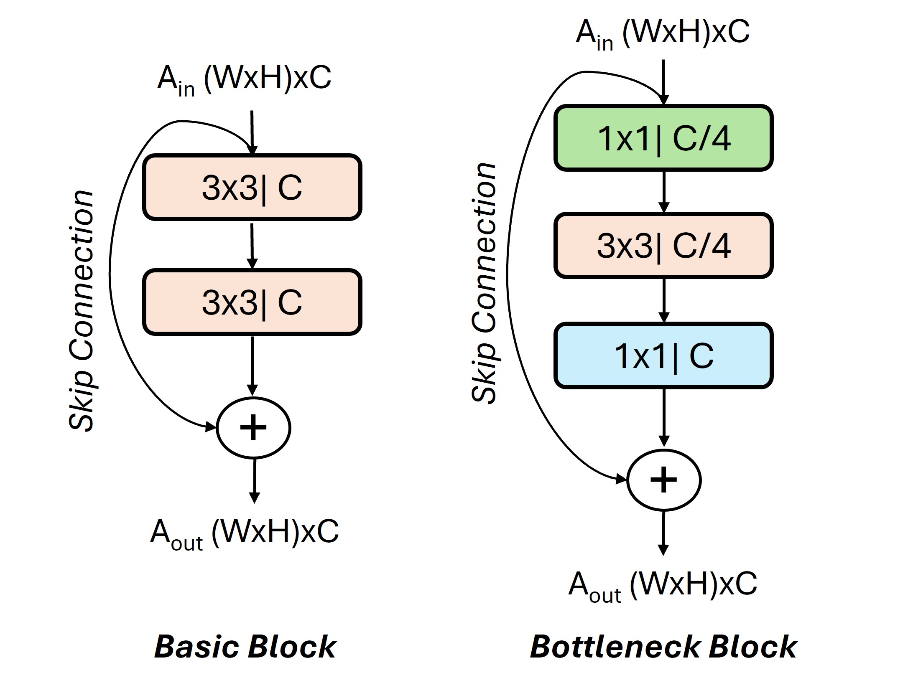

# Dataflow ResNet on Ryzen AI
ResNet (Residual Networks) is a type of deep neural network architecture that was introduced to address the challenges of training very deep neural networks. ResNet architectures are widely used in various computer vision tasks, such as image classification, object detection, and segmentation. ResNet can be built using two kinds of block implementations, basic block and bottleneck block, as shown in Figure below. A basic block has two convolutional layers, each using 3x3 filters. A bottleneck residual block has 3 convolutional layers, using 1x1, 3x3 and 1x1 filter sizes, respectively. Both blocks have a skip connection that perform identity mapping. Bottleneck variant allows the model to deepen without increasing the number of parameters significantly. 

<p align="center">
  <picture>
    <source media="(prefers-color-scheme: light)" srcset="misc/block.jpg">
  
</picture>
  <h3 align="center">Variants of Residual Blocks: (a) basic block has two 3x3 layers, (b) bottleneck block has a 1x1 convolution layer for dimension reduction, a 3x3 convolution layer, and a 1x1 convolution layer for dimension restoration.
  </h3>
</p>

The reference design shows how dataflow ResNet pipeline can be constructed from bottleneck block.

# Directory Structure
```
resnet
├───1. baseline
├───2. bottleneck_block
├───3. kernels
├───4. misc
├───5. network 
├───6. notebook

1. In "baseline", we have layer-by-layer design for conv1x1 and conv3x3.
2. In "bottleneck_block", we have bottleneck_block design mapped onto a single column of AIE.
3. In "kernels", we have C/C++ code for AIE kernel. We provide both scalar and vector variants.
4. In "misc", we provide utility function needed for ResNet pipeline.
5. In "network", we use bottleneck_block to build layers of ResNet architecture.
6. In "notebook", we provide jupyter notebooks to run end-to-end ResNet50 where we offload part of the model onto AIE. We also provide notebooks to run standalone bottleneck block or baseline.

```    

# Getting Help
If you have suggestions for improvement, new applications, or collaboration, please contact Gagandeep Singh (gagandeep dot singh at amd dot com) or Jack Lo (jack dot lo at amd dot com).
