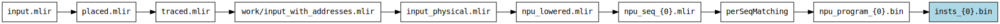
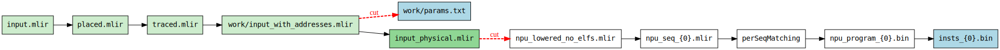
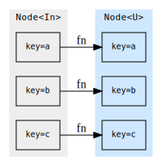
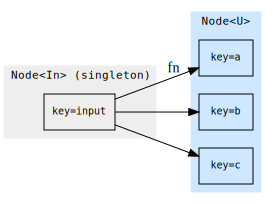
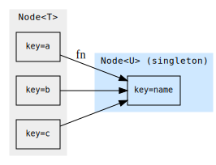
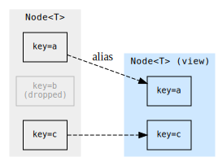
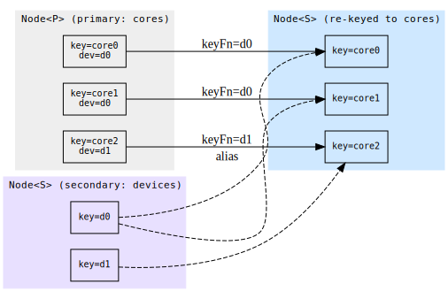
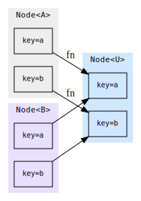
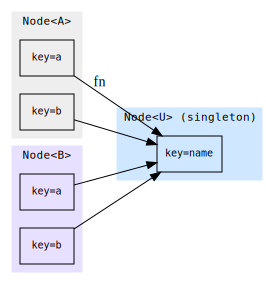
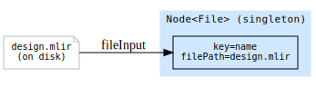

<!---//===- README.md --------------------------*- Markdown -*-===//
//
// Copyright (C) 2026 Advanced Micro Devices, Inc.
// SPDX-License-Identifier: Apache-2.0 WITH LLVM-exception
// 
//===----------------------------------------------------------===//-->

# aiecc — the AIE compiler driver

`aiecc` takes an AIE `.mlir` design and produces the artifacts needed to run it
on an NPU (instruction streams, ELFs, PDIs, xclbins, …).

```bash
aiecc [options] <input.mlir>
```

To also build a **host program** that drives the array, pass `--compile-host`
and put the host C/C++ sources — and any host-compiler flags — after a `--`
separator. Everything after `--` is forwarded verbatim to the host compiler
(`clang++`), which `#include`s the generated `aie_inc.cpp` array-configuration
source (its directory is added to the include path automatically):

```bash
aiecc --compile-host [options] <input.mlir> -- host.cpp [host-compiler flags]

# e.g. build the design and a host executable, with extra include/lib flags:
aiecc --compile-host design.mlir -- -I/inc -L/lib -lfoo host.cpp
# -> a.out   (name the executable with -o, e.g. -o test.exe)
```

---

## User guide

### The two most common flows

**1. Instruction-sequence + xclbin flow.** The host loads an `xclbin` (which
contains the array configuration) and, at dispatch time, streams a
per-runtime-sequence NPU instruction binary to the device:

```bash
aiecc --aie-generate-npu-insts --aie-generate-xclbin design.mlir
# -> insts_<device>_<seq>.bin   (one per runtime sequence)
# -> aie.xclbin                 (configuration PDI, packaged)
```

**2. Full-ELF flow.** Everything — all device PDIs and instruction streams — is
bundled into a single loadable ELF instead of an xclbin plus loose binaries:

```bash
aiecc --generate-full-elf design.mlir   # -> aie.elf
```

You can override these output file names with `--npu-insts-name`, 
`--xclbin-name`, and `--full-elf-name`. You can filter which devices and 
runtime sequences are compiled with `--device-name` and `--sequence-name`. 

### Seeing what the compiler will do / dry-running: `--emit-dot`

The compiler builds its execution plan from the flags you pass.
Adding `--emit-dot` prints that plan (as a GraphViz graph) for exactly the 
requested outputs and options and exits without compiling anything. You omit
the input file when you pass `--emit-dot`, as no compilation actually takes
place. For example, this shows the plan for the NPU-instruction flow and 
renders it to an image:

```bash
aiecc --aie-generate-npu-insts --emit-dot | dot -Tpng -o flow.png
```

Each box is a compilation step labelled by the artifact it produces, arrows show
dependencies between steps, and the outputs you requested are highlighted.
Changing the output flags (for instance to `--generate-full-elf`) changes the
graph accordingly, so this is the fastest way to understand what a given
invocation will actually do. The command above produces this graph:



### Stopping and restarting a build: `--checkpoint` and `--resume`

Sometimes you want to interrupt compilation partway through, look at or modify
an intermediate result, and then continue from that point rather than starting
over. `--checkpoint` and `--resume` let you do exactly that.

First, compile up to some intermediate stage and save the result. Here we stop
at the routed physical IR (`--cut`, described below, selects where to cut) and
write the checkpoint into the directory `cp`:

```bash
aiecc --cut=input_physical.mlir --checkpoint=cp design.mlir
```

Now you can open the intermediate files saved in `cp` and edit them — for
instance, to hand-tweak the IR and see how a change affects the rest of the
build. When you are ready, resume from the checkpoint and ask for the artifact
you want (`--get`, described below). The saved frontier is read back from disk
(IR frontiers are re-parsed from their `.mlir` text), the stages before the
checkpoint are skipped entirely, and only what comes after runs:

```bash
aiecc --resume=cp/manifest.json --get='insts_{0}.bin'
```

The resume invocation rebuilds the graph from the flags recorded in the
checkpoint manifest, so it inherits the original device, toolchain and lowering
options automatically — you neither repeat them nor may override them. `--resume`
rejects any graph-shaping flag on its command line, since changing the graph
would invalidate the saved intermediates; only execution-only flags may
accompany it: `--get`, `--cut`, `--checkpoint`, `-j`, `-v`/`--verbose`, and
`--progress`.

This makes it easy to isolate a problem: compile up to just before a stage you
suspect, change the intermediate result by hand, and re-run only what comes
after it.

Adding `--emit-dot` previews where the checkpoint will cut the build. Here the
NPU-instruction flow is cut right after routing produces the physical IR: the
steps run before the cut are shaded green (the `--cut` frontier, whose artifacts
are saved to disk, darker), and the steps a `--resume` runs afterwards sit
across the dashed red *cut* arrows. Each edge runs at most once across the pair:
the prefix and frontier during `--checkpoint`, the downstream steps during
`--resume` (which reloads the frontier from disk rather than rebuilding it).

```bash
aiecc --aie-generate-npu-insts --cut=input_physical.mlir --checkpoint=cp \
      --emit-dot | dot -Tsvg -o cut.svg
```



If an error occurs during compilation, `aiecc` will dump a checkpoint 
capturing the state up to the first failing edge. This allows you to submit
a checkpoint as a reproducer, or investigate the issue yourself using the
exact inputs the failing step saw.

### Extracting a single artifact: `--get`

`--get=<name>` asks for any single artifact in the build by name, including
intermediates that don't have their own `--aie-generate-*` flag (such as the
per-core objects or the routed IR). Run with `--emit-dot` to see the available
names; passing an unrecognized name prints the full list.

```bash
aiecc --get=objects_{0}.o design.mlir           # just the per-core objects
aiecc --get=input_physical.mlir design.mlir     # just the routed IR
```

`--get` and `--resume` work well together when you want just one final artifact
without redoing the whole build. First checkpoint all the intermediates up to
some stage, then resume and ask only for the one output you want; the compiler
reuses the checkpointed intermediates instead of recomputing them:

```bash
aiecc --cut=physical_with_elfs.mlir --checkpoint=cp design.mlir
aiecc --resume=cp/manifest.json --get=cdo_{0}   # only the CDO, from the checkpoint
```

---

## Developer guide

`aiecc` captures the build steps required for each requested output artifact
as a static graph: every kind of intermediate is a `Node`, every 
transformation an edge, and the engine runs only the edges needed for the
artifacts you asked for.

### Edge, Node, Item — and keys

- **`Item<T>`** — one typed intermediate or output artifact; a payload of type 
  `T` (e.g., JSON, IR module, vector of bytes) plus a `key`, which uniquely
  identifies the payload among its peers. Items are materialized to disk 
  lazily, i.e., only when a downstream edge needs them on disk. Payload types 
  and their disk serializers live in `Items.h`.
- **`Node<T>`** — the collection of all `Item<T>` artifacts produced by one 
  edge; for many edges this wraps a single item (e.g. `aie.elf`), but for
  some it contains many (e.g. the per-AIE-core `.o` files).
- **`Edge`** — a transformation from input node(s) to an output node, 
  performing some action (a lambda, a `PassPipeline`, or a `ShellCommand`). 
  Edges may change the cardinality of the input/output nodes, e.g. split or
  join, or apply a transform to each item (map) -- see below.

**Keys** are what make fan-out/fan-in well-defined: an edge that splits a module
per-device produces one item per device, each with a stable key (the device
name). Downstream edges zip nodes *by key*, so a core's object, its ld script,
and its arch string all line up. Keys also name checkpoint frontier entries. In
edge output names/file paths, `{0}` gets substituted for each item's key.

### Keeping the graph static

If you are adding logic to the driver, the single rule that makes everything
else work is: **the graph declaration is static, and every dependency and every
file written must flow through the graph and the `Item` abstraction.** Never
read inputs or write outputs out-of-band.

#### Why this matters

- **The graph is declared unconditionally.** No guards around edge construction 
  — every edge always exists. The engine prunes backward from the requested 
  outputs, so unrequested work never runs. `--emit-dot`, `--checkpoint`, and 
  `--resume` rely on this static shape.
- **`Item` owns materialization.** An `Item<T>` holds a typed payload and only
  writes it to disk when a *downstream* edge asks for its path via `asFile()`.
  Intermediates that nobody needs on disk stay in memory automatically. If you
  write files yourself, you defeat this and break checkpointing.

Keep both invariants and the user-facing features above come for free.

### Edge types

Each diagram shows the items (with their keys) of the input and output nodes
and how the edge relates them.

**`map<U>`** — one output item per input item, applying the action
element-wise and preserving keys.



**`split<U>`** — explode a singleton input into many keyed output items.



**`join<U>`** — fold every item of a node into a single output item.



**`filter`** — a zero-copy view keeping only the items whose payload matches;
the surviving output items alias their source items rather than copying.



**`rekeyFrom<S>`** — re-key a secondary node onto this node's keys (a broadcast
/ keyed join): one output item per primary item, aliasing the secondary item
whose key equals `keyFn(payload)`. Below, each core picks up its device's item.



**`bundle(a, b, …).map<U>`** — zip several nodes by key and run the action on
the matched items together, producing one output item per key.



**`bundle(a, b, …).join<U>`** — zip several nodes by key and fold all the
matched items into a single output item.



**`fileInput`** — seed the graph with an existing on-disk file; it has no input
node and produces a singleton `Node<File>`.



Mark an edge `.threadSafe()` only when its action touches no shared state
(external-tool invocations); such edges fan their per-key work across `-j`.

### Putting it together: scatter / gather

A worked slice of the real driver — split a module per core (scatter), compile
each core in parallel, then link each core against its object plus its script
(gather over multiple keyed nodes):

```cpp
// Scatter: one item per aie.core, keyed by "<device>_core_<col>_<row>".
auto &cores = physical.split<OpInModule<CoreOp>>(
    "perCore_{0}.mlir",
    SplitIRAction<CoreOp>([](CoreOp c) { return coreKey(c); }));

// Element-wise maps: each core gets its own object and ld script. The .o edge
// shells out to a tool, so it is thread-safe and runs under -j.
auto &objects = cores.map<ModRef>("lowered_{0}.mlir", lowerCore)
                     .map<File>("objects_{0}.o", ShellCommand{"llc"} /*...*/)
                     .threadSafe();
auto &scripts = cores.map<std::string>("ld_{0}.script", emitLdScript);

// Gather: zip the object and script nodes by key, link per core.
auto &elfs = bundle(objects.out, scripts.out)
    .map<File>("elfs_{0}.elf",
               ShellCommand{"clang"}.input().input("-Wl,-T,").output("-o"))
    .threadSafe();
```

Each core flows independently from `cores` through to `elfs`; nothing hits disk
unless a downstream consumer (or a requested output) calls `asFile()`. Add a new
artifact by declaring more edges off an existing node and appending the terminal
edge to `outputs` — the engine and every user-facing feature above adapt
automatically.

For the full picture, start from `buildMainGraph` in `aiecc.cpp`, then read
`Graph.h` (edges) and `Items.h` (payloads).
