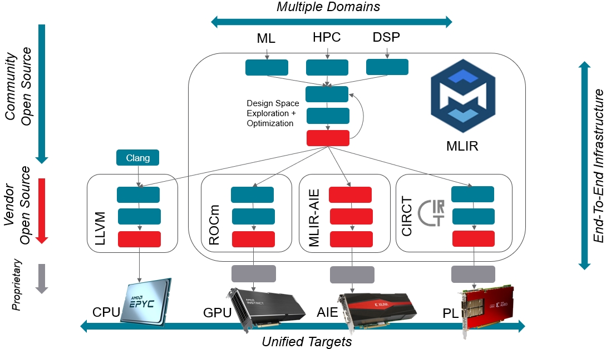
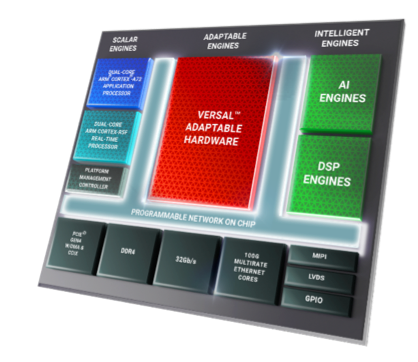
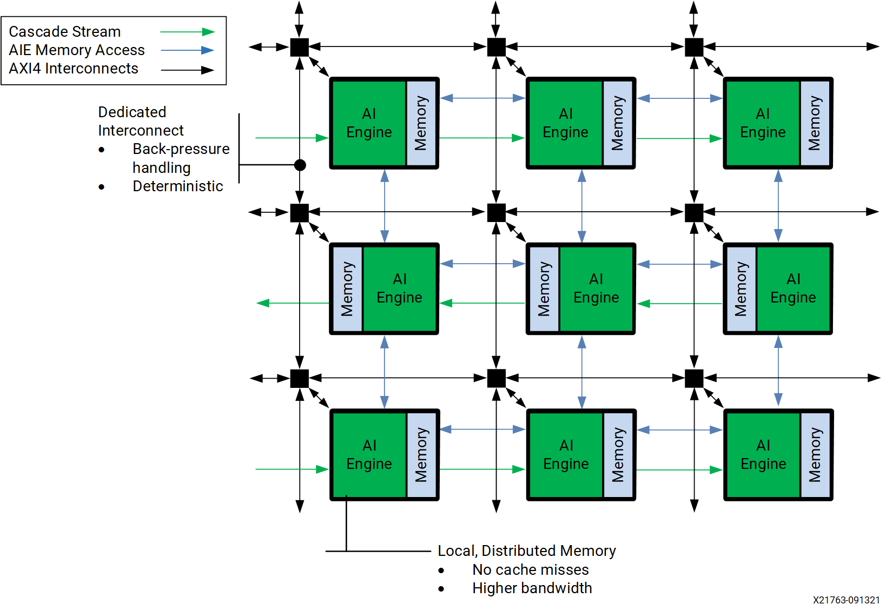
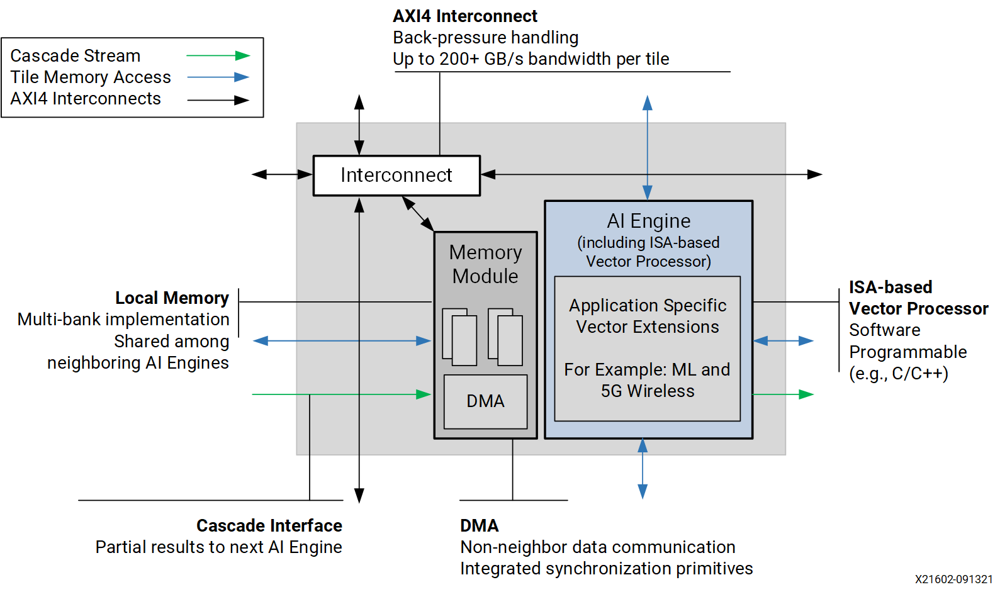
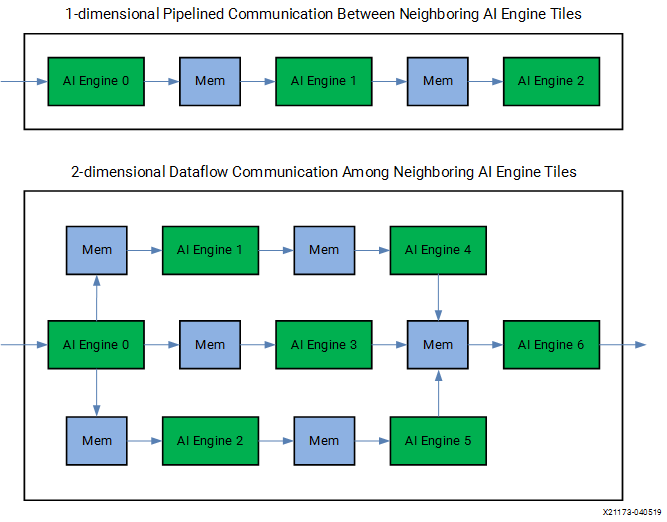
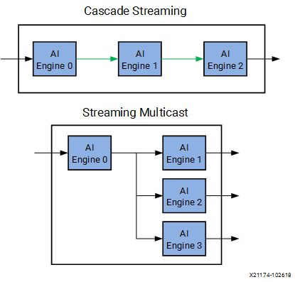
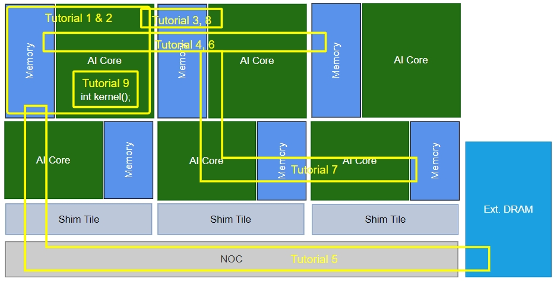

<!---//===- README.md --------------------------*- Markdown -*-===//
//
// This file is licensed under the Apache License v2.0 with LLVM Exceptions.
// See https://llvm.org/LICENSE.txt for license information.
// SPDX-License-Identifier: Apache-2.0 WITH LLVM-exception
//
// Copyright (C) 2022, Advanced Micro Devices, Inc.
// 
//===----------------------------------------------------------------------===//-->

# <ins>MLIR-based AI Engine Design Tutorial</ins>

The AI Engine array of the AMD Versal ACAP device is a set of VLIW vector processors with adaptable interconnect. This tutorial is targeted at tool developers and system designers who are looking for fast and completely open source design tools to support their research. We will first get insight into the Versal ACAP architecture, more specifically the AI Engine compute and data movement capabilities. Through small design examples expressed in the MLIR-AIE dialect and executed on an ACAP device, we will leverage AI Engine features for optimizing performance of increasingly complex designs. This will enable you to recognize how this physical-level dialect can be connected to higher level abstraction in the MLIR framework and understand how logical concepts can be expressed to increase productivity and reduce complexity. 

The context that the `mlir-aie` dialect sits with respect to other MLIR dialects, high level design entry points and AMD hardware devices and platforms can be seen in the following diagram.

Here, we see that `mlir-aie` is part of a larger ecosystem of open source dialects that allows customized tool development targeting AMD devices. `mlir-aie` can be used to generate low-level configuration for the AIEngine portion of Versal devices, including processors, stream switches, TileDMA and ShimDMA blocks. Backend code generation is included, targeting the LibXAIE library. In the tutorial examples, the configuration is used by host code that executes the generated configuration, and makes use of APIs in the [mlir-aie/runtime_lib](https://github.com/Xilinx/mlir-aie/tree/main/runtime_lib) directory to interface with the design.

This design tutorial will help guide someone new to MLIR through the steps of building increasingly complex multi-core designs. It can be consumed in different ways, depending on the user's end-goal. For a detailed walkthrough of the `mlir-aie` dialect at a physical-level, the tutorials should be followed in order and all the subdirectories of each tutorial should be read. For a more high-level description of the dialect the tutorials should still be followed in order, but reading only the first 5 tutorials will suffice to start building multi-core designs at a higher abstraction level without in-depth understanding of the low-level details. The subdirectories in each tutorial can thus be skipped (with the exception of tutorial-3 which introduces the high-level abstraction of the `mlir-aie` dialect). 

The individual tutorials are listed below along with the AI Engine architecture topics they cover. Following this is a more detailed description of the architecture, ending with an overview of how each tutorial maps onto it.

* [Tutorial 1 - Modules, tile, buffer, core, locks](./tutorial-1)
* [Tutorial 2 - Host code configuration, simulation, hardware performance](./tutorial-2)
* [Tutorial 3 - Communication (local memory)](./tutorial-3) 
* [Tutorial 4 - Communication (tile DMA, logical routing)](./tutorial-4)
* [Tutorial 5 - Communication (shim DMA, external memory aka DDR)](./tutorial-5)
* [Tutorial 6 - Communication (packet routing)](./tutorial-6)
* [Tutorial 7 - Communication (broadcast)](./tutorial-7)
* [Tutorial 8 - Communication (cascade)](./tutorial-8)
* [Tutorial 9 - External kernel - compilation and simulation](./tutorial-9)
* [Tutorial 10 - MLIR-AIE commands and utilities](./tutorial-10)
* [Tutorial 11 - Scaling up to large multi-core designs](./tutorial-11)
* [Example Design #1 - 2x2 Matrix Multiplication](../reference_designs/MM_2x2)
* [Example Design #2 - iDCT](../reference_designs/idct/)

## <ins>Basic AI Engine architecture</ins>
In order to understand this MLIR-based representation for AI Engine design, it is important to first understand AI Engines and their architecture. AI Engines are architected as 2D arrays consisting of multiple AI Engine tiles and allow for a very scalable solution across the Versal portfolio, ranging from 10s to 100s of AI Engines in a single device, servicing the compute needs of a breadth of applications.

To maximally utilize the full power of the AI Engine, designers are encouraged to familiarize themselves with [ug1076](https://docs.xilinx.com/r/en-US/ug1076-ai-engine-environment) for the AI Engine design environment and [am009](https://docs.xilinx.com/r/en-US/am009-versal-ai-engine) for detailed AI Engine functional specification.  For the purposes of this MLIR-based representation, we will focus primarily on the main AI Engine components and the communication between them. Single core programming and optimization, while an important aspect of AI Engine application development, will be described primarily as a means to facilitate data communication.

AI Engines are part of the larger Versal ACAP device and familiarity with other ACAP components such as the NoC, ARM processors, and custom PL components such as datamovers will help the designer integrate their AI Engine design into a larger ACAP system design.

Within the AI Engine region of the device, there is an array of AI Engine tiles connected to one another through a number of communication structures (stream switches, local memories, and cascade streams). 

And within an AI Engine tile, we see an ISA-based VLIW Vector processor with its own program memory and register file, and its associated local data memory, which is shared with its immediate neighbors in a regular pattern (more on that later).

## <ins>Communication</ins>
Focusing back on communication, there are 3 primary ways AI Engines communicate with one another: 
1. local memory
2. stream switch 
3. cascade. 

### <ins>Communication - Local Memory</ins>
For local memory, each AI Engine is able to access the local memory of its immediate neighbor in all 4 cardinal directions. This communication method has the most bandwidth as first generation AI Engines can do 2x 256-bit load and 1x 256-bit store per cycle.

>**Note for first generation AI Engines:** We have a notion of even and odd rows where the local memory of an AI Engine Core may be to the left (in even rows) or the right (in odd rows) of the AIE tile. As such, the local memory on the left for a given AIE tile may be its own local memory (for even rows) or that of its left neighbor (for odd rows). More on this in tutorial 1.

In the diagram below, we see data being communicated between AIE tiles through local memory in a pipelined or dataflow way.

### <ins>Communication - Stream Switch</ins>

The second way to communicate between AI Engines is through the stream switch which moves data up to 32-bits per cycle per stream. Here, data travels through stream switches throughout the AI Engine array from a source AIE tile to destination one. These stream paths can be circuit switched or packet switched and can be connected directly to stream ports at the AIE tile or read/written via DMAs. This is the second most common method of data communication and is the only method for moving data between non-adjacent tiles and into/out of the AI Engine array. The diagram below shows a streaming multicast example where streams are multicast from one AIE tile to 3 destinations.

### <ins>Communication - Cascade</ins>

Finally, we have cascade streams, a communication channel that has the widest data width (384-bits per cycle), but only moves data between accumulator registers of horizontally adjacent neighbors (for first generation AI Engines). The cascade direction serpentines in a zig-zag fashion across the array: Connections are right-to-left for even rows and left-to-right for odd rows. At the left end of even rows and the right end of odd rows, the connection wraps up to the next row. For example, the rightmost tile in row 1 has a cascade connection to the rightmost tile in row 2, while the leftmost tile of row 2 cascades into the leftmost tile of row 3.

## <ins>More on streams</ins>

There are fixed number of vertical and horizontal streams routed by the stream switch so balancing the data movement over these shared resources is an important part of efficient AI Engine design. 

We've only begun to touch the the processing and communication capabilities of the AI Engine so please refer to the online specification and user guides for more in-depth details.

## <ins>Overview of the tutorials by AIE architecture region they cover</ins>

