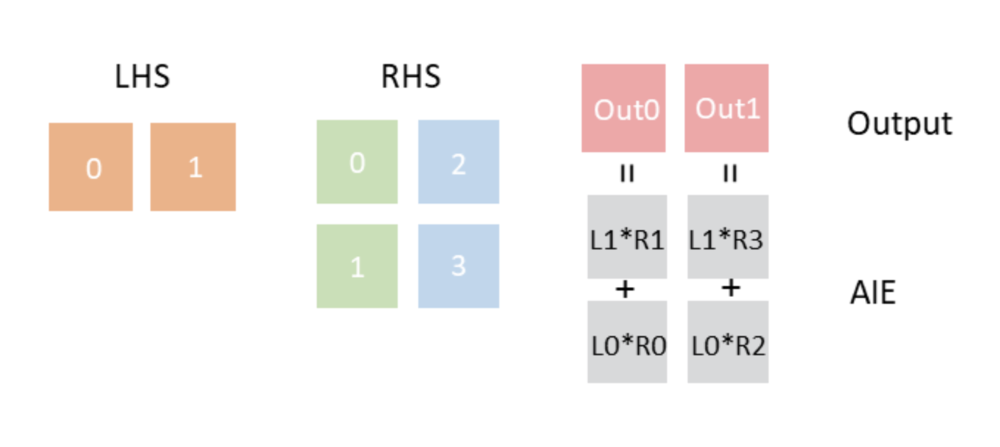
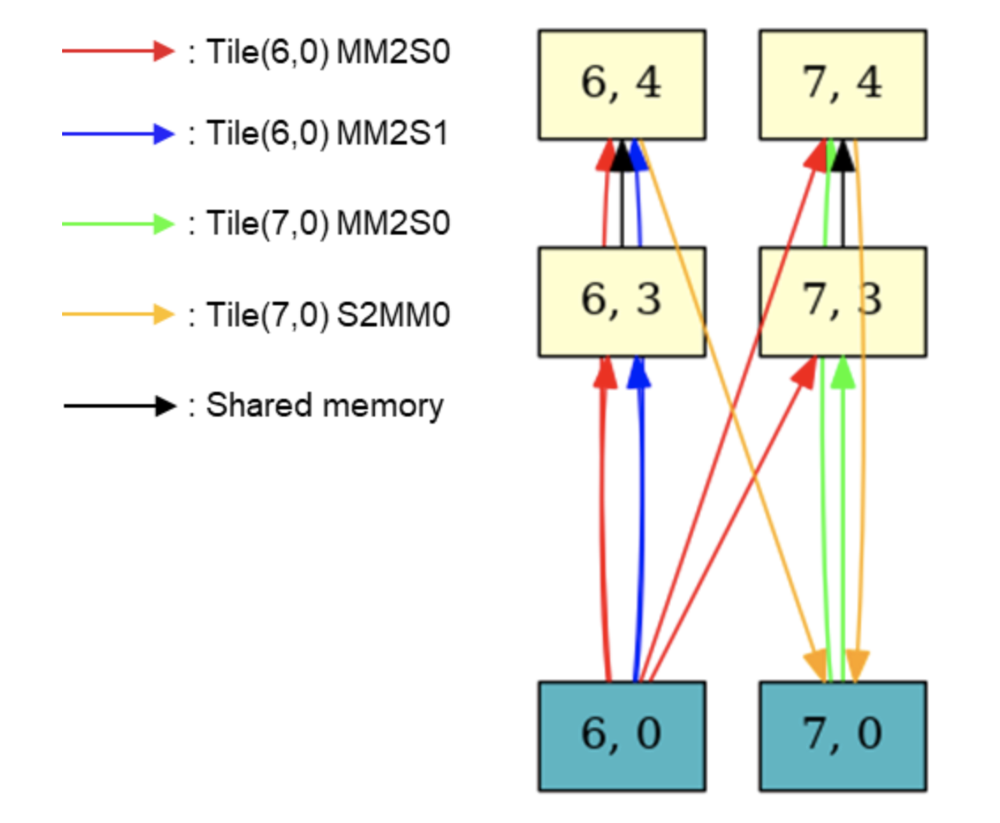

<!---//===- README.md --------------------------*- Markdown -*-===//
//
// This file is licensed under the Apache License v2.0 with LLVM Exceptions.
// See https://llvm.org/LICENSE.txt for license information.
// SPDX-License-Identifier: Apache-2.0 WITH LLVM-exception
//
// Copyright (C) 2022, Advanced Micro Devices, Inc.
// 
//===----------------------------------------------------------------------===//-->

## MM_2x2 Design Example : Packet-Switch Version

### Overall Description 
This is an end-to-end matrix multiply example with sizes (32 * 64) * (64 * 64) which uses the broadcast_packet data transferring mechanism. 
This design uses 4 AIEs for computation and 2 Shim tiles for data movement to and from external memory.  

### Computation Kernel 
&emsp; &emsp; &emsp; &emsp; &emsp; &emsp; &emsp; &emsp; &emsp; &emsp; &emsp; &emsp; &emsp; &emsp; &emsp; &emsp; &emsp; &emsp; &nbsp; LHS &emsp; &nbsp; &nbsp; RHS &emsp; &emsp; Acc &emsp; &emsp; Output 
Each of the 4 AIEs computes (32 * 32) * (32 * 32) + (32 * 32) = (32 * 32). In the single kernel design(kernel.cc) left-hand-side(LHS), right-hand-side(RHS), accumulator(Acc) and output matrix are all column based. 

### Mapping Strategy 
The following figure shows the mapping strategy of this design in which LHS and Output each have two (32 * 32) tiles, RHS has four (32 * 32) tiles. 

  

### AIE array Layout and Data Communication 
1. The communication from tile (6,0) MM2S0 channel is a broadcast_packet in which tile0 of LHS is broadcast to tile(6,3) and tile (7,3). The data in tile1 of LHS is broadcast to tile (6,4) and tile (7,4) by time-multiplexedly using the same DMA channel with different packet IDs.  
2. One thing to notice is that the accumulator matrices are set to zero in the local memories of the AIEs on tile (6,3) and tile (7,3).  
3. The accumulator matrices resulting from computation on tiles (6, 3) and (7, 3) are respectively communicated to tiles (6, 4) and (7, 4) via shared memory.  

  

