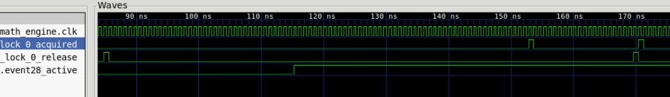

<!---//===- README.md --------------------------*- Markdown -*-===//
//
// This file is licensed under the Apache License v2.0 with LLVM Exceptions.
// See https://llvm.org/LICENSE.txt for license information.
// SPDX-License-Identifier: Apache-2.0 WITH LLVM-exception
//
// Copyright (C) 2022, Advanced Micro Devices, Inc.
// 
//===----------------------------------------------------------------------===//-->
# <ins>Tutorial 2b - Device configuration</ins>

In [tutorial-2a](../tutorial-2a), we described how to construct the host code `test.cpp` file for configuring, running and testing our AI Engine design. This tutorial focuses on how to run a hybrid software simulation of our design with the Vitis aiesimulator.

Before we dive into the simulation aspects, we introduce the `mlir-aie` device configuration operation:
```
module @module_name {
    AIE.device(target_device) {
      ... 
      AI Engine array components and connections 
      ...
    }
}
```

This operation specifies which particular device is being targetted by the design. This information is necessary as different AIE devices have different hardware architectures which influence some of the lower level mappings and library calls when running designs, both in simulation and on hardware.

This operation can be added explicitly, as can be seen in the MLIR source code (`aie.mlir`). Alternatively, `aiecc.py` also adds a defaut device target as part of its build flow in case no other target was specified in the code. The different device targets are described in [AIETargetModel.h](../../../include/aie/Dialect/AIE/IR/AIETargetModel.h) with the default target being the `VC1902TargetModel`.

# <ins>Tutorial 2b - Simulation</ins>

While single kernel simulation is important and covered in [tutorial-9](../../tutorial-9), we focus here on simulating our entire AI Engine system design where individual tiles run a cycle accurate simulation and communication between tiles are simulated at the transaction level. 

By default, `aiecc.py` will generate the `sim` directory which contains the stub and configuration files necessary for integrating with `aiesimulator` inside `aie.mlir.prj/`. These configuration files are specific to the the MLIR-AIE design so any changes to the design would require a recompile by `aiecc.py` to update the files under `sim`. The `sim` directory also contains a wrapper for our top level host code source (`test.cpp`) to run on the simulation host controller. To compile this wrapper and run the simulator, you can simply call:
```
make -C {path to}/sim
```
The wrapper and necessary host API source files (test.cpp, test_library.cpp) are then compiled to generate the top level simulator library (`ps.po`) and then `aiesimulator` is invoked automatically. The command to invoke `aiesimulator` directly from outside the `sim` folder is:
```
aiesimulator --pkg-dir={path to}/sim --dump-vcd foo
```
This command points the simulator to the local `sim` directory and generates the simulation waveform vcd to `foo.vcd`. The simulation results will be outputted to the terminal as applicable. 

Because `aiesimulator` is to set to run a cycle accurate simulation for each tile, the simulation time for our small tutorial design only take a few minutes to complete on modern machines. However, much bigger designs that involve a large number of tiles may take longer. A more effective strategy is to simulate a sub portion of that design in `aiesimulator` and then run the full design directly on hardware.

> Some things to note about the differences between running simulation and running on hardware. It is important to note the differences between host code timing and AIE timing in simulation compared to hardware. In hardware, the AI engines complete operation extremely quickly (in real time) while host code commands take a much longer time (as compared to AI Engine program cycles). As a result, a host command like `usleep` could be used to wait for a program to be done when AIE operations complete very quickly. However, in simulation, the opposite is true as the cycle accurate AIE simulator takes more time than the host program (in real time) which is why we use host API functions like `mlir_aie_acquire_lock` to ensure we are synchronizing AIE simulation and host code timings. These differences can also come up in unique ways which we will highlight in later tutorials.

> **NOTE**: The simulator cleanup process can take a few minutes but you can exit the simulator once you see the terminal message: `"Info: /OSCI/SystemC: Simulation stopped by user"` by pressing `Ctrl-C`.

### <ins>Simulating with shim DMAs</ins>
Integration with aiesimulator is supported with the same host API calls in the host program running in both simulation and on hardware. In most cases, the API calls abstracts the differences between the underlying function calls depending on if you're compiling for simulation. This is gated by the #define __ AIESIM __. However, at the moment, in order to support shim DMA in simulation, a customization is needed in the host code as shown below:
```
#if defined(__AIESIM__)
  mlir_aie_external_set_addr_ddr_test_buffer_in((u64)((_xaie->buffers[0])->physicalAddr));
  mlir_aie_external_set_addr_ddr_test_buffer_out((u64)((_xaie->buffers[1])->physicalAddr));
#else
  mlir_aie_external_set_addr_ddr_test_buffer_in((u64)mem_ptr_in);
  mlir_aie_external_set_addr_ddr_test_buffer_out((u64)mem_ptr_out);
#endif
```
In simulation, the transaction model requires the allocated physical address rather than the virtual address used in hardware. This may be better abstracted in future releases but is currently necessary for simulation with shim DMAs. More details about shim DMAs can be found in [tutorial-5](../../tutorial-5).

## <ins>Tutorial 2b Lab</ins>

1. Compile the design and then compile the simulation wrapper and run `aiesimulator`.
    ```
    make; make -C aie.mlir.prj/sim
    ```
    You should see the simulator print a number of status messages before finally running the host code and outputting the `PASS` message.

2. Modify the host code `test.cpp` to add a `mlir_aie_print_tile_status` for tile(1,4) and rerun the simulator. Did we need to recompile the `aie.mlir` and regenerate the core .elf files when we modify the host API? 

As mentioned earlier, the Makefile for running aiesimulator also generates a vcd file for viewing the resulting output transaction level waveforms. This can be view in a vcd viewer like `gtkwave`. 

3. Run `gtkwave` on the generated vcd wave form. 
    ```
    gtkwave foo.vcd
    ```
    Gtkwave is like most standard waveform viewers and allows you to select nodes, zoom in and out, and view the simulation. Selecting some notable signals would give an waveform image like:
    
    > Solution: `gtkwave ./answers/tutorial-2b.gtkw`

    Here, we see a few notable simulation timings. First, lock 0 is released during initialization (during the time that all locks are released in the 0 state). Then the tile is activated when `mlir_aie_start_cores` is asserted. The program on the core begins to run for a number of cycles including startup code. After some cycles, the lock 0 acquire is asserted signaling the beginning of our main kernel code. Then after some more time, the lock 0 release is asserted indicating the end of our kernel code. The final lock 0 acquire is asserted by the host API (`test.cpp`) so it knows when the kernel program is done.

The next [tutorial-2c](../tutorial-2c) walks us through running our design on hardware and measuring performance.
