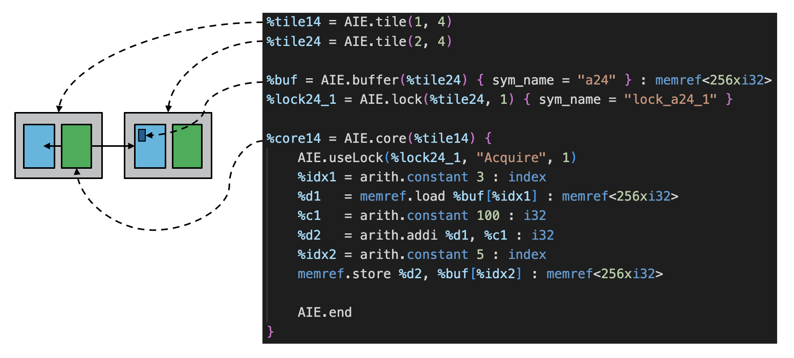

<!---//===- README.md --------------------------*- Markdown -*-===//
//
// This file is licensed under the Apache License v2.0 with LLVM Exceptions.
// See https://llvm.org/LICENSE.txt for license information.
// SPDX-License-Identifier: Apache-2.0 WITH LLVM-exception
//
// Copyright (C) 2022, Advanced Micro Devices, Inc.
// 
//===----------------------------------------------------------------------===//-->

# <ins>Tutorial 3 - communication (local memory), locks</ins>

After declaring the `core` and `buffer` dialect operations which map to the core and local memory respectively, and then defining the functionality within cores with either integrated dialect operations (arith, memref) or external kernel functions, the next major component of for AIE system design is communication. As summarized briefly in the [Basic AI Engine Architecture](../README.md) section, communication via local memory is one of the most efficient ways to share data and can be done among up to 4 tiles adjacent to a local memory. In `mlir-aie`, all tiles have an associated local memory but adjacent tiles are able to read and write to that memory as well.

In the diagram below, we see that the local memory for tile(2,4) is physically adjacent to the core in tile(1,4). If we were to expand the diagram further, we would see that tile(2,3) and tile(2,5) can also access that buffer. In general, each processor can access the memory in its own tile, the memory of the tile to the north and south, and the memory of the tile either to the east (in odd rows) or the west (in even rows).  As a result, communicating through shared memory is less constrained to the north and south: A processor can communicate in either of these directions using a buffer in two different tiles.  Communicating east and west is more more constrained: the communication buffer can be in only one tile, and it might not be in the same tile as the source of the data.  These constraints are verified in MLIR, so it's easy to know whether we've created a valid design.

|   | tile(col-1, row) _West_ | tile(col, row) | tile(col+1, row) _East_ |
|---|---|---|---|
| Odd Row |$$\color{red}{inaccessible}$$ | Shared West | Shared East   |
| Even Row | Shared West | Shared East  | $$\color{red}{inaccessible}$$  |

<p><p>

    
    
In the AIEngine architecture, read and write requests from different tiles are automatically arbitrated, so shared memory accesses are always well-ordered.  However, since the architecture includes hardware locks, polling on memory is not the preferred way to synchronize the operations of different processors.  We typically use these operations to transfer ownership of blocks of memory from one processor to another, by acquiring a lock before reading or writing memory and then releasing it with a different value to allow the buffer to be used by another processor.  Bear in mind, however, that locks are not explicitly tied to particular memory buffers and can be used for any purpose.

## <ins>Locks</ins>
Lock are declared using an `AIE.lock` operation in the toplevel `module`, and refer to their tile location. The syntax for declaring a lock is `AIE.lock(tileName, lockID)`. If no lockID is specified, then a lockID will be assigned later as a compiler pass.  An example would be:
```
%lockName = AIE.lock(%tileName, %lockID)
```
Examples:
```
%lock13_4 = AIE.lock(%tile13, 4)
%lock13_11 = AIE.lock(%tile13, 11)
```
Each tile has 16 locks and each lock is in one of two states (acquired, released) and one of two values (0, 1).
> By convention, we associate value=0 with an 'unused' buffer and value=1 with a 'used' buffer, but there is no intrinsic semantics to these values. The key thing to remember is that locks are initialized at reset with the value=0, and code will typically acquire with value=0 before writing into a buffer.  Code that acquires with value=1 will typically block until some other code releases the lock with value=1. 

The 16 locks in a tile are accessible in the same way that local memories are. This is ensures that all neighbors that can access the local memory can also access the corresponding locks. 

To use the lock, we call the `useLock` operation either inside a `core` operation or `mem/ shimDMA` operation. 
```
AIE.useLock(%lockName, "Acquire|Release", 0|1)
```
That code would look something like:
```
%core14 = AIE.core(%tile14) {
    AIE.useLock(%lock14_7, "Acquire", 0)
    ... core ops ...
    AIE.useLock(%lock14_7, "Release", 1)
}
```
Notice the familiar design pattern of:
* acquire lock in some value
* a set of operations
* release lock in some value (usually the other value)

The acquire value must match the current lock state in order for the acquire to succeed. The release value can be either 0 or 1. Below is another example of lock usage including a common state diagram of lock state transitions. Note that we can actually release to the same value if we choose.
<p><p>

## <ins>Tutorial 3 Lab </ins>

1. Read through the [aie.mlir](aie.mlir) design. Which tile's local memory is being shared between the two tiles? 

2. Can we share tile(1,4)'s local memory instead? Why or why not? 

3. What about in the vertical direction, say between tile(1,3) and tile(1,4). Which tiles' local memory can be shared between these two tiles? 

4. Change the lock from belonging to tile(2,4) to tile(1,4). Does this change the behavior of our design? What does that say about the total number of locks available between two adjacent tiles? 

5. Based on what you know about locks, which tile will execute its kernel code inside the lock calls first in this design? 

6. **Add simulation instructions here**

7. Change the design so that tile(2,4) runs first. What do you expect the value of buf[5] will be with this change? 

8. Change [test.cpp](test.cpp) so the testbench expects the correct result and passes again in simulation/ hardware. 

## <ins>Object FIFO Abstraction </ins>

In this tutorial the `objectFifo` abstraction is also introduced, see below. This is a higher-level abstraction which is used to establish communication across the AI Engine array without explicit configuration of the involved `mlir-aie` components. The following tutorials will use this abstraction to introduce the `mlir-aie` dialect further.

[Link to higher level objectFifo write-up](./objectFifo_ver)
