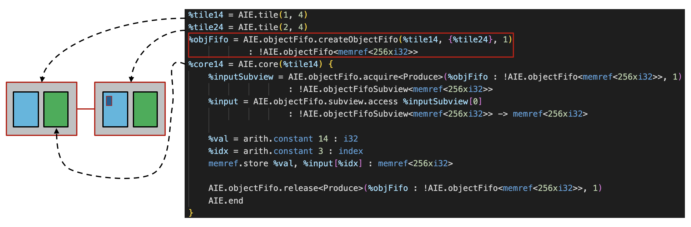

<!---//===- README.md --------------------------*- Markdown -*-===//
//
// This file is licensed under the Apache License v2.0 with LLVM Exceptions.
// See https://llvm.org/LICENSE.txt for license information.
// SPDX-License-Identifier: Apache-2.0 WITH LLVM-exception
//
// Copyright (C) 2022, Advanced Micro Devices, Inc.
// 
//===----------------------------------------------------------------------===//-->

# <ins>Tutorial 3 - communication via objectFifo (local memory)</ins>

This part of the tutorial introduces the `objectFifo` abstraction, which is used to setup communication between tiles without explicit configuration of the dataflow movement. The abstraction is then lowered via MLIR conversion passes onto the physical `mlir-aie` components.

This abstraction consists of several `AIE.objectFifo` operations which are gradually introduced in this tutorial and the following ones. The code in [aie.mlir](aie.mlir) is an implementation of tutorial-3 using the `objectFifo` abstraction. While it is seemingly more complicated than the initial implementation, we will see how powerful this logical abstraction is for more complex designs in future tutorials.

Firstly, an objectFifo is created between tiles (1,4) and (2,4) with the operation:
```
AIE.objectFifo.createObjectFifo(producerTile, {list of consumerTiles}, depth) : elemDatatype`
```
The objectFifo describes both the data allocation and its movement. An objectFifo has a depth, or size, which represents a number of pre-allocated objects of the specified datatype that can be synchronously accessed by actors, which we separate into consumers and producers. In this tutorial, tile (1,4) is the producer tile and tile (2,4) is the consumer tile and the objectFifo established between them has one object of type `memref<256xi32>`. This is shown in the diagram below.



To achieve deadlock-free communication, actors must acquire and release objects from the objectFifo. In this example, there is only one object to acquire. The operation, 
```
AIE.objectFifo.acquire<port>(objectFifo, numberElem) : subviewType
```
returns a subview of the objectFifo containing the specified number of elements. Individual elements can then be accessed in an array-like fashion with the operation: 
```
AIE.objectFifo.subview.access(subview, index) : elemDatatype
```
When an object is no longer required for computation, the actor which acquired it should release it with the operation:
```
AIE.objectFifo.release<port>(objectFifo, numberElem)
``` 
such that other actors may acquire it in the future. The acquire and release operations both take an additional port attribute which can be either "Produce" or "Consume". The use of this attribute will be further described in the `Object FIFO Lowering` section.

# <ins>Object FIFO Lowering</ins>

The objects of an objectFifo each lower into a lock and buffer pair. As such, the `AIE.objectFifo.acquire` and `AIE.objectFifo.release` operations are lowered into `useLock` operations. Both these operations take a port attribute which can be either "Produce" or "Consume". This attribute is used to determine the lock values to give to the `useLock` operations in order to achieve the desired synchronisation. For example:
```
AIE.objectFifo.acquire<Produce>(%objFifo : !AIE.objectFifo<memref<256xi32>>, 1)
AIE.objectFifo.acquire<Consume>(%objFifo : !AIE.objectFifo<memref<256xi32>>, 1)
```
are each lowered into,
```
AIE.useLock(%lock14_0, "Acquire", 0)
AIE.useLock(%lock14_0, "Acquire", 1)
```
where %lock14_0 is the lock generated by the lowering.

Both the lock and buffer are components that are local to a tile and its memory module. The lowering will generate these components in the tile, and in its associated memory module, chosen based on the position of the tiles which were used when creating the objectFifo, such that they are available in shared local memory.

To apply the lowering on an mlir source file, use the command below in a fully setup mlir-aie project:
```
aie-opt --aie-objectFifo-stateful-transform <mlir source file>
```

## <ins>Tutorial 3 Lab </ins>

1. Read through the [/objectFifo_ver/aie.mlir](aie.mlir) design. In which tile and its local memory will the objectFifo lowering generate the buffer and its lock? 

2. Increase the objectFifo size to 2. Navigate to the location of the [/objectFifo_ver/aie.mlir](aie.mlir) design and apply the objectFifo lowering on it. How many buffer/lock pairs are created and in which memory module? 
