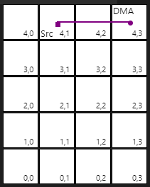

<!---//===- README.md --------------------------*- Markdown -*-===//
//
// This file is licensed under the Apache License v2.0 with LLVM Exceptions.
// See https://llvm.org/LICENSE.txt for license information.
// SPDX-License-Identifier: Apache-2.0 WITH LLVM-exception
//
// Copyright (C) 2022, Advanced Micro Devices, Inc.
// 
//===----------------------------------------------------------------------===//-->

# <ins>Tutorial 4 - Communication via objectFifo (tile DMA, logical routing)</ins>

Even though shared local memory is ideal for communicating between adjacent tiles, for non-adjacent tiles or tiles that are far away, communication is instead done through the stream switch network with the tile DMAs serving as data movers and each tile's local switchbox serving as the data steering highway. Efficient movement of data through the AIE array is key to achieving high performance. The `mlir-aie` dialect has built-in automatic routing capabilities and visualization tools for viewing the routing choices made. This is a great area for further research where additional transformations can be added to provide other optimized routing functionality.

There are many components in the `mlir-aie` dialect that must be configured in order to achieve communication between two cores that are placed on tiles which do not share local memory. However, with the `objectFifo` abstraction introduced in the previous tutorial, there is no visible difference between an objectFifo created with adjacent tiles and one with non-adjacent tiles. 

Under the hood, the abstraction leverages tile DMAs and stream switches in order to achieve communication between non-adjacent tiles. This can be seen in the diagram below where an objectFifo is created between two AIE tiles which do not share memory and the lowering instantiates the tileDMAs of each memory module as well as the stream switch network in order to achieve communication between the buffer/lock pairs in each memory module.

The components mentioned above are described in detail in the `./flow` and `./switchbox` sub-directories.

[Link to lower level flow write-up](./flow)

[Link to lower level switchbox write-up](./switchbox)

This is where the advantage of implementing designs at the `objectFifo` abstraction level becomes more apparent: the communication between cores boils down to creating an objectFifo between the tiles which they are placed on, while the data allocation and movement is left to the lowering. 

## <ins>Tutorial 4 Lab </ins>

1. Read through the [aie.mlir](aie.mlir) design. In the previous tutorial we saw that the objectFifo lowering creates buffer/lock pairs in the shared memory module between two tiles. Where are these elements created for tiles (1,4) and (3,4)? Verify your answer by applying the objectFifo lowering on the [aie.mlir](aie.mlir) design (see [tutorial-3](../tutorial-3) for the command).  than the original objectFifo size." height=25>

2. Run `make` and `make -C aie.mlir.prj/sim` to compile the design with `aiecc.py` and then simulate that design with aiesimulator.

3. Increase the size of the objectFifo to 2. Apply the lowering again. Are additional elements generated? 

4. Increase the size of the objectFifo to 4. Apply the lowering again. Are additional elements generated? 

5. Keep the objectFifo size of 4. Increase the number of acquired elements by %core14 to 2. Apply the lowering again. Are additional elements generated? 

## <ins> Routing Visualization </ins>

When working on a design, it can be informative to see what the tools have done in a human friendly format. We can use a VScode extension called `prviewer` to visualize the routing done in an AI Engine array. This extension should already be installed in your tutorial AWS environment, but it is currently not published for public use.

Here we see the design of tutorial 4 visualized as a single flow from the source in AIE tile (1,4) to the destination DMA in AIE tile (3, 4). 

> Note: The VS code extension uses a (row, col) format instead of the (col, row) format used elsewhere.

To use the extension, locate the file `sim/flows_physical.json` which is generated when you run `make` in any of the tutorials. (You can also examine `sim/flows_physical.mlir` to see what the mlir looks like after some physical routing lowerings have been applied.) With the JSON file opened, press Ctrl + Shift + p or F1 and search for the "Routing View" command. Press Enter and the visualization extension will run using the JSON file as input.

For more usage of this visualization, see the Advanced Topic section in [switchbox](./switchbox).
