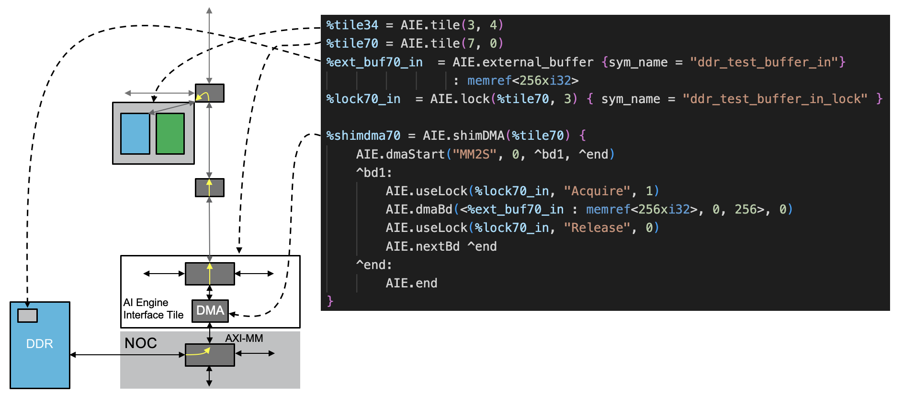

<!---//===- README.md --------------------------*- Markdown -*-===//
//
// This file is licensed under the Apache License v2.0 with LLVM Exceptions.
// See https://llvm.org/LICENSE.txt for license information.
// SPDX-License-Identifier: Apache-2.0 WITH LLVM-exception
//
// Copyright (C) 2022, Advanced Micro Devices, Inc.
// 
//===----------------------------------------------------------------------===//-->

# <ins>Tutorial 5 - Communication (shim DMA, external memory aka DDR)</ins>

In thinking about data communication, it's often helpful to use the memory hierarchy model of CPU architectures where we have different levels of memory with level 1 (L1) being closest to the processing unit (AI Engine local memory) and level 3 (L3) being further away (e.g. DDR). Up till now, we've focused on communication between AI Engines or L1 to L1 communication. Supporting the communication of data between L3 (DDR) to L1 (local memory) uses the same tileDMA and stream switch components as when communicating data between L1 and L1, but requires 3 additional blocks in the AI engine array and Versal device.

* Shim DMA and External Buffers
* NOC configuration
* Host code for buffer allocation and virtual address mapping

A diagram featuring the 3 blocks needed to connect L1 to L3 can be seen in the following diagram.
<p><p>

Here, we see the different components of the L1-L3 communciation defined in MLIR. The shim DMA is the box labeled AI Engine Interface Tile while the external buffer is the smaller gray box within the blue DDR box. We see the NOC block represented by the light gray box labeled NOC. And the host code portion would be found in the host code [test.cpp](./test.cpp).

## <ins>Shim DMA and External Buffers</ins>
### <ins>shimDMA</ins>
We first need a component to move the data out of the AIE array and that component can be the shim DMA which is connected to the NoC block, or the PL interfaces. For this tutorial, we will focus on the shim DMA as that does not require custom PL blocks to move data to the DDR controller.

The shim DMA functions very similarly to the tile DMA when defined in MLIR. Rather than define the BD behavior inside an `AIE.mem` oeprator, we define the same set of BD behaviors inside the `AIE.shimDMA` operator as shown below:
```
%shimdma70 = AIE.shimDMA(%tile70) {
    AIE.dmaStart("MM2S", 0, ^bd1, ^end)
    ^bd1:
        AIE.useLock(%lock70_in, "Acquire", 1)
        AIE.dmaBd(%external_buf : memref<256xi32>, 0, 256>, 0)
        AIE.useLock(%lock70_in, "Release", 0)
        cf.br ^end
    ^end:
        AIE.end
}
```
Here, we see that the rules for bd and channel definitions are the same as in the tileDMA case.
> Note that shimDMA are defined for the shim tiles (row 0). In this example, tile(7,0). Also note that not every column in row 0 is shimDMA capable. The list of capable tiles in the S70 device is `(2,3,6,7,10,11,18,19,26,27,34,35,42,43,46,47)`.

Much like the tile DMA, the shim DMA has 2 DMA units, each with a read and write port, giving us 4 independent dma+channel data movers. Among all 4 data movers, we again have 16 buffer descriptors (bd) describing the rules of the data movement. The definition of these bds are declared within an AIE.shimDMA operation in the same way as the tile DMA. Please review the tile DMA operations in [tutorial-4](../../tutorial-4) for more details.

### <ins>external_buffer</ins>
The second operator is the definition of the external buffer. tile DMA moves data from the local memory of each AI Engine. But shim DMA moves data from external buffers (e.g. DDR). The `dmabBd` operator then needs to refer to this buffer in its definition. External buffers are defined with the `AIE.external_buffer` operation as shown below:
```
%ext_buf70_in  = AIE.external_buffer {sym_name = "ddr_test_buffer_in"}: memref<256xi32>
```
This looks very much like a local buffer defintion except that it's not attached to any tile. Where this memory is physically located and how the shimDMA is able to connect to it is defined in the next two blocks.

## <ins>NOC configuration</ins>

The next block to configure is the NOC interface that is connected to all shimDMAs to route to a valid external buffer. In the S80 device, for example, this can be to the DDR memory controller or other memory component connected to the NOC (e.g. BRAM controller). In our example platform, we have created a design where all NOC ports are able to route to the DDR memory controller but in practice, this step is done as part of the platform design. Future efforts to streamline the NOC configuration at run time is ongoing.

## <ins>Host code for buffer allocation and virtual address mapping</ins>

The last block to configure is the external buffer itself. Because our shim DMA is connected to a DDR memory controller, it can access any valid memory location therein. We then need to allocate a valid region of memory and pass that virtual address to the host code configuration functions so the shim DMA is configured correctly. For all tileDMAs, they are configured at runtime through the `mlir_aie_configure_dmas()` function. But this does not include the configuration of the shim DMAs. This is done as follows:
```
int *mem_ptr_in  = mlir_aie_mem_alloc(_xaie, 0, 256);
mlir_aie_external_set_addr_ddr_test_buffer_in((u64)mem_ptr_in);
mlir_aie_configure_shimdma_70(_xaie);
```
In this example, we first call `mlir_aie_mem_alloc` to allocate a region of DDR memory with a given offset and size and return a virtual address pointer. Then, in the `mlir_aie_external_set_addr_<bufname>(virtual_addr)`, we pass in the virtual address to MLIR defined external buffer. 
> Note that the `<bufname>` used here is the `sym_name` defined in the MLIR code. 

Finally, the `mlir_aie_configure_shimdma_<location>()` is called to configure the shimDMA given the shim DMA operators in MLIR and the virtual address defined at runtime in the host code. The `<location>` refers to the shim DMA defined in MLIR and is the concatentation of the column-row number, in this case column 7, row 0 or 70. 

Once these three functions are called, the shim DMA is configured properly with the runtime allocated memory region in DDR. Since the common use of shimDMA requires timing synchronization to start a transaction, we often use locks to do this just as we did in the tile DMA example. Here, we can acquire and release locks in the shimDMA using the following access functions:
```
mlir_aie_acquire_<sym_name>_lock(_xaie, 1, 100);
mlir_aie_release_<symn_name_lock(_xaie, 0, 100);
```
The `<sym_name>` used here is the same sym_name of the external buffer. The first argument is the lock value (0,1) and the second argument is the timeout duration in microseconds.

## <ins>Tutorial 5 Lab </ins>

1. Read through the [aie.mlir](aie.mlir) design. How many external buffers are defined and which direction are they? L1). ext_buf70_out is for writing (L1->DDR)" height=25>

External buffers on their own cannot give any indication as to what they are used for but we can figure this out based on the bd description that the buffer is used in. For example, `ext_buf70_in` is defined in `bd1` which is itself defined for `dmaStart("S2MM")` which tells us this is a S2MM connection. 
> Note that S2MM means stream to memory map. In this case, the stream is the AIE array side and the MM is the external buffer side (e.g. DDR) so we are moving data out of the AIE array or writing data to the external buffer. This is kind of the opposite to the tile DMA case where S2MM would be moving data from the stream to the local memory which would be reading from the perspective of the AIE core.

2. Add a second read and write channel to the single shimDMA (tile(7,0)) that moves data to and from another tile. That tile can have the same function as the existing tile.

3. Can we add a third read or write channel to our shimDMA? 

4. Change the design so that the external buffer acts like a ping-pong buffer.

