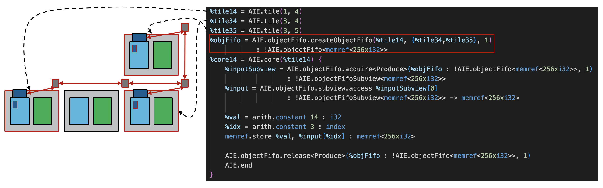

<!---//===- README.md --------------------------*- Markdown -*-===//
//
// This file is licensed under the Apache License v2.0 with LLVM Exceptions.
// See https://llvm.org/LICENSE.txt for license information.
// SPDX-License-Identifier: Apache-2.0 WITH LLVM-exception
//
// Copyright (C) 2022, Advanced Micro Devices, Inc.
// 
//===----------------------------------------------------------------------===//-->

# <ins>Tutorial 7 - Communication via objectFifo (broadcast)</ins>

Now that we've seen how point to point communication is handled, we need to introduce the concept of broadcast. This is necessary to allow data from a single source to be sent to multiple destinations. This is also important because with a fixed set of routing resources (e.g. channels), we need to be efficient in how we move data to avoid congestion. Broadcast then is our one-to-many communication tool. Many-to-one is also possible but only in the packet routing case. For circuit switch routing, we would need some kind of aggregator that decides when connections can be switched, which packet routing already supports.

This tutorial first introduces broadcast through the `objectFifo` abstraction, which for now only supports one-to-many broadcast and lowers it further onto physical AIE components using circuit switch routing. The aim in the future is to have the lowering be able to support both routing types and even choose between the two based on hardware restraints. For in-depth descriptions of how each routing is achieved in `mlir-aie` please refer to the [flow](./flow) sub-directory.

[Link to lower level flow write-up](./flow)

To express a one-to-many broadcast in the `objectFifo` abstraction, we create an objectFifo with one producer tile and many consumer tiles. It does not make a difference whether these consumer tiles share memory or not with the producer tile as they are all treated as if they did not. This is because the `objectFifo` lowering leverages the tile DMAs and stream switches to account for back pressure from the producer for each individual consumer such that no data is lost. An example of one-to-many broadcast is shown in the diagram below where an objectFifo is created between producer tile(1,4) and consumer tiles (3,4) and (3,5).

It is also possible to combine broadcast in this abstraction with shim tiles such that data coming from external memory can be broadcast to many different consumer tiles in the AIE array.

## <ins>Tutorial 7 Lab </ins>

1. Read through the [aie.mlir](aie.mlir) design. How many buffer/lock element pairs are created on each tile? 

2. What AIE components should be generated for each tile to achieve the broadcast data movement? 

3. Run `make` and `make -C aie.mlir.prj/sim` to compile the design with `aiecc.py` and then simulate that design with aiesimulator.
